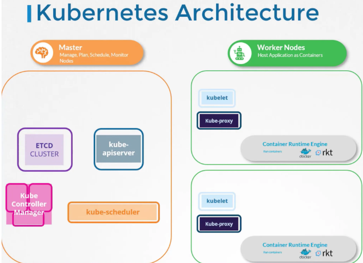

# 아키텍처 개요 : 배와 화물선 비유

- 쿠버네티스의 목적은 애플리케이션을 컨테이너 형태로 자동화된 방식에 따라 호스트하는 것

## k8s 아키텍처에는 크게 2가지 배가 있다고 생각하라

- k8s 클러스터에는 컨테이너를 호스팅하는 **노드(Node)**들로 구성
- 화물선 : 컨테이너 운반을 담당하는 **Worker Node**
- 통제선 : 화물선을 모니터링하고 관리하는 **Master Node**

## Master Node (Control Plane)

- Control Plane 구성 요소들을 통해 클러스터를 관리

### etcd (데이터 저장소)

- 어떤 배에 어떤 컨테이너가 실렸는지에 대한 정보를 유지
- key-value 형태의 데이터베이스로 **클러스터에 관한 모든 정보를 저장**

### kube-scheduler

- 배가 도착했을 때 어떤 컨테이너를 적재할지 결정하는 크레인
- 컨테이너의 리소스 요구사항, 워커 노드의 용량, 정책, 제약 조건 (Taints/Tolerations, Node Affinity 등)을 고려하여 최적의 노드를 식별하는 역할

### Controllers

- 특정 업무를 담당하는 사무소
- Node Controller
    - 노드의 상태를 관리하고, 새로운 노드를 클러스터에 합류시키거나 중단/파괴 상황을 처리
- Replication Controller
    - 특정 복제 그룹 내에서 원하는 수의 컨테이너가 항상 실행되도록 보장
- 등등

### kube-apiserver

- 클러스터 내의 **모든 운영을 오케스트레이션**
- 외부 사용자를 위한 api 노출
- 다양한 컨트롤러들이 클러스터 상태를 모니터링하고 필요한 동작을 수행할 때 거침

## Worker Node

- 컨테이너가 가동되는 화물선 내부의 핵심 요소

### Container Runtime Engine

- 애플리케이션과 관리 시스템 자체가 컨테이너 형태로 실행되므로, 컨테이너를 실행할 소프트웨어가 필요
- Docker를 포함하여 containerd, Rocket(rkt) 등이 있음
- 마스터 노드를 포함한 모든 노드에 설치되어야 함

### kubelet

- 각 노드의 선장 역할을 하는 에이전트
- kube-apiserver의 지시를 듣고, 노드에 컨테이너를 배포하거나 파괴함
- 노드와 컨테이너의 health check하고 주기적으로 api 서버에 전달

### kube-proxy

- 서로 다른 노드에 있는 애플리케이션 간의 통신을 가능하게 해주는 역할

