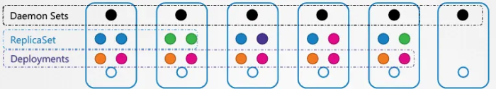

### **1. 데몬셋(DaemonSet)의 정의 및 특징**

- **정의:** 레플리카셋과 유사하게 여러 포드 인스턴스를 배포하지만, 클러스터 내의 **모든 노드에 포드 사본을 정확히 하나씩** 실행하는 객체임
- **노드 변화 대응:** 클러스터에 새로운 노드가 추가되면 자동으로 포드 복제본이 해당 노드에 추가되고, 노드가 제거되면 포드도 자동으로 삭제됨
- **상태 유지:** `클러스터의 모든 노드에 항상 포드 사본이 존재하도록 보장함`
- 아래 그림과 같이 ReplicaSet, Deployments는 모든 노드에 배치하지 않을 수 있으나 Daemonset은 모든 노드에 배치를 보장함



---

### **2. 주요 사용 사례**

- **모니터링 에이전트:** 클러스터 모니터링을 위해 각 노드에 배포되는 에이전트 포드
- **로그 수집기:** 각 노드에서 로그를 수집하는 `fluentd`, `logstash` 등
- **쿠버네티스 핵심 컴포넌트:** 모든 워커 노드에 필요한 `kube-proxy`
- **네트워킹 솔루션:** 각 노드에 에이전트 배포가 필요한 `Calico` 등

---

### **3. 데몬셋 정의 및 생성 방식**

### **YAML 구조 상세**

- 레플리카셋 작성 과정과 매우 유사하며, `template` 섹션 아래 포드 사양을 중첩하고 `selector`를 통해 연결함
- **apiVersion:** `apps/v1`
- **kind:** `DaemonSet`
- **metadata:** 데몬셋의 이름(예: `monitoring-daemon`) 정의
- **spec:** 포드를 관리할 `selector`와 실제 포드 정의인 `template` 포함 (라벨 일치 필수)

```yaml
apiVersion: apps/v1
kind: DaemonSet
metadata:
  name: monitoring-daemon
spec:
  selector:
    matchLabels:
      app: monitoring-agent
  template:
    metadata:
      labels:
        app: monitoring-agent
    spec:
      containers:
      - name: monitoring-agent
        image: monitoring-agent-image
```

---

### **4. 스케줄링 메커니즘**

- **과거 방식 (v1.12 이전):** 포드 사양에 `nodeName` 속성을 직접 설정하여 스케줄러를 우회하고 포드를 특정 노드에 직접 배치하는 방식을 사용함
- **현재 방식 (v1.12 이후):** 기본 스케줄러(Default Scheduler)와 **노드 어피니티(Node Affinity)** 규칙을 사용하여 포드를 각 노드에 예약함
- **보장 기능:** 스케줄러가 모든 노드를 대상으로 검토하여 각 노드에 데몬셋 포드가 하나씩 실행되도록 관리함