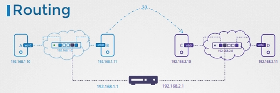
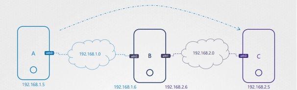

# 네트워크

- 컴퓨터 A와 B가 있을 때
    - A(192.168.1.10)와 B(192.168.1.11)가 서로 접근하기 위해
    - 두 시스템을 **스위치(switch)** 에 연결
      - 스위치는 두 시스템을 `하나의 네트워크`로 묶어준다
    - 스위치에 연결하려면 각 호스트는 네트워크 인터페이스(물리적 또는 가상)를 가져야 한다
- 호스트의 네트워크 인터페이스 확인 → `ip link`
- 예를 들어 `eth0` 인터페이스 및 네트워크 주소 192.168.1.0이라 가정

```bash
ip addr add 192.168.1.11/24 dev eth0
ip addr add 192.168.1.10/24 dev eth0
```

- 링크가 올라오고 IP가 할당되면 두 시스템은 스위치를 통해 통신할 수 있다.

---

# 스위치의 한계

- 스위치는 **같은 네트워크 내부**에서만 통신을 가능하게 함
    - B(192.168.1.11)가 C(192.168.2.1)에 접근하려면?
- 다른 네트워크 192.168.2.0과 통신하기 위해서는 `Router`가 필요
    - 라우터는 두 네트워크를 연결하는 장치
    - 두 네트워크에 각각 IP를 가짐
        - 192.168.1.1
        - 192.168.2.1



- 이제 두 네트워크 간 통신이 가능하다.

---

# 라우팅 설정

- 시스템 B가 C로 패킷을 보내려면 어디로 보내야 하는지 설정해줘야 함
    - route 설정
- 연결된 라우팅 확인 → **`route`**
- route 추가

```bash
# 양방향 추가
ip route add 192.168.2.0/24 via 192.168.1.1 # B -> C
ip route add 192.168.1.0/24 via 192.168.2.1 # C -> B
```

---

# 기본 게이트웨이(Default Gateway)

- 실제 인터넷에는 네트워크가 너무 많아서 모든 IP 주소를 라우팅에 추가하지 않는다
- 대신 기본 게이트웨이를 설정한다


```bash
# 모든 요청은 이 라우터로 전달된다
ip route add default via 192.168.1.1
# 또는
ip route add 0.0.0.0/0 via 192.168.1.1
# 0.0.0.0은 게이트웨이가 필요 없다는 것
```

---

# Linux 호스트를 라우터로 만들기



- A → 192.168.1.5
- B → 192.168.1.6(eth0) / 192.168.2.6(eth1)
- C → 192.168.2.5
- 이 상태에서 A → C는 **`Network is unreachable`**
    - 이 연결은 B를 통해서 가도록 설정해야함
- 따라서 A → B, C → B 추가

```bash
ip route add 192.168.2.0/24 via 192.168.1.6
ip route add 192.168.1.0/24 via 192.168.2.6
```

- 이제 네트워크는 연결되었지만 ping이 여전히 실패할 수 있다.
    - Linux 기본 설정에서 **IP forwarding이 비활성화되어 있기 때문**
    - 인터페이스 → 다른 인터페이스로 포워딩 안함, 즉 eth0 → eth1을 안한다
        - Why? 보안상의 이유 때문에. Private → Public이거나 Public → Private을 허용하지 않으려고 한다는 것
- 허용 설정

```bash
cat /proc/sys/net/ipv4/ip_forward
# 0이면 비활성화, default 0
echo 1 > /proc/sys/net/ipv4/ip_forward

# 재부팅후에도 유지하려면 /etc/sysctl.conf에서 직접 설정
```