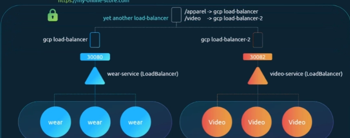
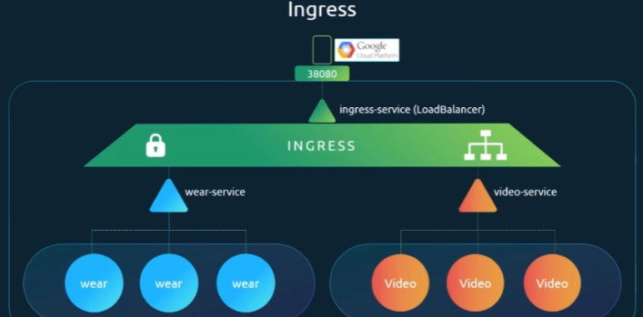
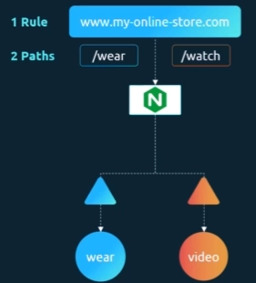
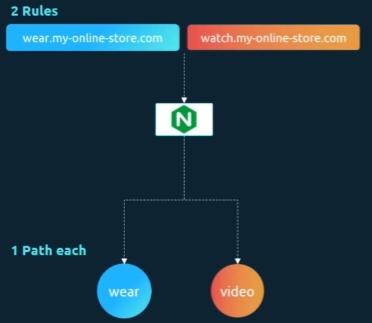

# 1. Pod 배포

- 애플리케이션 URL이 있다고 가정(myonlinestore.com)
    - 애플리케이션(이름:wear)은 Docker 이미지로 만들고 Kubernetes 클러스터에 Pod로 배포한다.
    - 애플리케이션은 데이터베이스가 필요하므로 MySQL을 Pod로 배포하고 다음과 같은 서비스를 만든다.
        - wear와 mysql 통신 가능한 상태

```
Service Type: ClusterIP
Name: mysql-service
```

# 2. 외부 사용자 접근 (NodePort)

- 애플리케이션을 외부 사용자에게 공개하기 위해 NodePort 필요

```
Service Type: NodePort
Port: 30080

사용자는 아래 url로 접근 가능
http://<node-ip>:30080
```

- 트래픽이 증가하면 Pod replica를 늘리고 Service가 Pod에 traffic을 분산한다.

---

# 3. dns 및 포트 포워딩

- 사용자가 node-ip를 기억할 필요 없도록 my-online-store와 매핑시키도록 dns 설정
- 30080 port 역시 프록시 서버를 두어 처리
- onpremise의 datacenter에서는 이렇게 가능하다

```
1.<node-ip> 부분을 dns 매핑
http://myonlinestore.com:30080

2.port는 프록시 서버를 두어 80 -> 30080으로 접근하도록 처리
http://myonlinestore.com
```

---

# 4. 클라우드 환경에서는 LoadBalancer

- NodePort 대신 LoadBalancer

```
Service Type: LoadBalancer
```

- Kubernetes는 다음 작업을 수행한다.

  1️⃣ NodePort 생성

  2️⃣ 클라우드에 Load Balancer 생성 요청

    - 클라우드(GCP, Google Cloud Platform)는 자동으로 네트워크 로드밸런서를 생성
    - 모든 노드의 서비스 포트로 트래픽을 전달하도록 설정
    - 로드밸런서는 외부 IP를 제공
    - DNS는 그 IP를 가리키게 한다.
    - 사용자는 다음 URL로 접근한다.

```
myonlinestore.com
```

---

# 5. [myonlinestore.com/watch](http://myonlinestore.com/watch) 배포(새로운 서비스)

- 사용자는 다음 URL로 접근해야 한다.

```
myonlinestore.com/watch
```

- 이 서비스를 완전히 별도 애플리케이션으로 개발했지만 클러스터 리소스를 공유해야 하기 때문에 같은 Kubernetes 클러스터에 배포했음
- 이 서비스도 LoadBalancer를 생성하고 외부 IP(30082)를 가지고 있음.

결과:

- 새로운 LoadBalancer 생성
- 새로운 외부 IP 생성
- 문제는 **`LoadBalancer마다 비용이 발생`**한다.

---

# 6. 새로운 애플리케이션이 개발될 때마다 문제 발생



```
myonlinestore.com -> web service
myonlinestore.com/watch -> video service
```

- 위의 그림같이 만들어지는 경우
    - 또 다른 **프록시 / 로드밸런서**가 필요하다.
    - 서비스가 추가될 때마다 로드밸런서를 다시 설정해야 한다.
        - SSL도 적용해야 한다. (아래 3군데를 고려할 수 있지만 대개 한 곳에서 관리하고 싶다)
            - 애플리케이션
            - 로드밸런서
            - 프록시
        - 새로운 서비스마다
            - 방화벽 설정
            - 로드밸런서 생성
            - DNS 설정

---

# 7. Ingress

- 하나의 외부 URL
- URL path 기반 라우팅
- SSL 처리
- 여러 서비스로 트래픽 분배
- Ingress는 Kubernetes 안에 구축된 **Layer 7 Load Balancer**
- 다른 Kubernetes 리소스처럼 YAML로 설정할 수 있다.
- Ingress도 외부에서 접근 가능해야 한다. (NodePort 혹은 LoadBalancer 필요)
    - 한 번만 설정하면 된다.
    - 그 이후에는 모든 라우팅과 SSL 설정을 Ingress에서 관리한다.



### Ingress의 구조

- Ingress Controller(배포하는 솔루션) / Ingress Resource(규칙 집합)
    - ingress resource는 yaml로 생성할 수 있음

### Ingress Controller 설치

- Kubernetes에는 기본적으로 Ingress Controller가 없으므로 직접 설치해야 한다.
    - GCE (Google의 L7 HTTP Load Balancer)
    - NGINX
    - Contour
    - HAProxy
    - Traefik
    - Istio
- 예시로 nginx ingress controller 배포

### 1️⃣ Deployment

### 2️⃣ Service

### 3️⃣ ConfigMap

### 4️⃣ ServiceAccount + RBAC

```yaml
apiVersion: apps/v1
kind: Deployment
metadata:
  name: nginx-ingress-controller
spec:
  replica: 1
  selector:
    matchLabels:
      name: nginx-ingress
    template:
      metadata: 
        labels: 
          name: nginx-ingress
      spec: 
        containers: 
          - name: nginx-ingress-controller 
            image: quay.io/kubernetes-ingress-controller/nginx-ingress-controller:0.21.0 
        args: 
          - /nginx-ingress-controller 
          - --configmap=$(POD_NAMESPACE)/nginx-configuration
        env: 
          - name: POD_NAME 
            valueFrom: 
              fieldRef: 
                fieldPath: metadata.name
          - name: POD_NAMESPACE 
            valueFrom: 
              fieldRef: 
                fieldPath: metadata.namespace
        port: 
          - name: http 
            containerPort: 80
          - name: https
            containerPort: 443
```

```yaml
# 수정요소가 필요할 때 nginx 파일을 수정하지 않고 configmap 수정
kind: ConfigMap
apiVersion: v1
metadata:
	name: nginx-configuration
```

```yaml
# NodePort
apiVersion: v1
kind: Service
metadata:
  name: nginx-ingress
spec:
  type: NodePort
  ports:
  - port: 80
    targetPort: 80
    protocol: TCP
    name: http
  - port: 443
    targetPort: 443
    protocol: TCP
    name: https
  selector:
    name: nginx-ingress
```

```yaml
# 접근하기 위한 계정 필요
apiVersion: v1
kind: ServiceAccount
metadata:
  name: nginx-ingress-serviceaccount
```

---

# Ingress Resource 예시

## 기본 예

```yaml
apiVersion: networking.k8s.io/v1
kind: Ingress
metadata:
  name: ingress-wear
spec:
  defaultBackend:
    service:
      name: web-service
      port: 80
```

- kubectl create -f Ingress-wear.yaml
- kubectl get ingress



```yaml
apiVersion: networking.k8s.io/v1
kind: Ingress
metadata:
  name: ingress-wear-watch
spec:
  rules:
    - http:
        paths:
          - path: /wear
            backend:
              service:
                name: wear-service
                port: 80
          - path: /watch
            backend:
              service:
                name: watch-service
                port: 80
```



```yaml
apiVersion: networking.k8s.io/v1
kind: Ingress
metadata:
  name: ingress-wear-watch
spec:
  rules:
    - host: wear.my-online-store.com
      http:
        paths:
          - path: /wear
            backend:
              service:
                name: wear-service
                port: 80
    - host: watch.my-online-store.com
      http:
        paths:
          - path: /watch
            backend:
              service:
                name: watch-service
                port: 80
```

- Ingress 규칙에 매칭되지 않는 요청은 default backend로 보내짐 (보통 404, 필요하다면 별도 세팅할 것)