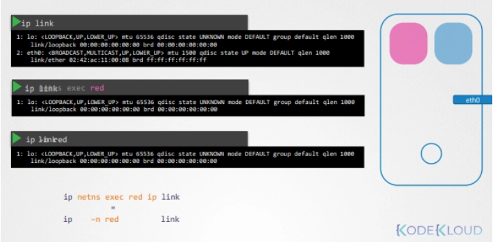
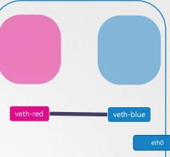
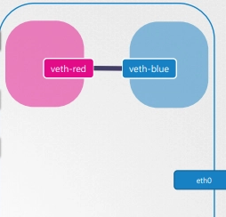
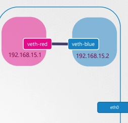
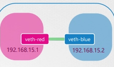
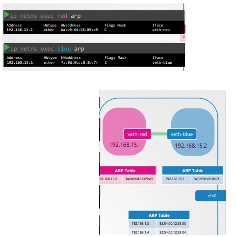
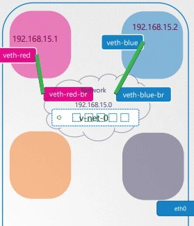
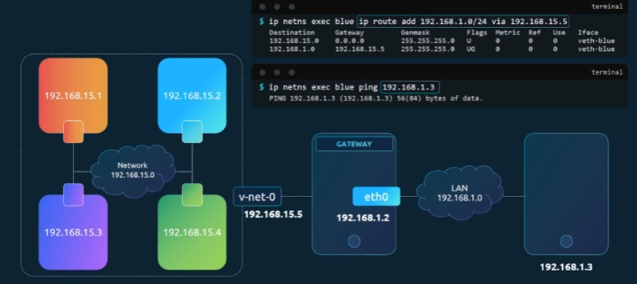

- 호스트가 집이라면 네임스페이스는 집 안의 방

## 컨테이너 생성

- 컨테이너가 생성될 때는 아무것도 보지 못함 (호스트로부터 격리)
- ps aux를 통해 컨테이너는 pid 1로 시작하는 것을 확인

## Network namespace

- 호스트(집) → 자체적인 Routing Table, ARP Table, eth0(인터페이스) 있음
    - 집은 방을 감시할 수 있다 (호스트는 다른 프로세스 확인 가능)
- 호스트 안에 생성된 컨테이너(방) → 동일
    - 컨테이너 입장에서는 컨테이너가 호스트 그 자체임
- linux에서 새로운 namespace 만들기

```bash
# red와 blue 네임스페이스를 만들었다고 가정하자
ip netns add red
ip netns add blue
```

- ip link를 인터페이스 확인 가능



- ip netns exec red ip link
    - red 네임스페이스에서 ip link 명령어를 쓰는 것과 같음
    - 네임스페이스 내에서 arp / route → 아무런 데이터도 못봄

## Establishing connectivity between namespaces

1. red와 blue를 연결할 veth 생성
    - 아직 각각의 namespace에 연결되지는 않음



```bash
ip link add veth-red type verth peer name veth-blue
```

2.각각의 namespace에 연결



```bash
ip link set veth-red netns red
ip link set veth-blue netns blue
```

3.각각의 namespace에 ip 할당



```bash
ip -n red addr add 192.168.15.1 dev veth-red
ip -n blue addr add 192.168.15.2 dev veth-blue
```

4.인터페이스 활성화



```bash
 ip -n red link set veth-red up
 ip -n blue link set veth-blue up
```

- 결과
    - 각 네임스페이스에서 arp 결과로 서로를 등록하고 있음
    - 서로 핑을 날릴 수 있음

    - 
- 링크 제거
    - 링크 제거는 한 쪽만 제거해도 다른 쪽은 자동으로 제거된다

```bash
ip -n red link del veth-red
```

## Linux bridge



1. bridge 타입 네트워크 인터페이스

```bash
ip link add v-net-0 type bridge
ip link set v-net-0 up
```

1. bridge와 연결할 veth 생성

```bash
ip link add veth-red type veth peer name veth-red-br
ip link add veth-blue type veth peer name veth-blue-br
```

1. 각각 연결

```bash
ip link set veth-red netns red
ip link set veth-red-br netns v-net-0
ip link set veth-blue netns blue
ip link set veth-blue-br netns v-net-0
```

1. ip 할당 및 up

```bash
ip -n red add 192.168.15.1 dev veth-red
ip -n blue add 192.168.15.2 dev veth-blue
ip -n red link set veth-red up
ip -n blue link set veth-blue up
```

## linux bridge와 외부 네트워크와 연결



```bash
ip netns exec blue ip route add 192.168.1.0/24 via 192.168.15.5
```

```bash
❯ iptables -t nat -A POSTROUTING -s 192.168.15.0/24 -j MASQUERADE
```