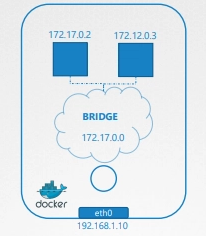
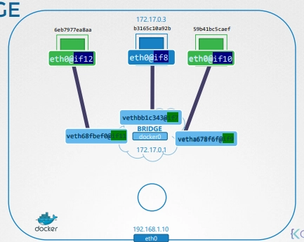

Docker가 설치된 하나의 호스트(서버)가 있다.

- 네트워크 인터페이스: `eth0`
- IP 주소: `192.168.1.1`
- 로컬 네트워크에 연결되어 있음

컨테이너를 실행할 때, 여러 가지 네트워크 옵션을 선택할 수 있다.

# Docker 네트워크 옵션

## none 네트워크

```bash
docker run --network none nginx
```

- 컨테이너는 어떤 네트워크에도 연결되지 않음
- 외부와 통신 불가
- 다른 컨테이너와도 통신 불가

## host 네트워크

```bash
docker run --network host nginx
# ex) http://192.168.1.10:80으로 실행 -> 호스트의 80번 포트에서 바로 접근
```

- 컨테이너가 **호스트 네트워크를 그대로 사용**
- 네트워크 격리 없음

컨테이너 안에서 80번 포트로 웹 서버 실행하면

호스트의 80번 포트에서 바로 접근 가능

같은 포트를 두 개의 컨테이너가 동시에 사용할 수 없다.

- 호스트 공유때문에

---

## bridge 네트워크 (default 설정)



```bash
docker run nginx
```

- Docker는 내부 프라이빗 네트워크를 생성
- 기본 대역: `172.17.0.0/16`
- 각 컨테이너는 이 네트워크 안에서 IP를 받는다

---

# Docker bridge 네트워크 내부 동작

- Docker 설치 시 기본 bridge 네트워크가 생성

```bash
docker network ls
```

- Docker 내부 이름은 `bridge`
- 호스트에서는 `docker0` 인터페이스로 생성

```bash
ip link # --> docker0 
```

- Docker는 내부적으로 다음과 유사한 명령을 사용

```bash
ip link add type bridge
```

- `docker0`
    - 호스트 입장에서는 네트워크 인터페이스
    - 컨테이너 입장에서는 스위치처럼 동작

---

# 컨테이너 생성 시 일어나는 일


- 매번 컨테이너를 생성할 때마다 아래 작업을 반복함
1. Docker는 **네트워크 네임스페이스** 생성
2. 가상 케이블(veth pair) 생성
3. 한쪽 끝은 컨테이너 네임스페이스에 연결
4. 다른 쪽은 `docker0` bridge에 연결
5. 컨테이너에 IP 할당 (예: `172.17.0.3`)

```bash
ip netns
# 도커에 의해 생성된 namespace를 확인할 수 있음

docker inspect 
```

- 컨테이너별 네임스페이스는 `docker inspect`로 확인

---

# 포트 매핑

```bash
docker run -p 8080:80 nginx
# http://<호스트IP>:8080 접근 --> 8080을 컨테이너의 포트 80과 매핑
```

# Docker의 포트 포워딩(예 - 8080:80)

- Linux에서는 이를 **iptables NAT 규칙**으로 구현

```bash
iptables \ 
	–t nat \
	-A PREROUTING \
	-j DNAT \
	--dport 8080 \
	--to-destination 80
```

- Docker
    - Docker 체인에 규칙 추가
    - 목적지 IP를 컨테이너 IP로 변경
    - 포트도 함께 변경

```bash
iptables
  –t nat \
  -A DOCKER \
  -j DNAT \
  --dport 8080 \
  --to-destination 127.17.0.3:80
```

```bash
iptables -nvL -t nat
Chain DOCKER (2 references)
target      prot opt source     destination
RETURN      all  --  anywhere   anywhere
DNAT        tcp  --  anywhere   anywhere        tcp dpt:8080 to:172.17.0.2:80
```