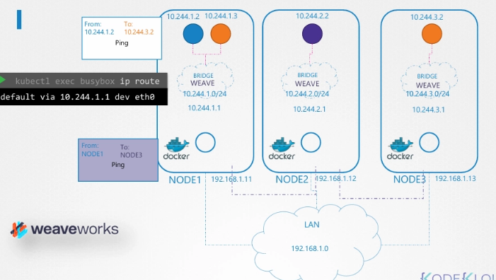

# 회사와 배송업체

- Kubernetes 클러스터를 회사라고 생각해보자
    - 각 노드 = 회사의 각 지점
    - 각 지점 안에는 여러 부서
    - 각 부서 안에는 여러 사무실
- 사무실 1에서 사무실 3으로 패킷을 보내고 싶다. (소규모일 때는 가능하다)
- 회사가 여러 나라로 확장되면 한 사람이 모든 경로를 기억하기 어렵다.
- 따라서 배송 전문 회사 **`(에이전트)`** 이용
    - 각 지점마다 에이전트를 둔다
    - 이 에이전트들은 서로 통신한다
    - 모든 지점, 부서, 사무실의 위치를 안다
- 패킷이 도착하면:
    1. 해당 지점의 에이전트가 패킷을 가로챈다
    2. 목적지를 확인
    3. 자신의 내부 네트워크 정보를 이용해 어느 지점인지 파악
    4. 새 포장(새 패킷)에 싸서 목적지 지점 주소로 전송
    5. 목적지 지점의 에이전트가 패킷을 풀어 원래 패킷을 해당 사무실로 전달

---

# Weave

- 클러스터의 각 노드에 **`에이전트(Weave peer)`**가 배포
    - 이 peer들은 서로 통신
    - 노드, 네트워크, Pod에 대한 정보를 교환
    - 각 peer는 클러스터 전체 토폴로지를 알고 있음
- Weave는 각 노드에 자체 브리지 인터페이스를 만든다
    - 브리지 이름: `weave`
    - 각 노드에 Pod 네트워크 IP 대역을 할당



- Pod는 여러 네트워크에 연결될 수 있다
    - Weave Bridge
    - Docker Bridge
- 어떤 경로로 패킷이 나갈지는 Pod 내부 라우팅 설정에 따라 결정된다
    - Weave는 Pod에 올바른 route를 설정해 트래픽이 Weave 에이전트를 통해 전달되도록 한다.

---

# Pod 간 통신 (다른 노드)

- Pod A (Node1)
- Pod B (Node2)
- Pod A가 패킷을 보내면:
    1. Weave가 패킷을 가로챈다
    2. 대상 Pod가 다른 노드에 있음을 확인한다
    3. 원래 패킷을 새 패킷으로 캡슐화(encapsulation)한다
    4. 새 패킷의 목적지 (예시 : Node2)로 전달한다
    5. Node2의 Weave peer가 수신
    6. 디캡슐화(decapsulation)
    7. 실제 Pod B로 전달

---

# 5️⃣ Weave 배포 방법

- 각 노드에 수동으로 서비스/데몬으로 배포
- 또는 Kubernetes 클러스터 안에 Pod 형태로 배포

보통은 Kubernetes가 구성된 후 다음처럼 배포한다:

```bash
kubectl apply -f "https://cloud.weave.works/k8s/net?k8s-version=$(kubectl version | base64 | tr -d '\n')"

serviceaccount/weave-net created
clusterrole.rbac.authorization.k8s.io/weave-net created
clusterrolebinding.rbac.authorization.k8s.io/weave-net created
serviceaccount/weave-net created
clusterrole.rbac.authorization.k8s.io/weave-net created
clusterrolebinding.rbac.authorization.k8s.io/weave-net created
role.rbac.authorization.k8s.io/weave-net created
rolebinding.rbac.authorization.k8s.io/weave-net created
role.rbac.authorization.k8s.io/weave-net created
rolebinding.rbac.authorization.k8s.io/weave-net created
daemonset.extensions/weave-net created
```

- Weave에 필요한 모든 리소스를 생성
- Weave peer를 **DaemonSet** 형태로 배포
    - 모든 노드에 해당 Pod를 하나씩 배포하도록 보장
- kubectl get pod -n kube-system으로 weave로 시작하는 파드 확이 가능

---

## 로그 확인 (트러블슈팅)

```bash
kubectl logs <weave-pod> -n kube-system
```