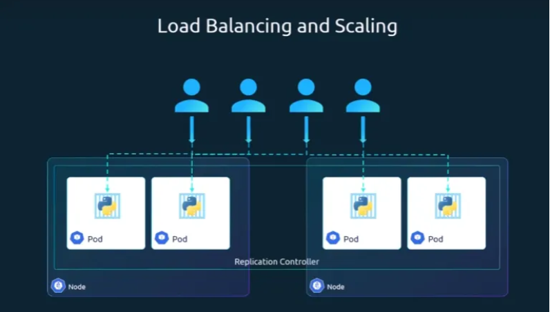

## 레플리카셋(ReplicaSet) 및 레플리케이션 컨트롤러 상세 정리

쿠버네티스의 '두뇌' 역할을 하는 컨트롤러 중, 포드의 가용성과 확장을 담당하는 **레플리케이션 컨트롤러**와 **레플리카셋**에 대한 상세 내용

---

### 1. 레플리카(Replica)의 필요성

- **고가용성(High Availability):** 단일 포드가 충돌이나 노드 장애로 실패할 경우, 사용자는 애플리케이션에 접근할 수 없음. 여러 인스턴스를 동시에 실행하여 하나가 실패해도 서비스가 유지되도록 함
- **자동 복구:** 지정된 수의 포드가 항상 실행되도록 보장. 기존 포드가 실패하면 자동으로 새 포드를 가동함(포드 개수가 1개여도 동일하게 작동)
- **부하 분산 및 확장:** 사용자 증가 시 포드를 추가하여 부하를 분산하고, 클러스터 내 여러 노드에 걸쳐 포드를 배치함으로써 물리적 자원을 효율적으로 활용함



---

### 2. 레플리케이션 컨트롤러 vs 레플리카셋

두 객체는 목적이 같으나 기술적 세대 차이가 있음

- **레플리케이션 컨트롤러(Replication Controller):** 구버전 기술
- **레플리카셋(ReplicaSet):** 현재 권장되는 최신 기술. 레플리케이션 컨트롤러보다 더 풍부한 **선택기(Selector)** 옵션을 제공함

---

### 3. 레플리케이션 컨트롤러 (구버전) 정의 예시

```yaml
apiVersion: v1
kind: ReplicationController
metadata:
  name: myapp-rc
  labels:
    app: myapp
spec:
  template:
    metadata:
      name: myapp-pod
      labels:
        app: myapp
    spec:
      containers:
      - name: nginx-container
        image: nginx
  replicas: 3
```

---

### 4. 레플리카셋 (신버전) 정의 및 핵심 요소

레플리카셋은 `apiVersion`이 다르며, 반드시 **selector** 섹션을 포함해야 함

- **apiVersion:** `apps/v1` (잘못 기재 시 `no match for kind` 에러 발생)
- **selector:** 레플리카셋이 관리할 포드를 식별하는 규칙. 포드 템플릿의 라벨과 일치해야 함
- **template:** 포드 실패 시 새로 생성할 포드의 정의서(이미 생성된 포드가 있어도 미래를 위해 반드시 필요)

```yaml
apiVersion: apps/v1
kind: ReplicaSet
metadata:
  name: myapp-replicaset
  labels:
    app: myapp
spec:
  template:
    metadata:
      name: myapp-pod
      labels:
        app: myapp
    spec:
      containers:
      - name: nginx-container
        image: nginx
  replicas: 3
  selector:
    matchLabels:
      app: myapp
```

---

### 5. 라벨(Labels)과 선택기(Selector)의 역할

- **모니터링 대상 식별:** 클러스터에는 수백 개의 포드가 존재할 수 있음. 레플리카셋은 `selector`에 정의된 라벨을 가진 포드들만 필터링하여 상태를 감시함
- **기존 포드 수용:** 레플리카셋 생성 전 이미 일치하는 라벨을 가진 포드가 있다면, 레플리카셋은 이를 자신의 관리 대상으로 포함하고 부족한 수만큼만 새 포드를 생성함

---

### 6. 스케일링(Scaling) 방법

실행 중인 레플리카의 개수를 변경하는 방법은 다음과 같음

1. **파일 수정 후 교체:** YAML 파일의 `replicas` 값을 수정하고 `kubectl replace -f <파일명>` 실행
2. **명령어 사용:** 파일 수정 없이 명령줄에서 즉시 변경
    - `kubectl scale --replicas=6 -f <파일명>`
    - `kubectl scale --replicas=6 rs/myapp-replicaset` (리소스타입/이름 지정)
    - *주의: 명령어 사용 시 원본 YAML 파일 내의 숫자 값은 자동으로 업데이트되지 않음*

---

### 7. 주요 관리 명령어 요약

- **생성:** `kubectl create -f <파일명>`
- **목록 조회:** `kubectl get replicaset` (또는 `rs`)
- **포드 확인:** `kubectl get pods` (자동 생성된 포드는 레플리카셋 이름을 접두어로 가짐)
- **삭제:** `kubectl delete replicaset <이름>` (연관된 포드도 함께 삭제됨)
- **상세 확인:** `kubectl describe replicaset <이름>`