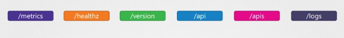
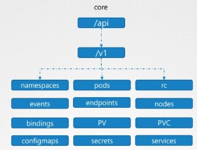
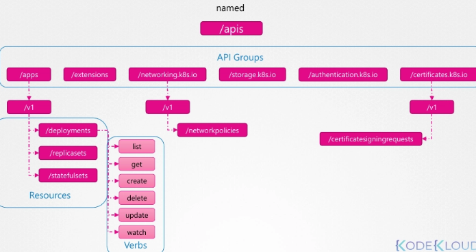

## Kubernetes API 서버 접근 방식과 API 경로

- 지금까지 클러스터에서 수행한 모든 작업은 어떤 방식으로든 kube-apiserver와 상호작용한 것
    - `kubectl 또는 REST`
- API 서버는 일반적으로 **마스터(컨트롤 플레인) 노드 주소 + 포트 6443(기본값)**
- 버전 확인은 API 서버의 version 엔드포인트를 호출함

```bash
# 예시: Kubernetes API 서버에 직접 버전 조회 요청
curl https://<MASTER_IP_OR_HOSTNAME>:6443/version
```

- 마찬가지로 pod 목록을 가져오려면 다음 경로로 접근함
    - `api/v1/pods`

```bash
# 예시: Pod 목록 조회 (core group v1의 pods 리소스)
curl https://<MASTER_IP_OR_HOSTNAME>:6443/api/v1/pods
```

---

## Kubernetes API는 목적에 따라 그룹화



- `version`는 클러스터 버전 조회
- `metrics` 및 `health`는 클러스터 상태 모니터링
- `logs`는 서드파티 로깅 애플리케이션 통합
- `api` 는 핵심 기능

---

## API

- 클러스터 기능 API는 크게 2가지로 분류
    - core group `(/api)`
    - named group `(/apis)`





---

## 클러스터에서 직접 API 그룹 목록 확인 방법

```bash

curl https://localhost:6443 -k # 일반 api는 /api를 생략해도 되는 듯

curl https://localhost:6443/apis -k | grep "name"
```

---

## curl로 직접 호출 시 인증 문제

- curl로 API에 직접 접근하면, 인증 메커니즘을 지정하지 않으면 대부분 접근 불가함
    - 일부 예외의 경우를 제외하고
- 따라서 인증서 파일을 이용해 인증 정보를 함께 전달해야 함

```bash
curl http://localhost:6443 –k
--key admin.key
--cert admin.crt 
--cacert ca.crt
```

---

## 대안: kubectl proxy

- `kubectl proxy`는 로컬에 HTTP 프록시 서비스를 띄움
    - 로컬 포트 8001에서 실행됨
    - kubeconfig 파일의 credentials/certificates를 사용해 클러스터에 접근함
- 따라서 curl에서 인증서를 매번 지정하지 않아도 됨

```bash
kubectl proxy --port
```

- 이제 로컬 프록시(8001)에 요청하면
    - 프록시가 kubeconfig의 자격 증명을 사용해 kube-apiserver로 요청을 포워딩함
- 루트 경로에서 “사용 가능한 API들”을 확인할 수 있다고 설명함

```bash
# 프록시 루트에서 API 확인
curl http://127.0.0.1:8001/

# core group pod 목록 조회
curl http://127.0.0.1:8001/api/v1/pods

# named group deployment 목록 조회
curl http://127.0.0.1:8001/apis/apps/v1/deployments
```

---

## kube-proxy vs kube control proxy(kubectl proxy) 차이

### kube-proxy

- 서로 다른 노드에 있는 pods와 services 사이 연결을 가능하게 하는 용도

### kube control proxy(kubectl proxy)

- `kubectl` 유틸리티가 kube-apiserver에 접근하기 위해 생성하는 HTTP 프록시 서비스

---

## 정리

- Kubernetes의 모든 리소스는 서로 다른 API group으로 묶여 있음
- 최상위에는 core API group과 named API group이 존재함
- named API group 아래에는 섹션별 그룹(apps, networking, storage, authentication, authorization 등)이 존재함
- 각 API group 아래에는 여러 resources가 존재
- 각 resource에는 가능한 actions가 존재하며 이를 verbs라고 부름