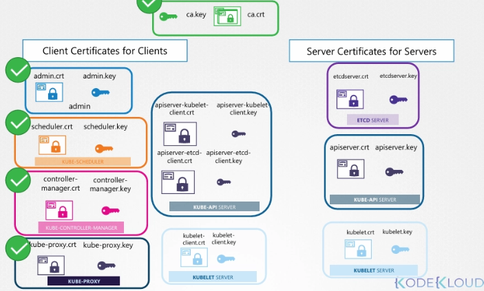
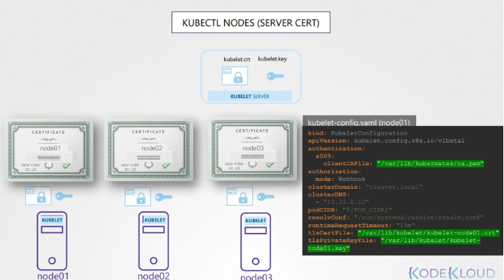
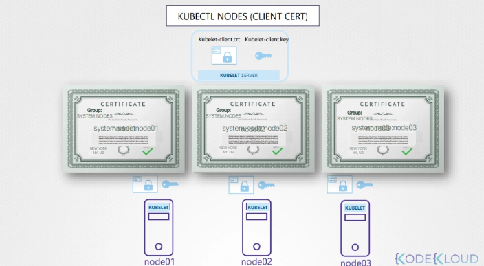

## Certificates 생성 도구

- easy-rsa
- OpenSSL
- SSL 등

## CA certificates 생성 (OpenSSL)

1. private key 생성

```bash
openssl genrsa -out ca.key 2048 # RSA 2048 bit
```

1. CSR(Certificate Signing Request) 생성
    - CSR은 서명이 없는 certificate 형태
    - CN(common name) 필드에 대상 이름 지정
    - 위에서 생성한 private key 사용
    - CA용이므로 CN을 `Kubernetes-CA`로 지정

```bash
openssl req -new -key ca.key -subj "/CN=Kubernetes-CA" -out ca.csr
```

1. CA certificate 생성(자체 서명)
    - CA 자신을 위한 certificate이므로 자기 private key로 self-sign

```bash
openssl x509 -req -in ca.csr -signkey ca.key -out ca.crt
```

- 결과 파일
    - `ca.key`
    - `ca.crt`
- 이후 다른 모든 certificate는 이 CA key pair로 서명

## Client certificates 생성

### admin certificate

1. admin private key 생성

```bash
openssl genrsa -out admin.key 2048
```

1. admin CSR 생성
- CN에 사용자 이름 지정
- 예시로 `kube-admin` 사용
    - 다른 이름으로도 지정될 수 있다
    - kubectl이 인증되는 사용자 이름으로 기록되는 값
    - audit logs 등에서 보이는 이름
    - 즉 **`relevant한 이름을 써라`**

```bash
openssl req -new -key admin.key -subj "/CN=kube-admin" -out admin.csr
```

1. CA로 서명된 admin certificate 생성
    - CA certificate와 CA key로 서명

```bash
openssl x509 -req -in admin.csr -CA ca.crt -CAkey ca.key -out admin.crt
```

- certificate/key 생성 과정은 사용자 계정 생성과 유사
- certificate는 검증된 user ID 역할
- key는 password 같은 역할
    - username/password보다 더 안전한 방식

### admin 권한 부여(그룹)

- admin을 “일반 사용자”와 구분 필요 (group details)
- Kubernetes에 관리 권한 그룹 `system:masters` 존재
- CSR 생성 시 OU로 그룹 지정

```bash
openssl req -new -key admin.key -subj "/CN=kube-admin/OU=system:masters" -out admin.csr
```

- 이 CSR을 CA로 서명하면 admin 권한을 갖는 certificate가 됨

### 다른 client certificates

- kube-scheduler
    - control plane의 system component
    - CN은 `system:` prefix 필요
- kube-controller-manager
    - system component
    - CN은 `system:` prefix 필요
- kube-proxy
- 예시(이름만 보여주는 형태)
    - scheduler: `system:kube-scheduler`
    - controller-manager: `system:kube-controller-manager`
    - kube-proxy: `system:kube-proxy`

```bash
# scheduler
openssl genrsa -out scheduler.key 2048
openssl req -new -key scheduler.key -subj "/CN=system:kube-scheduler" -out scheduler.csr
openssl x509 -req -in scheduler.csr -CA ca.crt -CAkey ca.key -out scheduler.crt

# controller manager
openssl genrsa -out controller-manager.key 2048
openssl req -new -key controller-manager.key -subj "/CN=system:kube-controller-manager" -out controller-manager.csr
openssl x509 -req -in controller-manager.csr -CA ca.crt -CAkey ca.key -out controller-manager.crt

# kube-proxy
openssl genrsa -out kube-proxy.key 2048
openssl req -new -key kube-proxy.key -subj "/CN=system:kube-proxy" -out kube-proxy.csr
openssl x509 -req -in kube-proxy.csr -CA ca.crt -CAkey ca.key -out kube-proxy.crt
```

- 여기까지 생성된 것
    - CA certificates
    - client certificates(admin, scheduler, controller-manager, kube-proxy)
- 남은 항목(뒤에서 생성)
    - server certificates(API server, kubelet)

## admin certificate 사용 방식

- username/password 대신 certificate 사용 가능
- REST API 호출에서 key/cert/CA cert 지정

```bash
curl https://kube-apiserver:6443/api/v1/pods \
--key admin.key --cert admin.crt 
--cacert ca.crt
{
"kind": "PodList",
"apiVersion": "v1",
"metadata": {
"selfLink": "/api/v1/pods",
},
"items": []
}
```

- 보통은 kubeconfig에 이 값들을 넣어 사용
    - API server endpoint
    - certificates 정보

```yaml
apiVersion: v1
clusters:
- cluster:
	  certificate-authority: ca.crt
	  server: https://kube-apiserver:6443
  name: kubernetes
kind: Config
users:
- name: kubernetes-admin
  user:
  client-certificate: admin.crt
  client-key: admin.key
```

## CA root certificate 필요

- 클라이언트→ 서버 / 서버 →클라이언트 certificate를 검증하려면 CA public certificate 필요
- Kubernetes에서도 각 컴포넌트가 서로를 검증하려면 CA root certificate(`ca.crt`)가 필요
- 즉 모두 갖고있어야 한다



## Server certificates 생성

### etcd server certificate

- etcd server certificate/key 생성 필요
- 예시 이름
    - `etcdserver.crt`
    - `etcdserver.key`
- etcd가 HA로 여러 서버에 걸쳐 클러스터 구성 가능
    - 멤버 간 통신 보호를 위해 peer certificates 추가 생성 필요
    - etcd 실행 옵션에서 key/cert 파일 지정
    - peer certificates 지정 옵션도 별도로 존재
    - etcd 서버도 CA root certificate로 클라이언트 유효성 검증 필요

```bash
    - etcd
    - --advertise-client-urls=https://127.0.0.1:2379
    - --key-file=/path-to-certs/etcdserver.key # key
    - --cert-file=/path-to-certs/etcdserver.crt # cert
    - --client-cert-auth=true
    - --data-dir=/var/lib/etcd
    - --initial-advertise-peer-urls=https://127.0.0.1:2380
    - --initial-cluster="master=https://127.0.0.1:2380"
    - --listen-client-urls=https://127.0.0.1:2379
    - --listen-peer-urls=https://127.0.0.1:2380
    - --name=master
    - --peer-cert-file=/path-to-certs/etcd/peer.crt # peer
    - --peer-client-cert-auth=true # peer
    - --peer-key-file=/etc/kubernetes/pki/etcd/peer.key # peer
    - --peer-trusted-ca-file=/etc/kubernetes/pki/etcd/ca.crt # peer
    - --snapshot-count=10000
    - --trusted-ca-file=/etc/kubernetes/pki/etcd/ca.crt # ca
```

### kube-apiserver certificate

- kube-apiserver certificate/key 생성 필요
- CN은 `kube-apiserver`
- kube-apiserver는 여러 이름으로 불림
    - Kubernetes
    - kubernetes
    - kubernetes.default.svc
    - kubernetes.default.svc.cluster.local
    - host IP
    - kube-apiserver를 실행하는 host/pod IP
- 이 모든 이름이 kube-apiserver certificate에 포함되어야 함(?????)
    - 포함되지 않은 이름으로 접속하면 certificate 검증 실패
- alternate names를 넣기 위해 OpenSSL config 파일 생성
- config 파일의 alt names 섹션에 DNS 이름과 IP 추가
    - CSR 생성 시 config 파일을 함께 전달
    - CA certificate/key로 서명하여 apiserver certificate 생성
- OpenSSL config 예시

```
# openssl-apiserver.cnf
[ req ]
req_extensions = v3_req
distinguished_name = req_distinguished_name

[ req_distinguished_name ]

[ v3_req ]
subjectAltName = @alt_names

[ alt_names ] # 이렇게 다 넣어줘야함
DNS.1 = kubernetes
DNS.2 = kubernetes.default
DNS.3 = kubernetes.default.svc
DNS.4 = kubernetes.default.svc.cluster.local 
IP.1  = 127.0.0.1
```

- apiserver CSR 생성 예시

```bash
openssl genrsa -out apiserver.key 2048

openssl req -new -key apiserver.key -subj "/CN=kube-apiserver" -out apiserver.csr -config openssl-apiserver.cnf

openssl x509 -req -in apiserver.csr -CA ca.crt -CAkey ca.key -out apiserver.crt -extensions v3_req -extfile openssl-apiserver.cnf
```

### kube-apiserver에서 사용하는 certificates 위치

- kube-apiserver 실행 옵션/설정 파일에 certificate 경로 지정
- 포함되는 항목
    - CA file
    - apiserver TLS cert/키
    - etcd에 연결할 때 쓰는 client certificates(+ CA)
    - kubelet에 연결할 때 쓰는 client certificates(+ CA)

## kubelet server certificates

- kubelet은 각 노드에서 HTTPS API server로 실행
- 노드마다 certificate/key pair 필요
- certificate 이름은 “kubelet” 고정이 아니라 **`노드 이름`** 기반
    - node01
    - node02
    - node03
- kubelet config file에 지정
    - CA root certificate
    - node별 kubelet certificate/key



## kubelet client certificates(노드가 apiserver에 인증)

- kubelet도 kube-apiserver에 접근하는 클라이언트 certificate 필요
- API server가 **`어느 노드가 인증 중인지 알아야`** 권한을 부여 가능
- 노드의 CN 형식
    - `system:node:<node-name>`
    - 예: `system:node:node01` ~ `system:node:node03`
- 노드가 속할 그룹
    - `system:nodes`
- 예시 CSR subject
    - `/CN=system:node:node01/O=system:nodes`
- 생성된 노드 client certificates는 kubeconfig에 들어감

