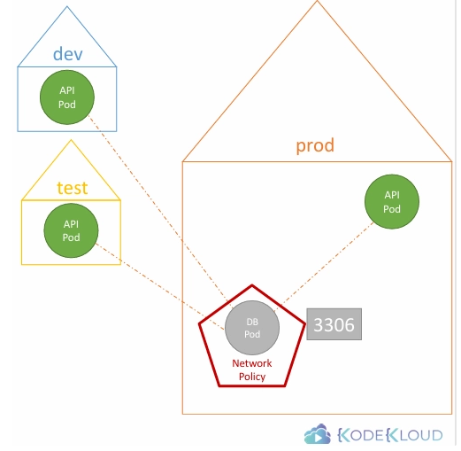
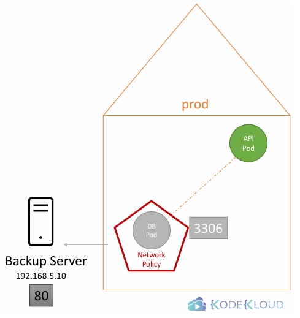

## 기본 예시: Web App + API + Database

- Web Server (Frontend)
- API Server (Backend)
- Database Server

### 트래픽 흐름

1. 사용자가 Web Server의 **port 80**으로 요청
2. Web Server는 API Server의 **port 5000**으로 요청
3. API Server는 Database Server의 **port 3306**으로 데이터를 요청
4. Database → API → Web → 사용자 순으로 응답이 반환

---

## Ingress vs Egress

- **Ingress**: 들어오는 트래픽
- **Egress**: 나가는 트래픽

### Web Server 관점

- 사용자 → Web Server (80) → **Ingress**
- Web Server → API Server (5000) → **Egress**

### API Server 관점

- Web → API (5000) → Ingress
- API → DB (3306) → Egress

### Database 관점

- API → DB (3306) → Ingress

# Kubernetes에서의 네트워크 보안

- 여러 Node, Pod, Service는 각각 IP를 가짐
- Kubernetes 네트워크 기본 조건
    - **`모든 Pod는 별도의 라우팅 설정 없이 서로 통신 가능해야 한다.`**
- 모든 Pod가 하나의 가상 네트워크(VPN) 안에 있다
- Pod는 IP, Pod 이름, Service 이름으로 서로 통신할 수 있다
- 기본 동작: `All Allow` (default)
    - 모든 Pod는 클러스터 내 다른 Pod 및 Service와 통신 가능

---

# Network Policy

- Pod, ReplicaSet, Service와 같은 네임스페이스 오브젝트
- Network Policy는 특정 Pod에 연결
    - 특정 Pod에 대해 허용할 트래픽 규칙을 정의

---

## Network Policy 연결 방식

- Labels
- Selectors
- ingress에 대해 api-pod로부터만 오는 것을 허용
    - 아래 예시는 policyTypes에 ingress만 있음
    - 따라서 다른 policy type (ex: Egress)같은 경우는 여전히 all allow임

```yaml
apiVersion: networking.k8s.io/v1
kind: NetworkPolicy
metadata:
  name: db-policy
spec:
  podSelector:
    matchLabels:
      role: db
  policyTypes:
    - Ingress
  ingress:
    - from:
        - podSelector:
            matchLabels:
              role: api-pod
      ports:
        - protocol: TCP
          port: 3306
```

- 모든 네트워크 솔루션이 Network Policy를 지원하는 것은 아님
- 지원
    - kube-router
    - Calico
    - Romana
    - Weave Net

---

## 주의 사항

- 네트워크 플러그인이 Network Policy를 지원하지 않는 경우
    - Policy는 생성 가능
    - 에러도 발생하지 않음
    - 하지만 실제로는 적용되지 않음
- 따라서 반드시 사용 중인 네트워크 솔루션의 문서를 확인해야 한다

# Developing Networking Policies

- 한 번 ingress로 들어오는 트래픽을 허용하면, 그 트래픽에 대한 응답(reply)은 자동으로 허용
- API 서버의 요청을 받는 DB 서버는 Ingress만 허용하면 응답은 자동으로 됨

---

## podSelector

```yaml
apiVersion: networking.k8s.io/v1
kind: NetworkPolicy
metadata:
  name: db-policy
spec:
  podSelector:
    matchLabels:
      role: db
  policyTypes:
    - Ingress
  ingress:
    - from:
        - podSelector:
            matchLabels:
              role: api-pod
      ports:
        - protocol: TCP
          port: 3306
```

- api-pod만 ingress 허용 → 모든 네임스페이스에서 api-pod인 경우 포함



---

## namespaceSelector

```yaml
  ingress:
    - from:
        - podSelector:
            matchLabels:
              role: api-pod
          namespaceSelector:
            matchLabels:
              name: prod
      ports:
        - protocol: TCP
          port: 3306
```

- prod namespace에 있는 api-pod만 허용
- 만약 podSelector가 없이 namespaceSelector만 있다면 해당 namespace에 있는 pod만 허용

---

## ipBlock

- 클러스터 외부에서의 연결 허용
    - backup server는 Kubernetes 클러스터 내부에 배포된 Pod가 아니므로 지정 불가
    - 이 경우 ip로 접근

```yaml
  ingress:
    - from:
        - podSelector:
            matchLabels:
              role: api-pod
          namespaceSelector:
            matchLabels:
              name: prod
          ipBlock:
            cidr: 192.168.5.10/32 # ip 대역 입력
      ports:
        - protocol: TCP
          port: 3306
```



- 이 selector들은 egress의 to 섹션에서도 동일하게 적용