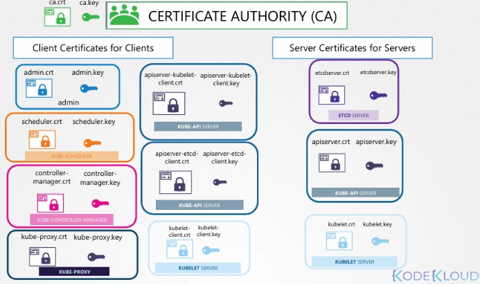

- certificates 3종류
    - server certificates(서버에 설정)
    - root certificate(CA 서버에 설정)
    - client certificates(클라이언트에 설정)

## 파일 이름 규칙

- public key를 포함한 certificate 파일
    - 확장자 `.crt` 또는 `.pem`
    - 예: `server.crt`, `server.pem`, `client.crt`, `client.pem`
- private key 파일
    - 확장자 `.key`
    - 또는 파일명에 key 포함
    - 예: `server.key`, `server-key.pem`
- 파일명에 key가 들어 있으면 보통 private key
- key가 없으면 보통 public key/certificate

## Kubernetes에서 TLS가 필요한 이유

- 여러 개의 마스터 노드와 워커 노드로 구성 → **`모든 통신에 안정성 보장 및 암호화가 목적`**
- 노드 간 통신 암호화
- 서비스와 클라이언트 간 암호화
- 클러스터 내부 컴포넌트 간 통신 암호화

## Kubernetes 컴포넌트의 서버/클라이언트 관계

### kube-apiserver

- kube-apiserver는 HTTPS 서비스를 제공
- 다른 컴포넌트와 외부 사용자가 이 HTTPS로 클러스터를 관리
- kube-apiserver는 server 역할
- 클라이언트와의 통신 보호를 위한 certificate/key pair 필요
    - `apiserver.crt`
    - `apiserver.key`

### etcd server

- etcd server는 클러스터 정보 저장
- etcd server도 server 역할
- certificate/key pair 필요
    - `etcdserver.crt`
    - `etcdserver.key`

### kubelet

- worker node의 kubelet 서비스는 HTTPS API endpoint 제공
- kube-apiserver가 kubelet과 통신하여 worker node와 상호작용
- kubelet도 server 역할
    - `kubelet.crt`
    - `kubelet.key`

## 클라이언트 컴포넌트

### 관리자(admin)

- kube-apiserver에 접근하는 클라이언트
    - kubectl
    - REST API
- admin 사용자도 client certificate/key pair 필요
    - `admin.crt`
    - `admin.key`

### kube-scheduler

- kube-apiserver에 접근하는 클라이언트
- kube-apiserver 관점에서는 admin과 같은 클라이언트
    - `scheduler.crt`
    - `scheduler.key`

### kube-controller-manager

- kube-apiserver에 접근하는 클라이언트
    - `controller-manager.crt`
    - `controller-manager.key`

### kube-proxy

- kube-apiserver에 접근하는 클라이언트
    - `kube-proxy.crt`
    - `kube-proxy.key`

## 서버 간 통신에서의 클라이언트 역할

- client certificates
    - 주로 kube-apiserver에 연결하는 클라이언트들이 사용
- server certificates
    - kube-apiserver
    - etcd server
    - kubelet
    - 각 서버가 클라이언트에게 자신을 증명하는 데 사용
- 서버 컴포넌트끼리도 통신 존재

### kube-apiserver → etcd

- etcd server에 연결하는 컴포넌트는 kube-apiserver뿐
- **etcd 관점에서 kube-apiserver는 client**
- kube-apiserver는 etcd에 대해 인증 필요
- kube-apiserver가 기존 `apiserver.crt/apiserver.key`를 재사용 가능
- 또는 etcd 접근 전용으로 새 certificate/key pair 발급 가능

### kube-apiserver → kubelet

- kube-apiserver가 각 노드의 kubelet server와 통신
- worker node 모니터링에 사용
- 기존 certificate 재사용 가능
- 또는 kubelet 접근 전용 새 certificate 발급 가능

## CA 구성

- Kubernetes 클러스터는 최소 1개의 CA 필요
- CA를 여러 개 둘 수도 있음
    - 클러스터 컴포넌트용 CA
    - etcd 전용 CA
- etcd 전용 CA를 쓰는 경우
    - etcd server certificate는 etcd CA가 서명
    - etcd에 접근하는 클라이언트 certificate(예: kube-apiserver의 etcd client certificate)도 etcd CA가 서명
- CA 자체도 certificate/key pair 보유
    - `ca.crt`
    - `ca.key`

## 최종 모습

- 하나의 클러스터에 여러 개의 인증서
- etcd 전용을 위한 인증서
- ca 자체 key pair

