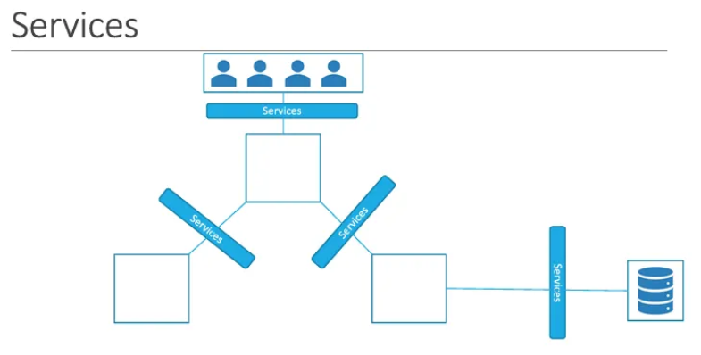
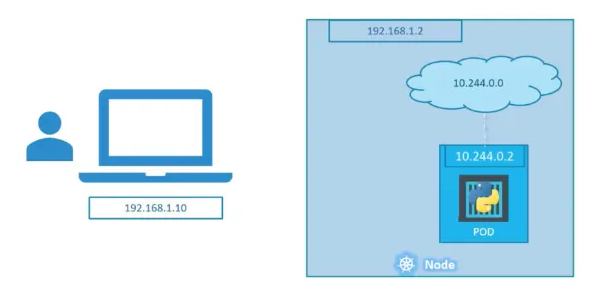
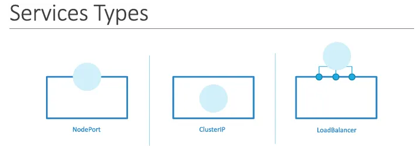
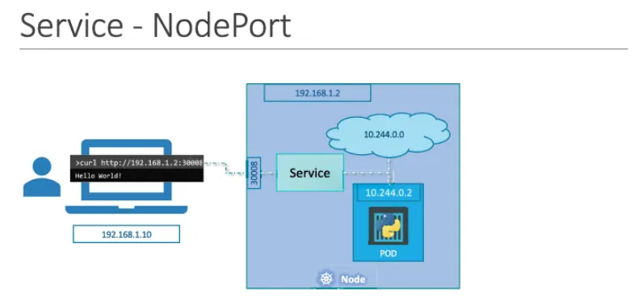
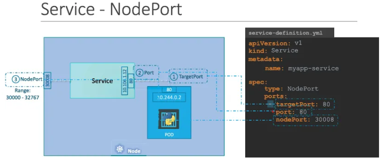
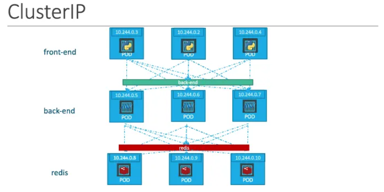

## 쿠버네티스 서비스(Services) 상세 정리

쿠버네티스 서비스는 애플리케이션 내부 및 외부의 다양한 구성 요소 간 통신을 가능하게 하는 객체

### 1. 서비스의 역할 및 마이크로서비스 연결

- 구성 요소 간 연결: 프론트엔드 포드 그룹, 백엔드 프로세스 그룹, 외부 데이터 소스 그룹 간의 통신을 연결함
- 외부 노출: 프론트엔드 애플리케이션을 엔드 유저에게 가동 가능하게 함
- 느슨한 결합(Loose Coupling): 마이크로서비스 간의 복잡한 연결을 단순화하고 유연하게 만듦



### 2. 네트워킹 시나리오와 외부 접근의 필요성

- **예시:**



    - 쿠버네티스 노드 IP: `192.168.1.2`
    - 사용자 노트북 IP: `192.168.1.1` (동일 네트워크)
    - 내부 포드 네트워크 범위: `10.244.0.0/16`
    - 포드 IP: `10.244.0.2`
- **접근의 한계:** 노트북에서 별도의 네트워크에 있는 포드 IP(`10.244.0.2`)로 직접 핑을 보내거나 접근하는 것은 불가능함
- **접근 방법의 대안:**
    1. 노드에 SSH로 접속 후 `curl` 또는 브라우저로 포드 IP에 접근 (노드 내부에서만 가능하므로 불편함)
    2. 노드 IP를 통해 직접 웹 서버에 접근할 수 있도록 중간에서 요청을 매핑해주는 장치 필요 (쿠버네티스 서비스의 역할)

### 3. 서비스의 주요 유형 (Service Types)



1. **NodePort:** 노드의 특정 포트를 개방하여 외부 사용자가 포드에 접근할 수 있도록 함
2. **ClusterIP:** 클러스터 내부에 가상 IP를 생성하여 프론트엔드와 백엔드 등 서비스 간 통신을 가능하게 함
3. **LoadBalancer:** 지원되는 클라우드 환경에서 로드 밸런서를 프로비저닝하여 부하를 분산함

### 4. NodePort

노드의 포트와 포드의 포트를 매핑하는 역할을 수행하며 세 가지 포트 개념이 존재함



- 그림에서 `30008이 NodePort`
- **Target Port:** 실제 웹 서버가 실행되는 포드 내부의 포트 (예: 80)
- **Port:** 서비스 객체 자체의 포트 (서비스는 노드 내부의 가상 서버와 같으며 자체 IP인 Cluster IP를 가짐)
- **NodePort:** 외부에서 노드 IP를 통해 접근할 때 사용하는 포트 (기본 범위: 30,000 ~ 32,767)

### 5. 서비스 정의 및 YAML 구성 방식

- **필수 필드:** `apiVersion(v1)`, `kind(Service)`, `metadata`, `spec`
- **Port 설정의 특징:**
    - `port` 필드만 필수 항목임
    - `targetPort` 미지정 시 `port`와 동일한 값으로 간주됨
    - `nodePort` 미지정 시 유효 범위 내의 빈 포트가 자동 할당됨
    - `ports`는 배열( 사용)이므로 하나의 서비스에 여러 개의 포트 매핑 정의 가능
- **Selector:** 서비스와 포드를 연결하기 위해 포드 정의서에 사용된 라벨을 `selector` 섹션에 동일하게 입력해야 함

```yaml
apiVersion: v1
kind: Service
metadata:
  name: myapp-service
spec:
  type: NodePort
  ports:
    - targetPort: 80
      port: 80
      nodePort: 30008
  selector:
    app: myapp
    type: front-end
```



### 6. 다중 포드 및 멀티 노드 환경에서의 서비스

- **자동 로드 밸런싱:** 동일한 라벨을 가진 포드가 여러 개일 경우 서비스는 이를 모두 엔드포인트로 선택함
- **알고리즘:** 외부 요청을 전달할 때 **랜덤(Random)** 알고리즘을 사용하여 포드 간 부하를 분산함
- **멀티 노드 확장:** 포드가 클러스터 내 여러 노드에 분산되어 있어도 서비스는 클러스터 전체에 걸쳐 생성됨
- **접근 유연성:** 클러스터 내 어떤 노드의 IP와 동일한 NodePort를 사용하더라도 쿠버네티스가 내부적으로 매핑하여 포드에 도달하게 함
- **적응성:** 포드가 추가되거나 제거될 때 서비스가 실시간으로 업데이트되어 별도의 추가 설정이 필요 없음

# Cluster IP

### 1. 내부 통신의 문제점

- **포드 IP의 비영속성:** 모든 포드는 IP를 할당받지만, 포드는 언제든 삭제되고 새로 생성될 수 있음. 이때 IP가 변경되므로 포드 간 직접 통신은 신뢰할 수 없음
- **부하 분산 문제:** 프론트엔드 포드가 여러 개의 백엔드 포드 중 어느 곳으로 요청을 보내야 할지 결정하는 장치가 필요함
- **해결책:** 쿠버네티스 서비스를 통해 포드 그룹을 하나로 묶고, 해당 그룹에 접근할 수 있는 단일 인터페이스(단일 IP 및 이름)를 제공함
    - 단일 인터페이스란 아래의 그림과 같이, 여러 개의 파드가 하나의 인터페이스를 바라보도록 한다는 것



---

### 2. ClusterIP의 특징

- **내부 전용 IP:** 클러스터 내부에서만 접근 가능한 가상 IP를 할당받음
- **단일 엔드포인트:** 여러 개의 백엔드 포드가 있더라도 서비스는 하나의 이름과 IP로 노출됨
- **랜덤 부하 분산:** 서비스로 들어온 요청은 연결된 포드들 중 하나로 랜덤하게 전달됨
- **마이크로서비스 최적화:** 각 계층(프론트엔드, 백엔드, 데이터베이스 등)이 서로의 개별 IP를 몰라도 서비스 이름을 통해 통신할 수 있어 유연한 스케일링이 가능함

---

### 3. ClusterIP 서비스 정의 및 YAML 구조

- **기본 설정:** `type`을 `ClusterIP`로 설정. 참고로 `ClusterIP`는 서비스의 기본값이므로 명시하지 않아도 자동으로 이 유형으로 생성됨
- **포드 연결:** `selector`를 사용하여 특정 라벨을 가진 포드들을 서비스에 묶음

```yaml
apiVersion: v1
kind: Service
metadata:
  name: backend        # 다른 포드들이 접근할 서비스 이름
spec:
  type: ClusterIP      # 생략 가능 (기본값)
  ports:
    - targetPort: 80   # 백엔드 포드가 수신하는 실제 포트
      port: 80         # 서비스가 클러스터 내부에서 노출할 포트
  selector:            # 연결할 포드의 라벨 매칭
    app: myapp
    type: back-end
```

---

### 4. 서비스 접근 방법

클러스터 내의 다른 포드들은 다음 두 가지 방식으로 서비스를 호출함

1. **Cluster IP:** 서비스에 할당된 가상 IP 주소 사용
2. **서비스 이름 (Service Name):** 쿠버네티스 내부 DNS 시스템을 통해 서비스 이름으로 직접 통신 (예: `http://backend`)

# Load Balancer

### 1. NodePort 서비스의 한계점

- **접근성 문제:** NodePort를 사용하면 클러스터 내 모든 노드의 IP와 해당 포트를 통해 앱에 접근 가능함 (예: `http://192.168.1.70:30004`, `http://192.168.1.71:30004` 등)
    - 즉 노드가 여러 개일 때 모든 노드의 ip를 사람이 직접 쳐서 들어가야 하는 불편함
- **사용자 경험 저하:** 엔드 유저는 여러 개의 IP와 복잡한 포트 번호가 아닌, `http://voting-app.com`과 같은 **단일 URL**을 통해 접속하기를 원함
- **관리 복잡성:** 이를 해결하기 위해 별도의 VM을 생성하고 HAProxy나 Nginx 같은 로드 밸런서를 수동으로 설치/구성하여 노드들로 트래픽을 라우팅하는 작업은 매우 번거롭고 유지보수가 어려움

---

### 2. LoadBalancer 서비스의 개념

- **클라우드 통합:** 지원되는 클라우드 플랫폼에서 제공하는 **네이티브 로드 밸런서**와 쿠버네티스를 통합함
- **자동 프로비저닝:** 서비스 유형을 `LoadBalancer`로 설정하면 쿠버네티스가 클라우드 제공자에게 요청하여 외부 로드 밸런서를 자동으로 생성하고 구성함
- **단일 엔드포인트:** 클라우드 로드 밸런서가 생성되면 외부에서 접근 가능한 단일 IP를 할당받으며, 이 IP가 클러스터 내의 노드들로 트래픽을 분산함

---

### 3. LoadBalancer 서비스 정의 및 YAML 구조

- **작성 방법:** 정의 파일에서 `spec.type` 필드를 `LoadBalancer`로 지정함
- **동작 원리:** 클라우드 환경이 아닐 경우(예: VirtualBox 등 로컬 환경) `LoadBalancer` 유형은 자동으로 `NodePort`와 동일하게 작동하며 외부 로드 밸런서는 구성되지 않음

```yaml
apiVersion: v1
kind: Service
metadata:
  name: voting-service
spec:
  type: LoadBalancer    # 서비스 유형을 LoadBalancer로 설정
  ports:
    - targetPort: 80
      port: 80
  selector:
    app: voting-app
```

---

### 4. 환경별 동작 차이

- **지원되는 클라우드(GCP, AWS, Azure 등):** * 클라우드 업체가 제공하는 외부 로드 밸런서가 생성됨
    - 외부 접근용 IP(External IP)가 할당되어 편리하게 접근 가능함
- **미지원 환경(로컬 개발 환경, 온프레미스 등):**
    - `NodePort`와 똑같이 작동함
    - 노드의 높은 번호 포트(30000-32767)를 통해 서비스가 노출되지만, 외부 로드 밸런서 구성 단계는 생략됨