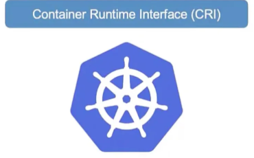
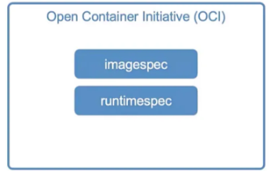

# 도커에서 CRI로

- 컨테이너 초기 기술에는 도커와 rkt같은 도구들이 있었음
- 쿠버네티스는 **초기에 도커를 오케스트레이션하기위해 만들어짐**
- 그래서 쿠버네티스는 다른 컨테이너 솔루션은 지원하지 않았음

## CRI(Container Runtime Interface)

- 다른 컨테이너와의 작업을 위해 표준 인터페이스인 CRI를 도입
    - 벤더와 상관없이 OCI 표준만 준수하면 쿠버네티스 런타임으로 작동할 수 있게 해주는 인터페이스
    - OCI(Open Container Initiative) 표준의 2가지
        - image spec : 이미지가 어떻게 만들어져야 하는지에 대한 규격
        - runtime spec : 컨테이너 런타임이 어떻게 개발되어야 하는지에 대한 규격
        - 

## Dockershim

- 도커는 CRI 표준이 나오기 훨씬 전에 만들어졌기에 쿠버네티스의 CRI를 만족하지 않음
- 따라서 k8s에서 Dockershim이라는 것을 만들어 CRI 외부에서 지원하였음
- Docker에서 실제 컨테이너를 실행하는 핵심은 runC와 이를 관리하는 containerd라는 개념
- 후에 dockershim은 여러 문제로 삭제되었고 도커 이미지는 OCI 표준을 따르며 containerd에서 문제없이 작동함

## 컨테이너 관리 CLI 도구

### ctr (containerd 전용 디버깅 도구)

- **특징:** 컨테이너디 **디버깅용**으로만 제작, 사용자 친화적이지 않으며 기능이 매우 제한적
- **사용법:**
    - 이미지 풀: **ctr images pull [이미지 주소]**
    - 컨테이너 실행: **ctr run [이미지 주소]**
- **결론:** 프로덕션 환경용이 아니며, 일반적인 상황에서는 거의 무시

### nerdctl (일반 목적의 도커 스타일 CLI)

- **특징:** **도커와 매우 유사한 CLI,** 도커 명령어를 거의 그대로 사용할 수 있으며(docker 대신 **nerdctl** 입력), 도커가 지원하지 않는 최신 기능을 지원
- **지원 기능:** 암호화된 이미지, 레이지 풀링(Lazy pulling), P2P 이미지 배포, 이미지 서명 및 검증, 쿠버네티스 네임스페이스 등을 지원
- **사용법:** nerdctl run, nerdctl run -p 80:80 등 도커와 동일하게 작동

### crictl (쿠버네티스 커뮤니티의 디버깅 도구)

- **특징:** 특정 런타임(containerd 전용 등)이 아니라 모든 CRI 호환 런타임에서 작동
- **주의사항:** 컨테이너를 생성할 수는 있지만, **Kubelet과 함께 작동**.
    - 만약 Kubelet 모르게 crictl로 컨테이너를 만들면, Kubelet이 이를 인지하지 못하고 삭제해 버릴 수 있음, 따라서 오직 **디버깅 목적**으로만 사용해야함
- **주요 명령어:**
    - 이미지 목록: crictl images
    - 컨테이너 목록: crictl ps (도커와 유사)
    - 명령어 실행: crictl exec -it [컨테이너ID] [명령어]
    - 로그 확인: crictl logs
    - 포트 확인: crictl ports (도커는 인식하지 못했던 기능)