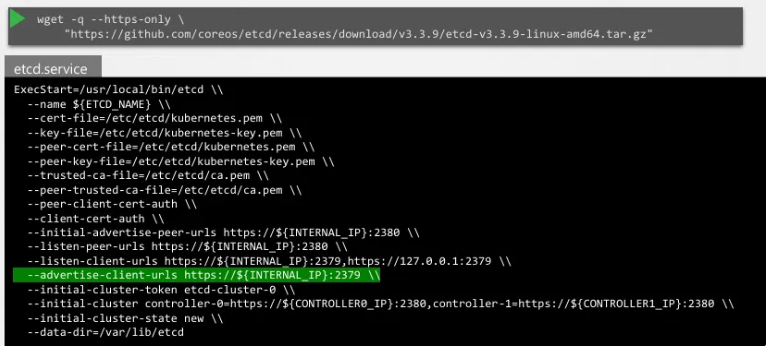
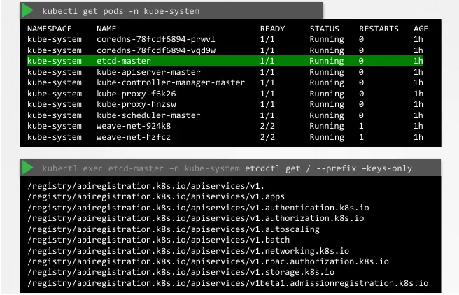
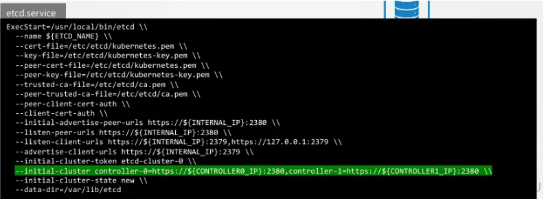

## 쿠버네티스 내 etcd의 역할

- **key - value** 스토리지이며 클러스터에 대한 모든 정보를 저장하는 데이터 저장소
- **저장 정보:** 노드(Nodes), 포드(Pods), 설정(Configs), 비밀 정보(Secrets), 계정(Accounts), 역할(Roles), 역할 바인딩(Role Bindings) 등 클러스터의 모든 데이터를 포함함
- **정보의 근원:** `kubectl get` 명령어를 실행했을 때 보이는 모든 정보는 실제로는 etcd 서버에서 가져오는 것임
- **변경 완료의 기준:** 클러스터에 노드를 추가하거나 포드, 레플리카셋을 배포하는 등의 모든 변경 사항은 **etcd 서버에 업데이트가 완료되어야만** 해당 변경이 완료된 것으로 간주됨

## 쿠버네티스 설치 방식에 따른 etcd 배포

- 설치 방식에 따라 etcd가 배포되는 방식이 달라짐

### 처음부터 직접 설치하는 경우 (Manual/From Scratch)

- etcd 바이너리를 직접 다운로드하고 설치하여 마스터 노드에 서비스(Service) 형태로 직접 구성함

  

- 실행 시 많은 옵션이 전달되는데, 상당수는 **TLS 인증서**와 관련된 것임
- **주요 옵션 - Advertise Client URL:** etcd가 클라이언트의 요청을 기다리는 주소임 (기본적으로 서버 IP의 2379 포트 사용)
- 이 URL은 kube-apiserver가 etcd 서버에 접속할 때 사용되도록 설정되어야 함

### kubeadm을 사용하여 설치하는 경우

- kubeadm은 etcd 서버를 `kube-system` 네임스페이스 내에 **포드(Pod)** 형태로 자동으로 배포함
- 이 경우 해당 포드 내에서 `etcdctl` 유틸리티를 사용하여 데이터베이스를 탐색할 수 있음

## etcd 데이터 구조 및 관리

쿠버네티스는 데이터를 특정 디렉터리 구조로 관리함

- **루트 디렉터리:** `/registry` 경로 아래에 데이터가 저장됨
- **하위 디렉터리:** 레지스트리 아래에 `minions`(노드), `pods`, `replicasets`, `deployments` 등 다양한 쿠버네티스 리소스들이 디렉터리 형태로 존재함
- **키 리스팅:** 모든 키를 나열하려면 `etcdctl get / --prefix --keys-only`와 같은 명령어를 사용함

## 고가용성(High Availability) 환경에서의 etcd

클러스터에 마스터 노드가 여러 개인 HA 환경에서는 etcd 인스턴스도 여러 개 실행됨

- **상호 인지:** 여러 etcd 인스턴스가 서로를 알 수 있도록 서비스 설정에서 올바른 매개변수를 지정해야 함
- **initial-cluster 옵션:** 이 옵션을 통해 클러스터를 구성하는 각 etcd 서비스 인스턴스들의 주소를 명시함

