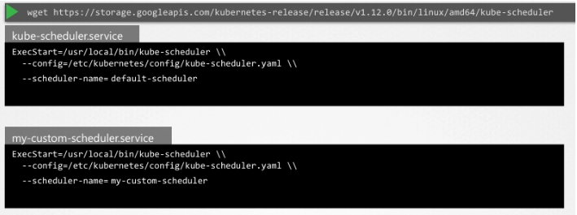

- 기본 스케줄러가 Pod를 노드에 고르게 분산시키는 알고리즘 보유하고 있고, 다양한 조건을 함께 고려할 수 있다
    - taints와 tolerations, node affinity 등으로 조건 지정 가능
- 그러나 기본 스케줄러가 제공하는 기능으로 충족되지 않는 경우에는?
    - 특정 애플리케이션이 추가 검사 수행 후에만 노드 배치가 필요한 경우 가정
- `custom scheduler`를 이용할 수 있다

## 다중 스케줄러

- 자체 Kubernetes Scheduler 프로그램 작성 가능
- 작성한 스케줄러 패키징과 배포 가능
- 작성한 스케줄러를 기본 스케줄러로 배포 가능
- 작성한 스케줄러를 추가 스케줄러로 배포 가능
- 일반 애플리케이션은 기본 스케줄러 사용 가능
- 특정 애플리케이션은 커스텀 스케줄러 사용 가능
- 하나의 클러스터에서 여러 스케줄러 동시 운영 가능
- Pod 또는 Deployment 생성 시 특정 스케줄러로 스케줄링 지시 가능

## 스케줄러 이름과 설정 파일

- 여러 스케줄러 사용 시 `서로 다른 이름` 필요
- 기본 스케줄러 이름은 `default-scheduler`
- kube-scheduler 설정 파일에서 이름 구성 가능

```bash
# kube-scheduler.serivce
ExecStart=/usr/local/bin/kube-scheduler
      --config=/etc/kubernetes/config/kube-scheduler.yaml
      --scheduler-name=default-scheduler
```

- 이름을 지정하지 않으면 기본값이 default-scheduler로 설정되는 동작
- 이름을 명시한 설정 파일 형태 예시 필요

```yaml
apiVersion: kubescheduler.config.k8s.io/v1
kind: KubeSchedulerConfiguration
profiles:
  - schedulerName: default-scheduler
```

- 추가 스케줄러는 별도 설정 파일 생성 필요
- 설정 파일에 schedulerName을 커스텀 이름으로 지정 필요

```yaml
apiVersion: kubescheduler.config.k8s.io/v1
kind: KubeSchedulerConfiguration
profiles:
  - schedulerName: my-custom-scheduler
```

## 스케줄러를 바이너리 다운로드 하여 배포하는 방식

- kube-scheduler 바이너리를 다운로드하고 서비스로 실행하는 방식 사용 가능
- kubeadm 배포에서는 컨트롤 플레인 컴포넌트가 클러스터 내부에서 Pod 또는 Deployment로 실행되는 구조



## 스케줄러를 파드로 배포하는 방식

- 스케줄러를 Pod로 배포하는 방식 확인
- Pod 정의 파일 생성 필요
- kubeconfig는 **Kubernetes API 서버 연결을 위한 인증 정보 포함 경로**
- 커스텀 kube-scheduler 설정 파일을 config 옵션으로 전달 필요
- schedulerName은 설정 파일 내부 값으로 스케줄러가 인식하는 방식

```yaml
apiVersion: v1
kind: Pod
metadata:
  name: my-custom-scheduler
  namespace: kube-system
spec:
  containers:
    - name: my-custom-scheduler
      image: k8s.gcr.io/kube-scheduler-amd64:v1.11.3
      command:
        - kube-scheduler
        - --kubeconfig=/etc/kubernetes/scheduler.conf
        - --config=/etc/kubernetes/my-scheduler-config.yaml
```

```yaml
# my-scheduler-config
apiVersion: kubescheduler.config.k8s.io/v1
kind: KubeSchedulerConfiguration
profiles:
  - schedulerName: my-custom-scheduler
leaderElection:
  leaderElect: true
  resourceNamespace: kube-system
  resourceName: lock-object-my-scheduler
```

## Leader Elect 옵션

- 여러 마스터 노드에 동일 스케줄러가 복수 실행되는 상황에서
    - 동일 스케줄러 복수 실행 시 한 번에 하나만 active 가능
    - 이 때를 위해 리더 선출 기능을 활성화할 수 있음
- 공식문서

  Update the following fields for the KubeSchedulerConfiguration in the `my-scheduler-config` ConfigMap in your YAML file:

    - `leaderElection.leaderElect` to `true`
    - `leaderElection.resourceNamespace` to `<lock-object-namespace>`
    - `leaderElection.resourceName` to `<lock-object-name>`

## 스케줄러를 Deployment로 배포 방식

```yaml
apiVersion: apps/v1
kind: Deployment
metadata:
  name: my-custom-scheduler
  namespace: kube-system
spec:
  replicas: 1
  selector:
    matchLabels:
      app: my-custom-scheduler
  template:
    metadata:
      labels:
        app: my-custom-scheduler
    spec:
      containers:
        - name: kube-scheduler
          image: my-custom-kube-scheduler:latest
          command:
            - kube-scheduler
            - --kubeconfig=/etc/kubernetes/scheduler.conf
            - --config=/etc/kubernetes/my-scheduler-config.yaml
          volumeMounts:
            - name: scheduler-config
              mountPath: /etc/kubernetes/my-scheduler-config.yaml
              subPath: my-scheduler-config.yaml
      volumes:
        - name: scheduler-config
          configMap:
            name: my-scheduler-config 
```
- Deployment 방식에서 추가 전제 조건 존재
    - service account와 cluster role bindings 필요 (아직 강의에서 본격적으로 다루지 않는 내용)
    - 목적은 인증 처리
- 로컬 파일을 volume mount로 또는 ConfigMap 생성 후 volume으로 전달 가능
- ConfigMap에 schedulerName 포함 구성
- ConfigMap 내용이 volume으로 매핑되어 특정 경로에 파일로 제공되는 구조

```yaml
apiVersion: v1
data:
  my-scheduler-config.yaml: |
    apiVersion: kubescheduler.config.k8s.io/v1
    kind: KubeSchedulerConfiguration
    profiles:
      - schedulerName: my-scheduler
    leaderElection:
      leaderElect: false
kind: ConfigMap
metadata:
  creationTimestamp: null
  name: my-scheduler-config
  namespace: kube-system
```

## 배포 확인

- kube-system 네임스페이스에서 get pods 실행 시 커스텀 스케줄러 확인 가능

```bash
kubectl get pods -n kube-system
```

## Pod 또는 Deployment에서 특정 스케줄러 사용

- 커스텀 스케줄러 배포 후 Pod/Deployment에 스케줄러 지정 필요
- Pod 정의 파일에 schedulerName 필드 추가 필요
- schedulerName에 스케줄러 이름 지정 필요
- Pod 생성 시 지정된 스케줄러가 선택되어 스케줄링 수행
- 스케줄러 구성이 잘못되면 Pod가 `Pending` 상태로 유지
    - describe로 확인하면 원인 다 알 수 있다

```yaml
apiVersion: v1
kind: Pod
metadata:
  name: test-pod
spec:
  schedulerName: my-custom-scheduler
  containers:
    - name: app
      image: nginx
```

## 어떤 스케줄러가 처리했는지 확인

- 여러 스케줄러 환경에서 특정 Pod를 어떤 스케줄러가 스케줄링했는지 확인 필요
- kubectl get events -o wide로 이벤트 목록 조회 가능

```bash
kubectl get events -o wide
```

## 스케줄러 로그 확인

- 문제 발생 시 스케줄러 로그 확인 가능
- kubectl logs로 스케줄러 Pod 또는 Deployment 대상 로그 조회 가능
- 올바른 네임스페이스 지정 필요

```bash
kubectl logs -n kube-system <scheduler-pod-name>
```