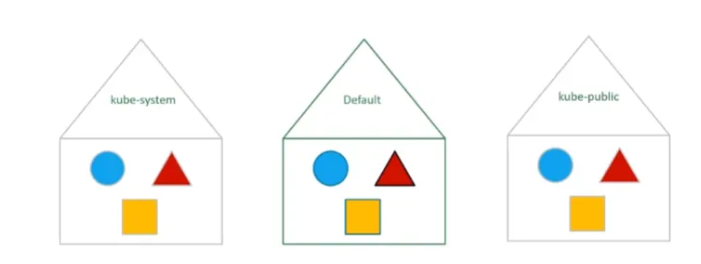
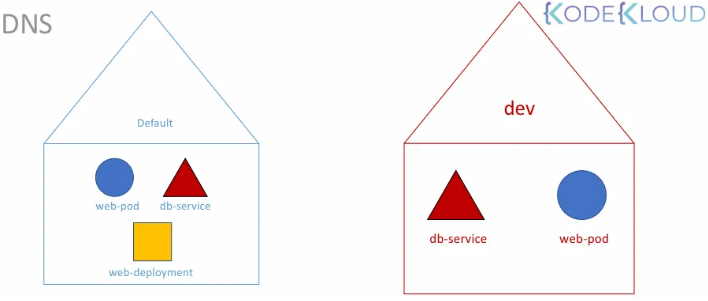

### 1. 네임스페이스의 개념 및 비유

- **비유:** 성이 다른 두 명의 '마크(Mark)'가 서로 다른 집(Smith가, Williams가)에 사는 것과 같음
    - **집 내부:** 서로를 '마크'라는 이름으로 부름(네임스페이스 내부 통신)
    - **집 외부:** 다른 집의 마크를 부를 때는 '마크 스미스'처럼 전체 이름을 사용함(네임스페이스 간 통신)
- **정의:** 하나의 물리적 클러스터 내에서 리소스(포드, 서비스 등)를 **논리적으로 구분**하는 가상 클러스터

---

### 2. 기본 네임스페이스 종류

쿠버네티스 설치 시 자동으로 생성되는 주요 네임스페이스

- **default:** 별도의 네임스페이스를 지정하지 않고 생성한 모든 오브젝트가 위치하는 기본 장소
- **kube-system:** 클러스터 내부 운영에 필요한 핵심 포드 및 서비스(네트워킹, DNS 등)가 위치함 사용자의 실수로 인한 삭제나 수정을 방지하기 위해 분리되어 있음
- **kube-public:** 모든 사용자에게 공개되어야 하는 리소스가 생성되는 장소



---

### 3. 네임스페이스 사용 이유 및 장점

작은 규모에서는 `default`만 써도 무방하나, 기업용이나 운영 환경에서는 사용을 권장함

- **환경 격리:** 동일 클러스터에서 개발(Dev)과 운영(Prod) 환경을 분리하여 사고 방지
- **리소스 할당(Quota):** 각 네임스페이스별로 사용할 수 있는 CPU, 메모리, 포드 개수 등의 제한량을 설정하여 자원 독점을 방지
- **정책 적용:** 네임스페이스별로 누가 어떤 작업을 할 수 있는지 정의하는 권한 정책을 다르게 적용 가능

---

### 4. 네임스페이스 간 통신 및 DNS 구조

- **동일 네임스페이스 내:** 서비스 이름만으로 직접 접근 가능 (예: `db-service`)
- **다른 네임스페이스 접근:** `서비스이름.네임스페이스.svc.cluster.local` 형식을 사용
    - 예: `db-service.dev.svc.cluster.local`
    - **DNS 구성:** `cluster.local`은 클러스터의 기본 도메인, `svc`는 서비스 서브도메인, 그 앞은 각각 네임스페이스와 서비스 이름임



---

### 5. 주요 관리 명령어

- **오브젝트 조회:** `kubectl get pods --namespace=kube-system`
- **전체 네임스페이스 조회:** `kubectl get pods --all-namespaces`
- **네임스페이스 생성:**
    - 명령어 방식: `kubectl create namespace dev`
    - YAML 방식: `kubectl create -f namespace-dev.yaml`
- **네임스페이스 영구 전환:** 매번 옵션을 붙이지 않도록 현재 컨텍스트의 기본 네임스페이스를 변경
    - `kubectl config set-context --current --namespace=dev`

---

### 6. 관련 YAML 정의 예시

### **네임스페이스 정의**

```yaml
apiVersion: v1
kind: Namespace
metadata:
  name: dev
```

### **특정 네임스페이스에 포드 생성**

- 메타데이터 섹션에 `namespace`를 명시하면 항상 해당 위치에 생성됨

```yaml
apiVersion: v1
kind: Pod
metadata:
  name: myapp-pod
  namespace: dev
  labels:
    app: myapp
spec:
  containers:
  - name: nginx-container
    image: nginx
```

### **리소스 할당 제한 (Resource Quota)**

```yaml
apiVersion: v1
kind: ResourceQuota
metadata:
  name: compute-quota
  namespace: dev
spec:
  hard:
    pods: "10"
    requests.cpu: "4"
    requests.memory: "5Gi"
    limits.cpu: "10"
    limits.memory: "10Gi"
```