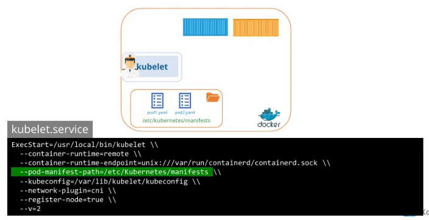
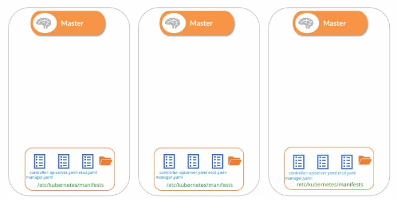

- kubelet은 보통 Control Plane의 지시를 받는다 (api서버로부터)
- 근데 api 서버도, 스케줄러도, etcd도 없는 상황에서 kubelet은 무엇을 할 수 있나?

### **1. 정적 포드의 개념 및 독립 노드 동작**

- **Control Plane 부재 시:** API 서버, 스케줄러, 컨트롤러, etcd가 없는 독립적인 호스트 환경에서도 Kubelet은 독자적으로 노드 관리 가능함
- **Kubelet의 역할:** 선박의 선장처럼 클러스터 외부에서도 독립적인 노드 운영이 가능하며, 이를 위해 Kubelet과 컨테이너 런타임(예: ContainerD)이 설치되어 있어야 함
- **지시 전달 방식:** API 서버가 없는 환경에서는 서버의 특정 디렉터리에 저장된 포드 정의 파일(YAML)을 읽어 지시를 받음

---

### **2. Kubelet의 정적 포드 관리 메커니즘**

- **포드 생성 및 유지:** 지정된 디렉터리를 주기적으로 확인하여 파일을 읽고 포드를 생성하며, 애플리케이션 충돌 시 재시작을 시도하여 생존 보장함
- **변경 및 삭제 반영:** 디렉터리 내 파일 수정 시 포드 재구성, 파일 삭제 시 포드 자동 삭제 수행함
- **범위 제한:** 오직 **포드(Pod)** 수준에서만 작동함
    - 레플리카셋, 디플로이먼트, 서비스 등은 컨트롤러 매니저 등 다른 구성 요소가 필요하므로 생성 불가

---

### **3. 설정 및 구성**

지정된 폴더를 설정하고 확인하는 두 가지 경로

- **방법 1 (직접 지정):** Kubelet 서비스 실행 시 `-pod-manifest-path` 옵션에 디렉터리 경로 전달함 (예: `/etc/kubernetes/manifests`)
    - 1.의 그림
- **방법 2 (설정 파일 이용):** `-config` 옵션으로 전달된 설정 파일 내부에 `staticPodPath` 항목으로 경로 정의함 (`kubeadm` 툴이 사용하는 방식)
- **구성 확인 절차:**

    1. Kubelet 서비스 파일에서 `pod-manifest-path` 확인
    2. 없을 경우 `config` 옵션의 설정 파일 경로 확인
    3. 해당 설정 파일 내 `staticPodPath` 확인

---

### **4. 클러스터 환경에서의 동작 및 미러 포드(Mirror Pods)**

- **단독 모드 확인:** API 서버가 없는 경우 `kubectl`을 사용할 수 없으므로 `docker ps` 등의 명령어로 컨테이너 실행 상태 확인함
- **다중 입력 수용:** Kubelet은 로컬 파일(정적 포드)과 API 서버의 HTTP 엔드포인트 요청(일반 포드)을 동시에 수용 가능함
- **미러 포드 생성:** 클러스터 환경인 경우, Kubelet은 API 서버에 읽기 전용 **미러 객체**를 생성함. 이를 통해 마스터 노드에서 `kubectl get pods`로 정적 포드 조회가 가능해짐
- **관리 특징:** 미러 포드는 읽기 전용이므로 `kubectl`로 편집이나 삭제가 불가하며, 반드시 노드 내부의 매니페스트 파일을 수정해야 함. 이름 뒤에 노드 이름이 접미사로 붙음(예: `static-pod-node01`)

---

### **5. 주요 활용 사례: 제어 평면(Control Plane) 배포**

- **구성 방식:** API Server, Controller Manager, etcd 등 제어 평면 구성 요소 자체를 정적 포드로 배포함

- **장점:** 바이너리 다운로드 및 서비스 설정의 번거로움이 없으며, 구성 요소 충돌 시 Kubelet이 자동으로 재시작하여 안정성 유지함
- **kubeadm 방식:** `kubeadm`으로 설치된 클러스터에서 `kube-system` 네임스페이스 내 제어 평면 요소들이 포드 형태로 보이는 이유가 바로 정적 포드 방식이기 때문임

---

### **6. 정적 포드 vs 데몬셋(DaemonSet) 비교**

| 구분 | 정적 포드 (Static Pods) | 데몬셋 (DaemonSet) |
| --- | --- | --- |
| **관리 주체** | Kubelet이 직접 관리 | 데몬셋 컨트롤러가 API 서버를 통해 관리 |
| **개입 요소** | API 서버 및 제어 평면 개입 없음 | API 서버 및 제어 평면 필수 |
| **용도** | 제어 평면 구성 요소 배포 등 | 클러스터 전체 노드에 에이전트 배포 등 |
| **공통점** | **쿠버네티스 스케줄러(Kube Scheduler)의 영향을 받지 않음** | - |