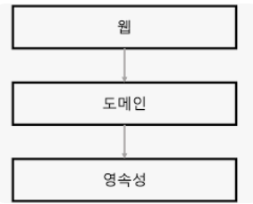
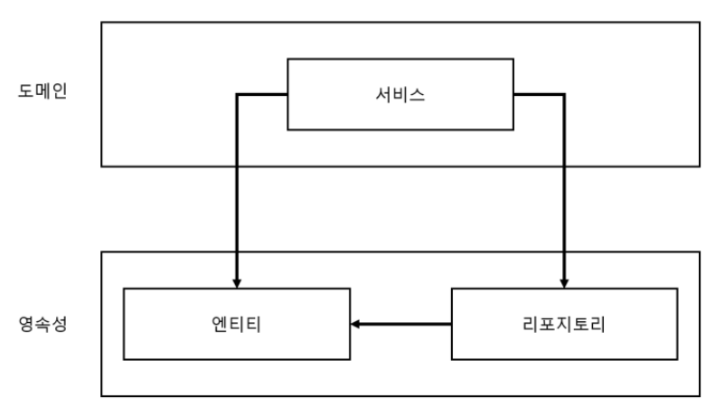
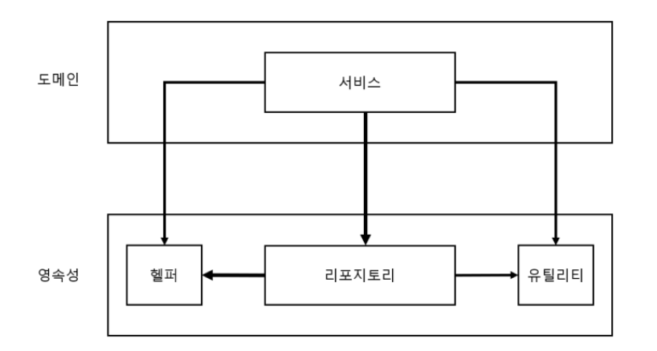
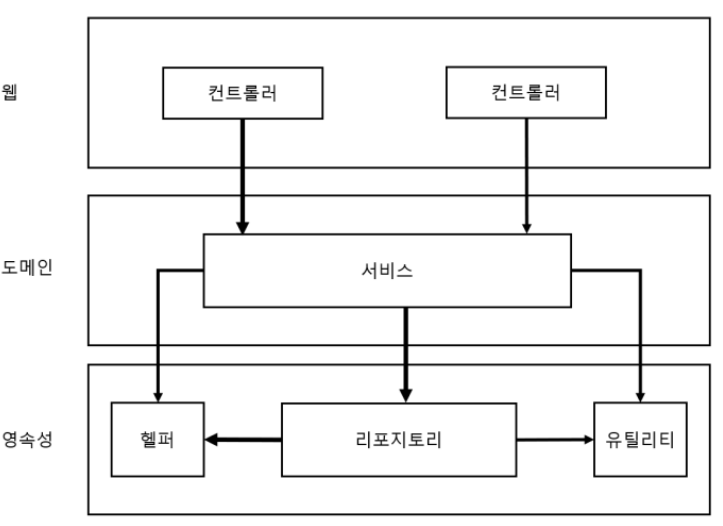

# 1. 계층형 아키텍처의 문제

- 상위 수준 관점에서 일반적인 3계층 아키텍처 표현
    
    
    
    - 웹 계층에서 요청을 받아 **도메인** 혹은 비즈니스 계층에 있는 서비스로 요청
    - 서비스에서 필요한 비즈니스 로직 수행 후
    - 도메인 엔티티의 현재 상태를 조회하거나, 변경하기 위해 **영속성** 계층의 컴포넌트 호출

# 계층형 아키텍처는 데이터베이스 주도 설계를 유도

- 전통적인 계층형 아키텍처의 토대 → 데이터베이스
    - 웹 계층 → 도메인 계층 의존
    - 도메인 계층 → 영속성 계층 의존
        - **자연스레 데이터베이스에 의존**

<aside>
💡 모든 것이 **`영속성 계층을 토대`**로 만들어진다.

</aside>

- 애플리케이션의 목적
    - 비즈니스를 관장하는 규칙이나 정책을 반영한 모델을 만들어 사용자가 규칙과 정책을 더욱 편리하게 활용할 수 있게 하는 것.
    - 상태가 아니라 **행동(behavior)** 중심으로 모델링.
        - **`행동이 상태를 바꾸는 주체`**이기 때문에

- 데이터베이스 중심적인 아키텍처가 만들어지는 가장 큰 원인 → **ORM**
    
    
    
    - **영속성과 도메인 계층 사이에 강한 결합**
    - 서비스는 영속성 모델을 비즈니스 모델처럼 사용하게 된다.
        - 도메인 로직 뿐만 아닌, 영속성 계층과 관련된 작업들을 해야 한다.

# 지름길을 택하기 쉬워진다

- 전통적인 계층형 아키텍처에 적용되는 유일한 규칙
    - 특정한 계층에서는 같은 계층에 있는 컴포넌트나, 아래에 있는 계층에만 접근 가능
    - **이 규칙을 깨버리는 경우가 많아질 수 있다.**
        - 상위 계층에 위치한 컴포넌트에 접근해야 한다 → 한 번 씩 허용…. 계속.
        - 이게 지름길이다.

- 영속성 계층은 컴포넌트를 아래 계층으로 내릴 수록 비대해진다.
- 어떤 계층에도 속하지 않는 것처럼 보이는 헬퍼, 유틸리티 등이 가장 큰 후보

# 테스트가 어려워진다

- 계층형 아키텍처를 사용할 때 일반적으로 나타나는 변화
    - 계층을 건너뛰는 것
    - 엔티티의 필드를 하나만 조작하면 되는 경우 → 웹에서 영속성으로 바로?
        - 도메인 로직을 웹 계층에 구현하게 되는 것.
            - 책임이 이곳 저곳 섞인다
        - 테스트 시 영속성 계층도 mocking

# 유스케이스를 숨긴다

- 아키텍처는 코드를 빠르게 탐색하는데 도움이 돼야 한다.

- 넓은 서비스는 영속성 계층에 많은 의존성을 가진다.
- 웹 레이어의 많은 컴포넌트가 서비스에 의존하게 된다.
    - 서비스를 테스트하기 어려워지고, 작업해야 할 유스케이스를 책임지는 서비스 찾기 어렵다
- 고도로 특화된 좁은 도메인 서비스가 유스케이스 하나씩만 담당한다면?
    - 작업들이 수월해질 것이다.

# 동시 작업이 어려워진다

- 계층형 아키텍처가 동시 작업을 지원해야 하는데 별로 도움이 되지 않는다?
- 애플리케이션에 새로운 유스케이스를 추가한다고 가정
    - 계층형 아키텍처에서는 모든 것이 영속성 계층 위에서 만들어진다.
        - 즉 영속성 계층을 먼저 개발
        - 그 이후 도메인
        - 그 이후 웹 계층
            - 특정 기능은 동시에 한 명의 개발자만 작업할 수 있다.
- 코드에 넓은 서비스가 있다면 **서로 다른 기능**을 동시에 작업하기가 어렵다.
    - merge conflict
