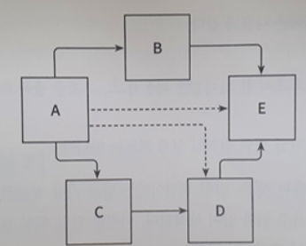
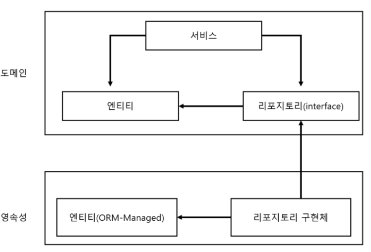
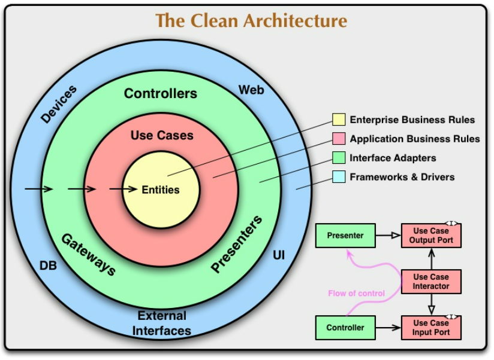
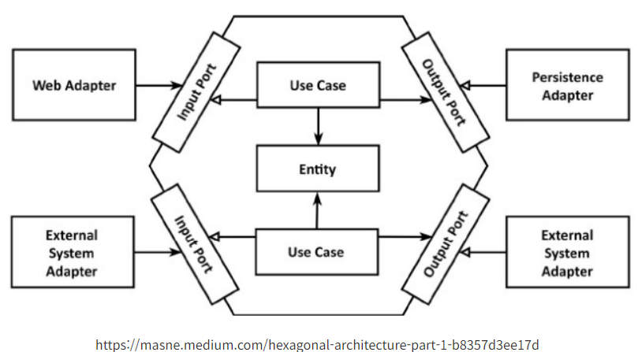

# 2. 의존성 역전하기

- 참고 지식
    
    [SOLID (객체 지향 설계)](https://ko.wikipedia.org/wiki/SOLID_(객체_지향_설계))
    

# 단일 책임 원칙

<aside>
💡 하나의 컴포넌트는 오로지 한 가지 일만 해야 하고, 그 것을 올바르게 수행해야 한다.

</aside>

- 단일 책임 원칙의 설계 의도는 아니다.
- 실제 정의

<aside>
💡 컴포넌트를 변경하는 이유는 오직 하나뿐이어야 한다.

</aside>

- 컴포넌트를 변경할 이유가 한 가지라면 컴포넌트는 딱 한 가지 일만 한다.

<aside>
💡 어떤 다른 이유로 소프트웨어를 변경하더라도 **이 컴포넌트에 대해서 신경 쓸 필요가 없다.**

</aside>

- A는 여러 컴포넌트에 의존하나 E는 의존하지 않음.
- E는 새로운 요구사항에 의해 E의 기능을 바꿔야 할 때만 바뀌고
- A는 아님.
- 시간이 갈수록 컴포넌트를 변경할 더 많은 이유가 쌓여간다.

# 의존성 역전 원칙

- 계층형 아키텍처에서 의존성은 항상 다음 계층인 아래 방향을 가리킨다.

<aside>
💡 코드상의 어떤 의존성이든 그 방향을 바꿀 수(역전시킬 수) 있다.

</aside>

- 엔티티는 도메인 객체를 표현하고 도메인 코드는 이 엔티티들의 상태를 변경하는 일을 중심
- 엔티티를 도메인 계층으로 올린다.
    - 영속성 계층의 리포지토리가 도메인 계층에 있는 엔티티에 의존하는 상태.
        - 순환 의존성

### 도메인 계층에 리포지토리에 대한 인터페이스, 리포지토리는 영속성 계층 구현

# 클린 아키텍처

- 설계가 비즈니스 규칙의 테스트를 용이하게
- 비즈니스 규칙은 프레임워크, 데이터베이스, 그 밖의 외부에 대해 독립적일 수 있다.

<aside>
💡 도메인 코드가 바깥으로 향하는 어떤 의존성도 없어야 한다.

</aside>

- 모든 의존성이 도메인 코드로 향하고 있다.

[Clean Coder Blog](http://blog.cleancoder.com/uncle-bob/2012/08/13/the-clean-architecture.html)

<aside>
💡 계층 간의 모든 의존성이 안쪽으로 향한다.

</aside>

- 도메인 코드에서 어떤 영속성 프레임워크나 UI 프레임워크가 사용되는지 알 수 없다?
    - **`비즈니스 규칙`**에 집중할 수 있다.
    - DDD

# 육각형 아키텍처

- 도메인 엔티티와 상호작용하는 Use Case
- 육각형에서 외부로 향하는 의존성이 없다.
- 모든 의존성은 Core로 향한다.
- 좌측 adpater
    - 어플리케이션 코어 호출 → 어플리케이션을 주도하는 어댑터
- 우측 adapter
    - 어플리케이션 코어에 의해 호출 → 어플리케이션에 의해 주도되는 어댑터
- 어댑터와 어플리케이션이 통신이 가능하기 위해 코어가 각각의 포트를 제공
    - **포트와 어댑터 아키텍처**라고도 부름

<aside>
💡 어떤 아키텍처든, 의존성을 역전시켜 도메인 코드가 바깥쪽 코드에 의존하지 않도록.

</aside>
