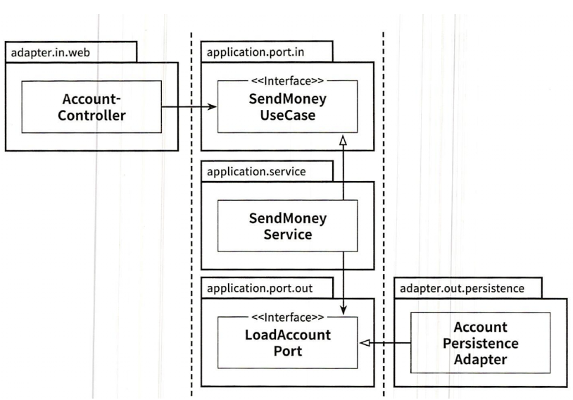

# 3. 코드 구성하기

# 계층으로 코드 구성하기

- 계층으로 코드를 구성하면 기능적인 측면들이 섞이기 쉽다.

```jsx
buckpal
ㄴdomain
	ㄴAccount
	ㄴ Activity
	ㄴ AccountRepository
	ㄴ AccountService
ㄴpersistence
	ㄴ AccountRepositoryImpl
ㄴweb
	ㄴAccountController
```

### 문제점

- **애플리케이션 기능 조각이나 특성을 구분 짓는 패키지 경계가 없다.**
    - User관련 기능을 추가 시 web, domain, persistence에 추가된다.
        - 다른 기능도 역시..
- **애플리케이션이 어떤 유스케이스들을 제공하는지 파악 불가**
    - AccountService, AccountController가 어떤 유스케이스를 구현했는지?

# 기능으로 구성하기

```jsx
buckpal
ㄴaccount
	ㄴAccount
	ㄴAccountController
	ㄴAccountRepository
	ㄴAccountRepositoryImpl
	ㄴSendMoneyService
```

- package - private 접근 이용하여 경계 강화 가능
- 그러나 **기반 아키텍처가 명확하게 보이지 않음**.
    - 어댑터를 나타내는 패키지명 x
    - 인커밍, 아웃고잉 포트 확인 불가

# 아키텍처로 표현력 있는 패키지 구조

```jsx
buckpal
|--- account
      |--- adapter
      |     |--- in
      |     |    |--- web
      |     |          |--- AccountController
      |     |--- out
      |          |--- persistence
      |                |--- AcountPersistenceAdapter
      |                |--- SpringDataAccountRepository
      |      
      |--- domain
      |     |--- Acount
      |     |--- Activity
      |     
      |--- application
            |--- SendMoneyService
            |
            |--- port
                  |--- in
                  |     |--- SendMoneyUseCase
                  |
                  |--- out
                        |--- LoadAccountPort
                        |--- UpdateAccountStatePort
```

- 구조의 각 요소들이 패키지 하나씩에 직접 매핑
- 최상위에 account와 관련된 유스케이스를 구현한 모듈임을 나타내는 account 패키지
- 도메인 모델이 속한 domain 패키지
- application 패키지는 도메인 모델을 둘러싼 서비스 계층
- SendMoneyService
    - 인커밍 포트 인터페이스SendMoneyUseCase
    - 아웃고잉 포트 인터페이스, 영속성 어댑터에 의해 구현된 LoadAccountPort, UpdateAccountStatePort
- adapter 패키지
    - 애플리케이션 계층의 인커밍 포트를 호출
    - 아웃고잉 포트에 대한 구현을 제공하는 아웃고잉 어댑터 포함

### 장점

- 어댑터 코드를 자체 패키지로 이동 → 하나의 어댑터를 다른 구현으로 쉽게 교체할 수 있다.
- DDD 개념에 직접적으로 대응시킬 수 있다.

# 의존성 주입의 역할

<aside>
💡 애플리케이션 계층이 인커밍/아웃고잉 어댑터에 의존성을 갖지 않아야 한다.

</aside>

- 포트 인터페이스를 구현한 실제 객체를 애플리케이션 계층에 제공해야 한다.
    - 포트를 애플리케이션 계층 안에서 수동으로 초기화하고 싶지 않다.
        - 의존성 주입 → **모든 계층에 의존성을 가진 중립적인 컴포넌트**



- AccountController, SendMoneyService, AccountPersistenceAdpater 클래스의 인스턴스를 만들어주는 역할
- 컨트롤러
