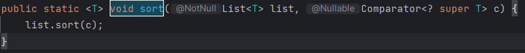
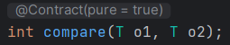
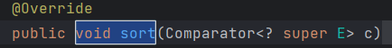
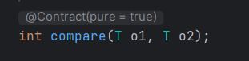
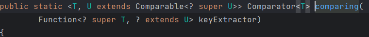

# 메서드 참조

## 참고 : 모던 자바 인 액션

## 기존의 메서드 정의를 재활용해서 람다처럼 전달한다.

- 아래의 코드를 개선의 과정까지 직접 경험한다.
    
    ```java
    //기존
    inventory.sort((Apple a1, Apple a2) -> a1.getWeight().compareTo(a2.getWeight()));
    
    // 개선
    inventory.sort(comparing(Apple::getWeight));
    ```
    

### 요약

- 특정 메서드만을 호출하는 람다의 축약형
    - 람다가 ‘이 메서드를 직접 호출해’라고 명령한다면
    - 메서드를 어떻게 호출해야 하는지 설명 참조보다 **메서드명을 직접 참조**가 편리
    - 명시적으로 메서드명을 참조하여 가독성을 높인다.
        - **메서드명 앞에 구분자`(::)`**

### 메서드 참조 만들기

- 정적 메서드 참조 → Integer::parseInt
- 다양한 형식의 인스턴스 메서드 참조 → String::length
- 기존 객체의 인스턴스 메서드 참조 → 기존객체::메서드명
    
    ```java
    () -> expensiveTransaction.getValue()
    // 변경
    expensiveTransaction::getValue
    ```
    
- List에 포함된 문자열을 대소문자를 구분하지 않고 정렬하는 프로그램
    - List의 sort 메서드는 인수로 Comparator를 기대한다.
        
        
        
    - Comparator는 (T, T) → int라는 함수 디스크립터를 가진다.
        
        
        
        ```java
        @FunctionalInterface
        public interface Comparator<T> {
            
            int compare(T o1, T o2);
        
        		// 생략
        ```
        
    
    ```java
    List<String> str = Arrays.asList("a","b","A","B");
    str.sort((s1, s2) -> s1.compareToIgnoreCase(s2));
    
    // 변경
    str.sort(String::compareToIgnoreCase);
    ```
    
    - 메서드 참조는 **context의 형식**과 일치해야 한다.

## 메서드 참조 활용하기

### 1단계 : 코드를 전달한다.



- Comparator 객체를 인수로 받아 두 사과를 비교한다고 상황을 가정하자.
- 객체 안에 동작을 포함시키는 방식으로 다양한 전략을 전달할 수 있다.
- 이제 ‘**sort의 동작은 파라미터화 되었다**’라고 말할 수 있다.
    - sort에 전달된 **정렬 전략에 따라** sort의 동작이 달라질 것이다.

```java
/**
아래의 compare를 어떻게 작성하냐에 따라 전략이 달라지는 것입니다.
*/

public class AppleComparator implements Comparator<Apple> {
		public int compare(Apple a1, Apple a2) {
			return a1.getWeight().compareTo(a2.getWeight());
	}
}

inventory.sort(new AppleComparator());
```

### 2단계 : 익명 클래스 사용

- 한 번만 사용할 Comparator는 익명 클래스를 이용해보자.

```java
inventory.sort(new Comparator<Apple>() {
		public int compare(Apple a1, Apple a2) {
			return a1.getWeight().compareTo(a2.getWeight());
		}
});
```

### 3단계 : 람다 표현식 사용

- 함수형 인터페이스를 기대하는 곳 어디에서나 람다 표현식을 사용할 수 있음.
    - 함수형 인터페이스 : 오직 하나의 추상 메서드를 정의하는 인터페이스
    - 추상 메서드의 시그니처(함수 디스크립터)는 람다 표현식의 시그니처를 정의.
    - Comparator의 함수 디스크립터는 (T, T) → int
        
        
        

```java
inventory.sort((Apple a1, Apple a2) -> a1.getWeight().compareTo(a2.getWeight()));
```

- 자바 컴파일러는 **람다식이 사용된 context**를 활용해서 람다의 **파라미터 형식** 추론
- 위의 코드를 개선할 수 있다.

```java
inventory.sort((a1,a2) -> a1.getWeight().compareTo(a2.getWeight()));
```

- 바로 위의 코드를 다시 개선해보자.



- Comparator는 **static한 comparing** 메서드가 있다.

```java
inventory.sort(comparing(apple -> apple.getWeight()));
```

### 4단계 : 메서드 참조 사용

```java
inventory.sort(comparing(Apple::getWeight));
```

- **Apple을 weight별로 비교해서 inventory를 sort하라**
- 문장을 통해 **`명확한 의미`**를 파악할 수 있다.
