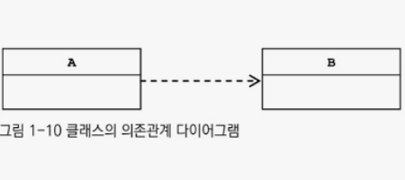
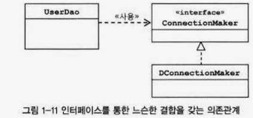

# 1.7 의존관계 주입(DI)

# 제어의 역전(IoC)와 의존관계 주입

- IoC는 소프트웨어에서 자주 발견할 수 있는 일반적인 개념
- 객체를 생성하고 관계를 맺어주는 등의 작업을 담당하는 기능을 일반화한 것이 스프링 IoC 컨테이너
- 스프링 IoC 기능의 대표적인 동작원리
    - 주로 의존관계 주입

## 런타임 의존관계 설정

### 의존관계

- 두 개의 클래스 또는 모듈이 의존관계에 있다고 말할 때는 **`방향성`**을 부여해야 함
    - 누가 누구에게 의존하는 관계에 있는가를 표시
- UML 모델에서 표현 방식

- 의존한다는 것
    - B가 변하면 A에 영향을 미친다
    - A에서 B에 정의된 메소드를 호출해서 사용하는 경우
        - 사용에 대한 의존관계

- 아래의 그림을 보자.
    
    
    
    - UserDao가 ConnectionMaker에 의존하고 있기 때문에
    - ConnectionMaker 변경 시 UserDao도 영향을 받는다.
    - 그러나 DConnectionMaker는 변경되어도 UserDao는 영향을 받지 않음.
        - **인터페이스에 대한 의존관계**

<aside>
💡 인터페이스 구현 클래스와의 관계는 **느슨해지면서** 변화에 영향을 덜 받는 상태

</aside>

- 인터페이스를 통해 의존관계를 제한!
