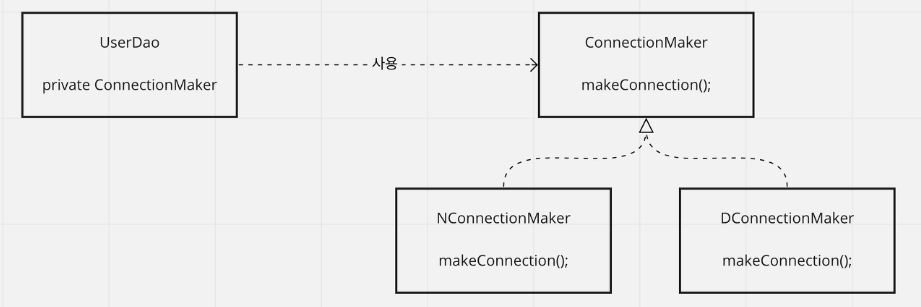
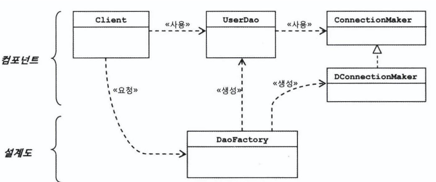

# 1.오브젝트와 의존관계

# 스프링이 가장 관심을 많이 두는 대상 == 오브젝트

- 애플리케이션에서 오브젝트가 생성되고
- 다른 오브젝트와 관계를 맺고
- 사용, 소멸까지의 과정을 생각해봐야 한다.
    - 이런 생각들이 **오브젝트의 설계**로 발전하게 된다.

## 관심사의 분리

- 객체지향의 세계에서는 모든 것이 변한다.
    - 변수나 오브젝트 필드의 값이 변한다는게 아니다.
    - **오브젝트의 설계와 이를 구현한 코드**가 변한다는 것

<aside>
💡 **`미래의 변화`**를 어떻게 대비할 것인가

</aside>

### 분리와 확장을 고려한 설계

- 변화는 대체로 집중된 한 가지 관심에 일어난다.
    - 그러나 그에 따른 작업은 한 곳에 집중되지 않는 경우가 대부분이다.

<aside>
💡 우리가 할 것은 **한 가지 관심이 한 군데에 집중**되게 하는 것

</aside>

<aside>
💡 관심사의 분리

</aside>

- 관심이 다른 것은 가능한 따로 떨어져서.
- 방법
    - 중복 코드의 메서드 추출

- 템플릿 메소드 패턴
    - 슈퍼 클래스에 기본적인 로직의 흐름을 만들고, 그 기능의 일부를 추상 메소드나 오버라이딩이 가능한 protected 메소드 등으로 만든 뒤 이런 메소드를 필요에 맞게 구현해서 사용하도록 하는 방법
        - 추상 메소드, 오버라이드 가능한 메소드 정의
- 팩토리 메소드 패턴
    - 서브클래스에서 구체적인 오브젝트 생성 방법을 결정하게 하는 것

## 클래스의 분리

- 관심사가 다르고 변화의 성격이 다른 두 가지 코드를 분리
- 상속관계도 아닌 독립적인 클래스로 만들기

```java
public class UserDao {
	private SimpleConnectionMaker simpleConnectionMaker;

	public UserDao() {
		simpleConnectionMaker = new SimpleConnectionMaker();
	}

	public User get() throws ClassNotFoundException, SQLException {
		Connection c = simpleConnectionMaker.makeNewConnection();
	}
}

public class SimpleConnectionMaker {
	...
}
```

- 문제점?
    - DB 커넥션을 제공하는 클래스가 어떤 것인지 UserDao가 알고 있어야 한다.

## 인터페이스의 도입

- 두 개의 클래스가 서로 긴밀하게 연결되어 있지 않도록 중간에 **`추상적인 느슨한 연결고리`**
    - 추상화
        - 어떤 것들의 공통적인 성격을 뽑아내어 이를 따로 분리
        - JAVA Interface



- UserDao는 ConnectionMaker의 makeConnection()만 알면 된다.
    - makeConnection이 어떻게 구현되었는지는 알 필요 없다.
- 역시 문제가 있다.

## 관계설정 책임의 분리

- 두 개의 오브젝트가 있고 한 오브젝트가 다른 오브젝트를 사용한다고 하자
    - 사용되는 오브젝트는 서비스, 사용하는 오브젝트를 클라이언트라고 한다.
- UserDao와 ConnectionMaker 구현 클래스의 관계를 결정해주는 기능을 분리해서 보자.

- UserDao가 동작하려면 하나의 오브젝트가 만들어져야 한다.
    - UserDao 오브젝트가 다른 오브젝트와 관계를 맺으려면 관계를 맺을 오브젝트가 있어야 한다.
        - 이게 꼭 UserDao 코드 내에서 있을 필요 없다.
        - **외부에서 만든 걸 이용**

- 클래스 사이의 관계는 코드에 다른 클래스 이름이 나타나기 때문에 만들어진다.
- 오브젝트 사이의 관계는 그렇지 않다.
    - 특정 클래스를 알지 못하더라도 해당 클래스가 구현한 인터페이스를 사용한다
        - 그 클래스의 오브젝트를 인터페이스 타입으로 받아서 사용할 수 있다.
        - **다형성**

<aside>
💡 스프링 책을 더 참고해야 한다…..

</aside>

## 원칙과 패턴

### 개방 폐쇄 원칙

- 클래스나 모듈이 확장에는 열려 있어야 하고 변경에는 닫혀 있어야 한다.
- **높은 응집도와 낮은 결합도**

### 전략 패턴

- 필요에 따라 변경이 필요한 알고리즘을 인터페이스를 통해 통째로 외부로 분리시키고,  이를 구현한 구체적인 알고리즘 클래스를 필요에 다라 바꿔서 사용할 수 있게 하는 디자인 패턴
    - 여기서 알고리즘이란, 독립적인 책임으로 분리 가능한 기능
        - DB 연결방식 → ConnectionMaker 인터페이스 정의

## 제어의 역전(IoC)

- 위에서 이루어낸 결과는 사실 클라이언트에게 수고를 준 것

### 팩토리

- 객체의 생성 방법을 결정하고 만들어진 오브젝트를 돌려주는 것
    - 오브젝트를 생성하는 쪽과 생성된 오브젝트를 사용하는 쪽의 **역할과 책임을 분리**하는 목적
- UserDao의 생성 책임을 맡은 팩토리 클래스
    
    ```java
    public class DaoFactory {
    		public UserDao userDao() {
    			ConnectionMaker connectionMaker = new DConnectionMaker();
    			UserDao userDao = new UserDao(connectionMaker);
    			return userDao;
    		}
    }
    ```
    
    - 이미 설정된 UserDao 오브젝트를 돌려주기

### 설계도로서의 팩토리



- 새로운 ConnectionMaker 구현 클래스로 변경 필요
    - DaoFactory 수정
    - 애플리케이션 컴포넌트 역할을 하는 오브젝트와 구조를 결정하는 오브젝트 분리

## 제어권의 이전을 통한 제어관계 역전

- 프로그램의 제어 흐름 구조가 뒤바뀌는 것
- 일반적인 흐름
    - 프로그램이 시작되는 지점에서 다음에 사용할 오브젝트 결정
    - 결정한 오브젝트 생성, 만들어진 오브젝트에 있는 메소드 호출
    - 다음 과정 결정 ……
- 제어의 역전
    - 오브젝트가 자신이 사용할 오브젝트를 스스로 선택하지 않음
    - 모든 제어 권한을 다른 대상에게 위임
    - 프레임워크
        - 제어의 역전 개념이 적용된 대표적인 기술

```java
**라이브러리**를 사용하는 애플리케이션 코드는 애플리케이션 흐름을 직접 제어함

**프레임워크**는 애플리케이션 코드가 프레임워크에 의해 사용
```

- 관심을 분리하고 책임을 나누고…
    - DaoFactory를 도입 → IoC를 적용한 것이나 다름없다.
