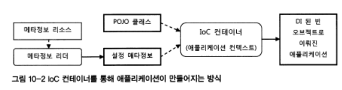
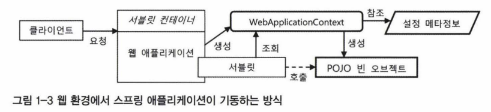
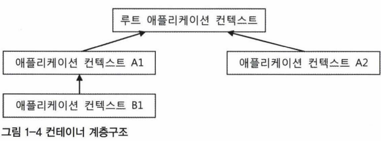
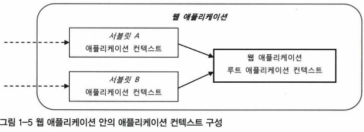
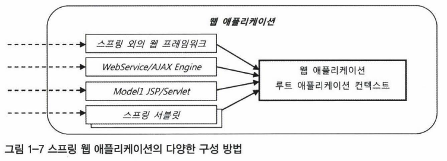

# 1.1 IoC 컨테이너 : 빈 팩토리와 애플리케이션 컨텍스트

# 빈 팩토리와 애플리케이션 컨텍스트

- 오브젝트의 생성과 관계 설정, 사용, 제거 등의 작업을 독립된 컨테이너가 해준다.
- 컨테이너가 **코드 대신 오브젝트의 제어권을 갖고 있다**고 하여 **`IoC` 컨테이너라고도 한다.**
- 이 컨테이너들을 **빈 팩토리 또는 애플리케이션 컨텍스트**라고 한다.

### 차이

- 애플리케이션 컨텍스트는 DI를 위한 빈 팩토리에, 애플리케이션을 개발하는 데 필요한 여러 가지 컨테이너 기능을 추가한 것
    - 빈 팩토리이면서, 그 이상의 기능을 가진 것

# IoC 컨테이너를 이용해 애플리케이션 만들기

- 가장 간단한 방법
    
    ```java
    StaticApplicationContext ac = new StaticApplicationContext();
    ```
    
    - IoC 컨테이너 하나 준비.
    - 컨테이너가 본격적인 IoC 컨테이너로 동작하려면 2가지가 필요
        - **POJO**
        - **설정 메타정보**

## POJO

- 각자 기능에 충실하게 독립적으로 설계된 POJO 클래스를 만들고
- 결합도가 낮은 유연한 관계를 가질 수 있도록 인터페이스를 이용해 연결해주기

### 설정 메타정보

- 만든 POJO 클래스들 중에
    - 애플리케이션에서 사용할 것을 선정
    - IoC 컨테이너가 제어할 수 있도록 적절한 메타정보를 만들어 제공한다.
- 스프링의 설정 메타정보
    - **`BeanDefinition 인터페이스`로 표현되는 순수한 추상 정보**
    - 애노테이션, 자바 코드, 프로퍼티 파일…
        - **BeanDefinition으로 정의되는 스프링의 설정 메타정보의 내용을 표현한 것**이면 무엇이든 된다.
        - 스프링 IoC 컨테이너는 각 빈에 대한 설정 메타 정보를 읽은 다음, 이를 참고해서 빈 오브젝트를 생성하고 프로퍼티나 생성자를 통해 의존 오브젝트를 주입하는 DI 작업을 한다.
        - 이 작업을 통해 만들어지고, DI로 된 오브젝트의 집합이 하나의 애플리케이션을 구성하고 동작하게 된다.



<aside>
🧐 스프링 애플리케이션?
POJO와 설정 메타 정보를 이용해 IoC 컨테이너가 만들어주는 오브젝트의 조합

</aside>

<aside>
🧐 IoC 컨테이너가 관리하는 빈은 오브젝트 단위, 클래스 단위가 아님.

</aside>

## IoC 컨테이너 종류와 방법

- 스프링 애플리케이션에서 ApplicationContext를 직접 구현하는 경우는 거의 없다.
- 아래에서 ApplicationContext 구현 클래스의 종류와 용도를 파악한다.

### StaticApplicationContext

- 코드를 통해 빈 메타정보를 등록하기 위해 사용
- 실전에서는 사용하면 안된다.

### GenericApplicationContext

- 컨테이너의 주요 기능을 DI 확장할 수 있도록 설계되어 있다.
- XML 파일과 같은 외부 리소스에 있는 빈 설정 메타정보를 리더로 읽어서 메타정보로 변환해서 사용
- 특정 포맷의 빈 설정 메타정보를 읽어서 애플리케이션 컨텍스트가 사용할 수 있는 BeanDefinition 정보로 변환하는 기능을 가진 오브젝트는 BeanDefinitionReader 인터페이스를 구현해서 만들고, **빈 설정 정보 리더**라 불림
- Xml을 읽는 리더는 XmlBeanDefinitionReader

### GenericXmlApplicationContext

- XmlBeanDefinitionReader와 결합되있다.

```java
GenericApplicationContext ac = new GenericXmlApplicationContext
("xml의 위치");
// 애플리케이션 컨텍스트 생성과 동시에 xml 파일을 읽어오고 초기화 작업 수행
```

### WebApplicationContext

- 스프링 애플리케이션에서 가장 많이 사용되는 것
- WebApplicationContext를 구현한 클래스를 사용하는 셈
- 애노테이션을 이용한 설정 리소스만 사용한다면
    - AnnotionConfigWebApplicationContext
- 디폴트
    - XmlWebApplicationContext
- 스프링 IoC 컨테이너를 이용하여 DI 작업을 수행한 후, 적어도 한 번은 특정 빈 오브젝트의 메서드를 호출해서 애플리케이션을 동작시켜야 한다.
    - 두 번은 필요 없다. DI로 연결되어 있어 의존관계를 타고 필요한 오브젝트가 호출된다

```java
ApplicationContext ac = ..
Hello hello = ac.getBean("hello", Hello.class);
```

- 웹에서는 main() 메서드를 호출할 방법이 없다.
    - 서블릿 컨테이너 등장
    - 해당 요청에 매핑되어 있는 서블릿을 실행해준다. 서블릿이 일종의 main

<aside>
🧐 그럼 웹 상에서 어떻게 기동하는가?

</aside>

- 서블릿 만들고, 미리 어플리케이션 컨텍스트 올려두고, 서블릿으로 요청이 올 때마다 getBean



- **`DispatcherServlet`**

## IoC 컨테이너 계층 구조

- 빈을 담아둘 IoC 컨테이너는 애플리케이션마다 하나씩이면 충분하다.
- 그러나 한 개 이상의 컨테이너가 필요한 경우가 있다.
    - **트리 모양의 계층 구조**를 만들 때
    - 여러 애플리케이션 컨텍스트가 **공유할 설정을 만들기 위해**

### 부모 컨텍스트를 이용한 계층 구조 효과

- 모든 애플리케이션 컨텍스트는 부모 애플리케이션 컨텍스트를 가질 수 있다.
    - 이를 이용하여 트리 구조의 컨텍스트 계층을 만든다.
    
    
    
    - 계층 구조 안의 컨텍스트는 각자 독립적인 설정 정보로 빈 오브젝트를 만들고 관리
    - DI를 위해 빈을 찾을 때는 부모 애플리케이션 컨테스트의 빈까지 모두 탐색
        - 자신이 관리하는 빈 중에서 먼저 찾아보고
        - 없으면 부모에게 찾아달라고 요청하는 것
        - **자신의 자식 컨텍스트에는 요청하지 않는다.**
        - **같은 레벨에 있는 형제 컨텍스트의 빈도 찾을 수 없다.**

### 컨텍스트 테스트

- 부모 ApplicationContext 선언
    
    ```java
    ApplicationContext parent = new GenericXmlApplicationContext("부모 xml의 위치")
    ```
    
- 자식에게 부모를 인식시키기
    
    ```java
    GenericApplicationContext child = new GenericXmlApplicationContext(parent);
    
    XmlBeanDefinitionReader reader = new XmlBeanDefinitionReader(child);
    reader.loadBeanDefinitions("child xml의 위치");
    child.refresh(); // 리더를 이용해서 설정을 읽은 경우 반드시 초기화 작업을 해야함.
    ```
    

- 부모와 자식이 동일한 hello 빈을 가지고 있다면, 우선 자식의 빈을 호출.
    - parent.getBean으로 부모의 것을 가져오도록 하는 것도 당연히 가능.

## 웹 애플리케이션의 IoC 컨테이너 구성

- 웹 모듈 안에 컨테이너를 두는 것
- 엔터프라이즈 애플리케이션 레벨에 두는 것

### 웹 애플리케이션의 컨텍스트 계층 구조

- 웹 애플리케이션 레벨에 등록되는 컨테이너는 보통 **루트 웹 애플리케이션 컨텍스트**
    - 서블릿 레벨에 등록되는 컨테이너들의 부모 컨테이너
    - 전체 계층 내에서 **가장 최상단 위치**
- 웹 애플리케이션 레벨에는 하나 이상의 프론트 컨트롤러 역할을 하는 서블릿이 등록될 수 있다.
    - 각각 독립적인 애플리케이션 컨텍스트
    - 각 서블릿이 공유하는 빈이 있다면 웹 애플리케이션 레벨의 컨텍스트에 등록한다.
    
    
    
    <aside>
    🧐 일반적으로 하나의 프론트 컨트롤러만 만들어서 사용. 위의 경우는 많지 않다
    
    </aside>
    
    
    

### 계층 구조를 만드는 이유가 무엇인가?

- **웹 기술에 의존적인 부분과 그렇지 않은 부분의** **`분리`**
- 스프링을 이용하는 웹 애플리케이션이 반드시 스프링의 기술을 사용해야 하는 것은 아님
    - 데이터 액세스, 서비스 계층은 스프링 기술을 사용할 수도 있고
    - 프레젠테이션 계층은 그렇지 않을 수도 있다.
- JSP나 AJAX 엔진 같은 곳에서 어떻게 루트 애플리케이션 컨텍스트에 접근할까?
    - 유틸리티 메서드 등을 이용해서 가능하다.
    
    
    

### 루트 애플리케이션 컨텍스트 등록

- 서블릿의 event listner 이용
- 스프링은 애플리케이션의 시작과 종료를 알리는 ServletContextListner 이용
    - 시작 시 루트 애플리케이션 컨텍스트를 만들어 초기화
    - 종료 시 컨텍스트를 함께 종료시키는 리스너를 만들 수 있음.
    - ContextLoaderListner
- 웹 애플리케이션 web.xml 파일에 설정 관련 정보를 넣는다
    
    ```java
    <listner>
    	<listner-class>org.springframework.web.context.ContextLoaderListner</listner-class>
    </listner>
    ```
    
    - 애플리케이션 컨텍스트 클래스 : WebApplicationContext
    - XML 설정파일 위치 : /WEB-INF/applicationContext.xml
    - 위의 2개는 별다른 파라미터를 지정하지 않을 경우의 Default
