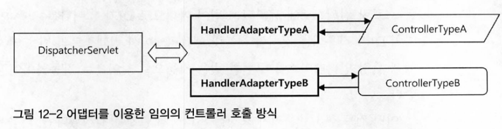

# 3. 스프링 웹 기술과 스프링 MVC

# DispatcherServlet과 MVC 아키텍처

- MVC
    - 프레젠테이션 계층 구성요소를 담은 모델(M)
    - 화면 출력 로직 뷰(V),
    - 제어 로직을 담은 컨트롤러(C)
    - 보통 **프론트 컨트롤러** 패턴과 함께 사용
        - 중앙집중형 컨트롤러가 **프레젠테이션의 맨 앞**에 위치
        - 모든 요청을 먼저 받아서 처리
        - 공통적인 작업을 먼저 수행 후 세부 컨트롤러로 작업 위임
        - 클라이언트에게 보낼 뷰를 선택해서 최종 결과를 생성하는 등의 작업
            - **`DispaterServlet`**

- DispatcherServlet의 작업 순서
    - HTTP 요청 접수
        
        ```xml
        <servleet-mapping>
        	<servlet-name>Spring MVC Dispatcher Servlet</servlet-name>
        	<url-pattern>/app/*</url-pattern>
        </servlet-mapping>
        
        <!-- 
        DispatcerServlet이 전달 받을 URL 패턴 정의 
        /app로 시작하는 모든 요청을 DispatcherServlet에게 할당
        -->
        ```
        
    - 컨트롤러로 HTTP 요청 위임
        - 어떤 컨트롤러에게 작업을 위임할지 결정
        - **핸들러 매핑 전략** 이용
            - **컨트롤러를 핸들러**라고 부르며, **웹의 요청을 다루는 오브젝트**라는 의미
            - 전략이라고 부르는 이유는 전략 패턴이 적용되어 있기 때문
            - DI를 통해 얼마든지 확장 가능하다.
            - **어댑터** 이용
                - 오브젝트 어댑더 패턴을 사용해서, 특정 컨트롤러를 호출해야 할 때 해당 컨트롤러 타입을 지원하는 어댑터들 중간에 껴서 호출한다.
                
                
                
                - 확장구조의 기본이 어댑터를 통한 컨트롤러 호출 방식임
                - 핸들러 어댑터에 줄 때는 모든 웹 요청 정보가 담긴 HttpServletRequest 타입의 오브젝트를 전달하고, 어댑터가 변환해서 컨트롤러의 메서드가 받을 수 있는 파라미터로 변환해서 전달한다.
    - 컨트롤러의 모델 생성과 정보 등록
        - 모델은 보통 맵에 담긴 정보, 이름과 오브젝트 값의 쌍으로 만들어진다.
    - 컨트롤러의 결과 리턴 : 모델과 뷰
        - ModelANdView
    - DispatcherServlet의 뷰 호출과 모델 참조
        - 뷰 오브젝트에 모델을 전달해주고 클라이언트에게 돌려줄 최종 결과물을 생성해달라고 요청한다.
    - HTTP 응답 돌려주기
        - 뷰 생성까지의 작업을 마친 후 등록된 후처리기가 있는지 확인한다
            - 있다면 처리한 후 뷰가 만들어준 HttpServletResponse에 담긴 최종 결과를 서블릿 컨테이너에게 준다.
        - 서블릿 컨테이너는 HttpServletResponse에 담긴 정보를 HTTP 응답으로 만들어 클라이언트에게 전달
