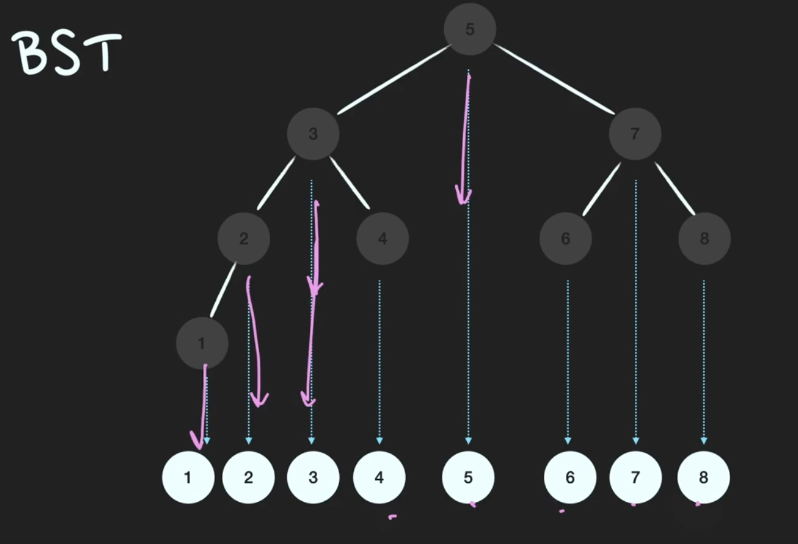

# 7. Binary Search Tree

태그: AVL, Red-Black

- 정렬된 트리
    - **`저장과 동시에 정렬`**이 되는 자료구조
    - 모든 노드들의  자식의 개수가 2 이하
    - 해당 노드의 **`왼쪽 서브트리`**에는 자기 자신보다 **`작은 값`**들만
    - 해당 노드의 **`오른쪽 서브트리`**에는 자기 자신보다 **`큰 값`**들만
    
    
    

- 검색과 삽입, 삭제의 시간복잡도 **`O(logN)`**
    - Worst Case : 한쪽으로 치우친 트리 , 이 때는 O(n)
        - 예를 들어 계속 제일 작은 값들이 들어오는 경우
        - 예를 들어 계속 제일 큰 값들이 들어오는 경우
    - Worst Case 해결 방법
        - 자가 균형 이진 탐색 트리(Self-Balancing BST)
            - **`높이를 가능한 낮게 유지`**
            - **AVL Tree**
            - **Red-Black Tree**

- 검색
    - 루트노드와 비교하여 작은지? 큰지를 계속 비교하여 찾아간다.
    - 최대 트리의 높이

- 삽입
    - 루트노드와 비교하여 작은지? 큰지를 계속 비교하며 내려간다.
    - 본인이 들어갈 위치를 찾아서 삽입
        - null인 경우 삽입이 될 것임
- 삭제
    - 루트노드와 비교하여 작은지? 큰지를 계속 비교하며 내려간다.
    - 삭제하고자 하는 값이 자식을 가지고 있는지 아닌지를 확인
        - 자식을 1개 가지고 있는 경우
            - 삭제하려는 데이터와 자식을 대체
        - 자식을 2개 가지고 있는 경우
            - 왼쪽 서브트리에서 가장 큰 값을 가져오거나
            - 오른쪽 서브트리에서 가장 작은 값을 가져오거나
                - 가지고 와서 대체
                - **`BST의 정의에 위배되지 않기 위함.`**
