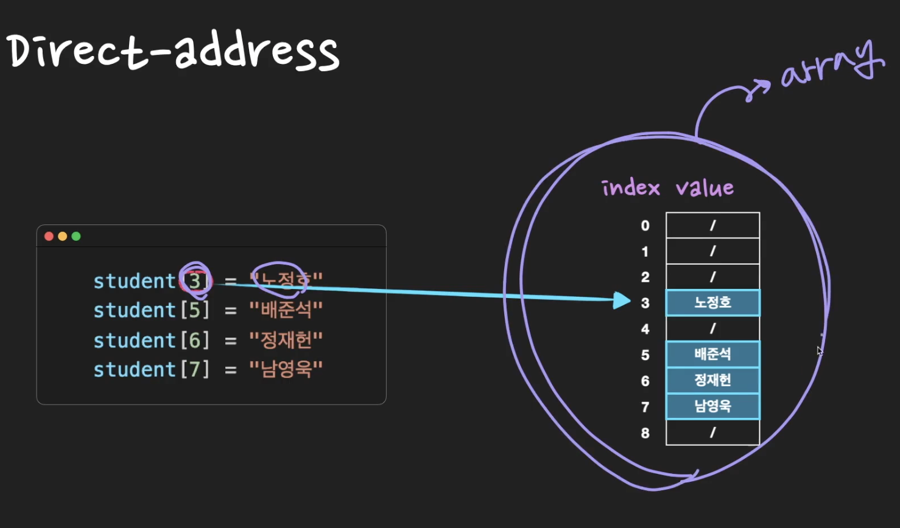
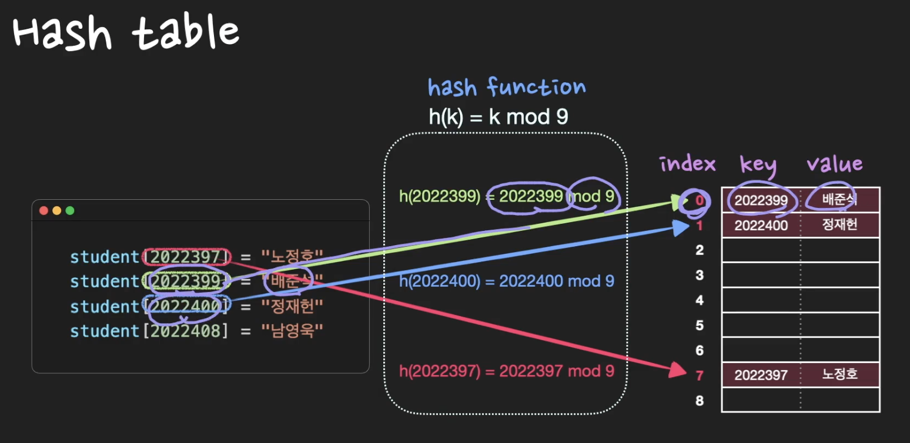
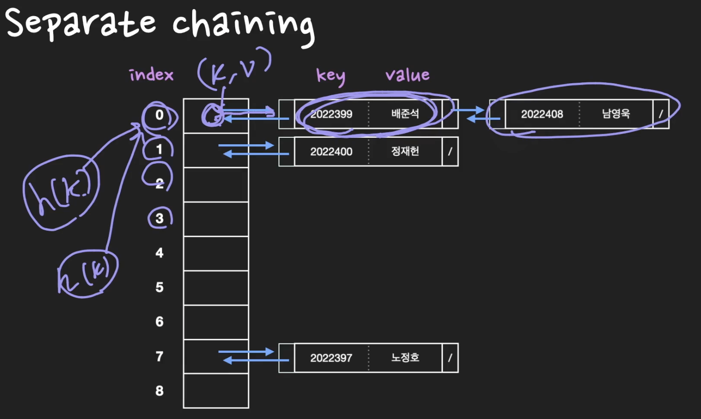

# 8. Hash table

태그: Java HashMap

[참고] Direct address table

- key값으로 k를 갖는 원소는 index k에 저장하는 방식
    
    
    
- 단점
    - 불필요한 공간 낭비 필요
        - 학번은 20251234~ 이러한 식으로 시작하는데 어떻게?
    - key가 다양한 자료형을 담을 수 없다
        - String 형식 → index로 저장 불가

## 개념

- **`효율적인 탐색(빠른 탐색)`**을 위한 자료구조
- **`key - value 쌍의 데이터`**를 입력받음
- (key, value)데이터를 저장할 수 있는 공간을 **`slot`** 또는 **`bucket`**이라 부름
- hash function h에 key 값을 입력으로 넣어 얻은 해시 값 h(key)를 위치로 지정하여 key-value 쌍을 저장한다
    - 키 k값을 갖는 원소가 위치 h(k)에 hash된다 → **`h(k)가 index임.`**
    - h(k)는 키 k의 해시값이다
    
    
    

## Collision

- 중복되는 key는 없는데 **`해시값은 중복된 경우`**임.
- 해결방법
    - seperate chaining
        - Linkedlist(또는 Tree) 이용
            - collision 발생 시 linkedlist에서 slot을 추가
            
            
            
            - 시간복잡도
                - 검색, 삭제에는 최악의 경우 O(n)
                - **`n개의 모든 key가 동일한 hash값을 갖게되는 경우`**
                
    - open addressing
        - collision 발생 시 미리 정한 규칙에 따라 hash table에 빈 slot을 찾는다.
        - 추가적인 메모리를 사용하지 않는 방법
        - 빈 slot을 찾는 방법
            - Linear Probing
                - **`일정한 값`**만큼 건너 뛰어 빈 슬롯에 데이터 저장 : (+1, +2, +3 ….)
                - 충돌 횟수가 많아지면 특정 영역에 데이터가 몰리는 클러스터링 현상 발생
            - Quadratic Probing
                - **`제곱수`**로 건너 뛰어 빈 슬롯에 데이터 저장
                - 충돌 횟수가 많아지면 특정 영역에 데이터가 몰리는 클러스터링 현상 발생
            - Double Hashing
                - 클러스터링 문제가 발생하지 않도록 **`2개의 해시 함수`** 방식 사용 : 이중 해싱
                - 하나는 최초의 hash값 얻을 때 사용 (기존과 동일)
                - 하나는 해시 충돌이 일어났을 때 **`탐사 이동폭`**을 얻기 위해 사용
        

## 특징

- 시간복잡도
    - 저장, 삭제, 검색 모두 기본적으로 **`O(1)`**
    - **`Collision`**으로 인하여 최악의 경우 **`O(n)`**
- 공간복잡도
    - 데이터가 저장되기 전 미리 저장공간 확보 → 효율성이 떨어짐.

## 좋은 hash function의 조건

- 당연히 상황마다 달라질 수 있다.
    - 연산속도를 빠르게
    - 해시 값을 **`고르게 분포`**하는 것

- 네이버 D2
    
    <aside>
    💡 Java HashMap에서 사용하는 방식은 Separate Channing이다. Open Addressing은 데이터를 삭제할 때 처리가 효율적이기 어려운데, HashMap에서 remove() 메서드는 매우 빈번하게 호출될 수 있기 때문이다. 게다가 HashMap에 저장된 키-값 쌍 개수가 일정 개수 이상으로 많아지면, 일반적으로 Open Addressing은 Separate Chaining보다 느리다. Open Addressing의 경우 해시 버킷을 채운 밀도가 높아질수록 Worst Case 발생 빈도가 더 높아지기 때문이다. 반면 Separate Chaining 방식의 경우 해시 충돌이 잘 발생하지 않도록 '조정'할 수 있다면 Worst Case 또는 Worst Case에 가까운 일이 발생하는 것을 줄일 수 있다
    
    </aside>
    
    <aside>
    💡 지금까지 설명한 내용을 요약하면, Java HashMap에서는 해시 충돌을 방지하기 위하여 Separate Chaining과 보조 해시 함수를 사용한다는 것, Java 8에서는 Separate Chaining에서 링크드 리스트 대신 트리를 사용하기도 한다는 것, 그리고 String 클래스의 hashCode() 메서드에서 31을 승수로 사용하는 이유는 성능 향상 도모를 위한 것이라고 정리할 수 있다.
    
    </aside>
    

[Java HashMap은 어떻게 동작하는가?](https://d2.naver.com/helloworld/831311)
