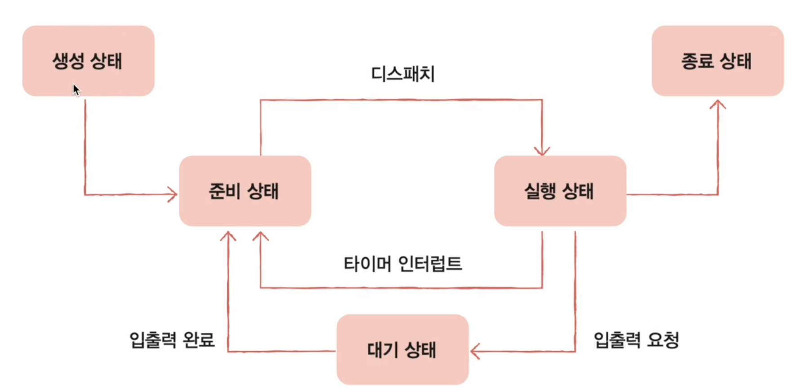
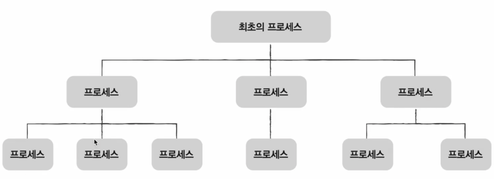
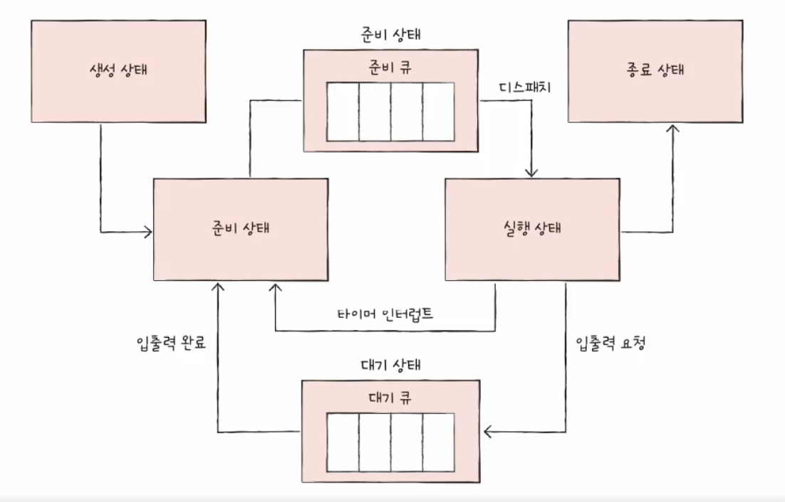
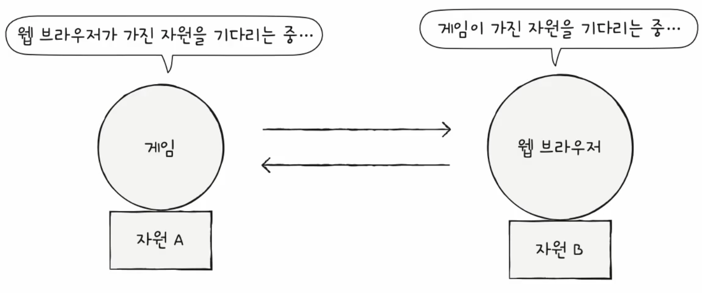
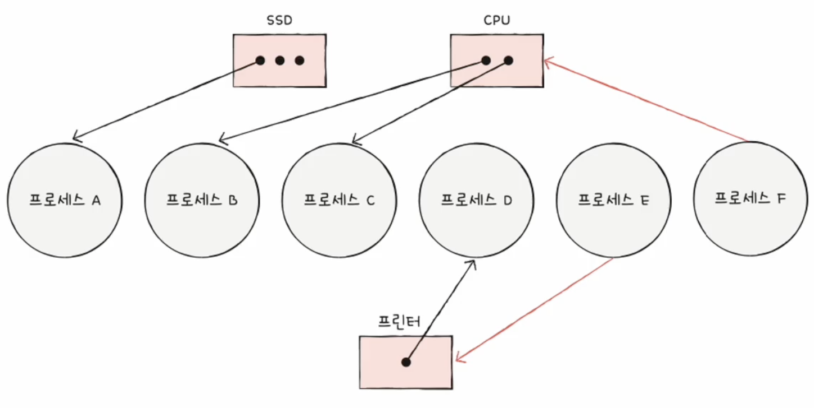
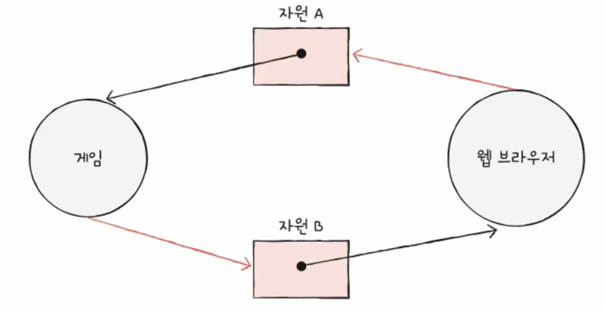
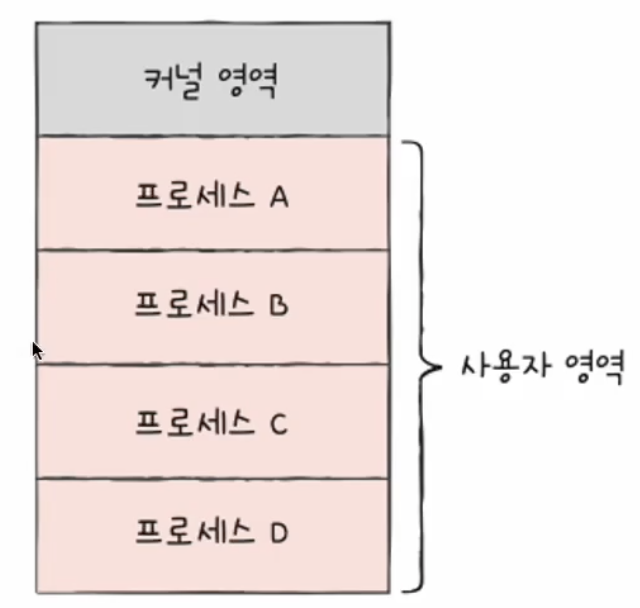
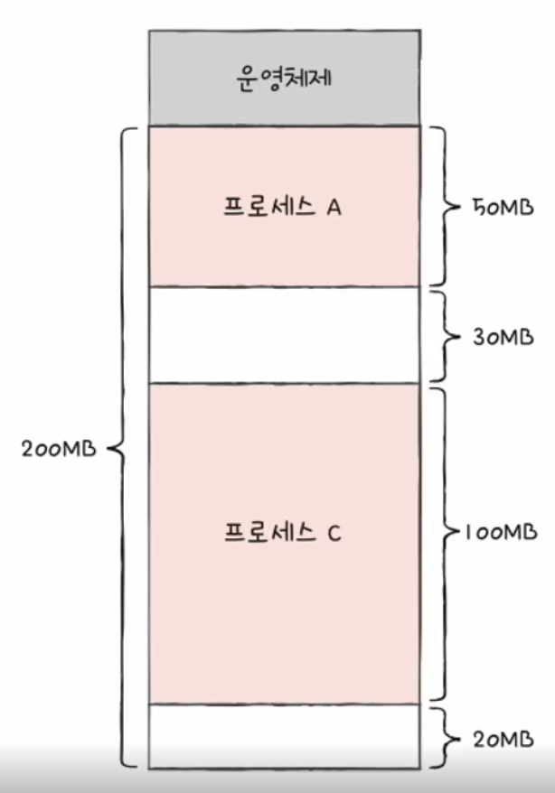

# 운영체제

# 운영체제

모든 프로그램은 하드웨어를 필요로한다. 프로그램 실행에 필요한 요소들을 가리켜 시스템 자원, 줄여서 **자원**이라고 한다. CPU, 메모리, 보조기억장치, 입출력장치 모두 자원이다. 결국 프로그램은 실행되기 위해서 반드시 자원이 필요하다. 

실행할 프로그램에 필요한 자원을 할당하고, 프로그램이 올바르게 실행되도록 돕는 역할을 하는 프로그램이 바로 운영체제다. 운영체제는 컴퓨터가 부팅될 때 메모리 내 **커널 영역**이라는 공간에 따로 적재되어 실행된다. 커널 영역을 제외한 영역에서 사용자가 이용하는 응용 프로그램이 적재되는 영역이 **사용자 영역**이다. 다시 말해서, 운영체제가 커널 영역에 적재되고 사용자 영역에 적재된 프로그램들에 자원을 할당하고 이들의 올바른 실행을 돕게 된다.

## 커널

운영체제는 현존하는 프로그램 중 가장 큰 프로그램의 하나이다. 자원에 접근하고 조작하는 기능, 프로그램이 안전하게 실행되게 하는 기능 등이 운영체제의 핵심 서비스인데, 이런 운영체제의 핵심 서비스를 담당하는 부분을 **커널(kernel)**이라고 한다.

운영체제가 설치된 모든 기기에는 커널이 있고, 어떤 커널을 사용하느냐에 따라 성능도 달라질 수 있다. 운영체제가 제공하는 서비스 중에는 커널에 포함되지 않는 서비스도 있는데, 대표적으로 UI다. UI는 단지 운영체제와 컴퓨터가 상호작용하기 위한 통로이다.

## 이중 모드와 시스템 호출

운영체제는 사용자가 실행하는 응용 프로그램이 하드웨어 자원에 직접 접근하는 것을 방지하여 자원을 보호한다. 응용 프로그램들은 운영체제를 통해서만 접근하도록 하여 자원을 보호한다. 이런 운영체제의 문지기 역할은 **이중 모드(dual mode)**를 통해서 구현된다. 이중 모드는 CPU가 명령어를 실행하는 모드를 사용자 모드와 커널 모드로 구분하는 방식이다.

**사용자 모드(user mode)**는 운영체제 서비스를 제공받을 수 없는 실행 모드로, 커널 영역의 코드를 실행할 수 없는 모드다. 커널 영역의 코드를 실행할 수 없기 때문에 일반적인 응용 프로그램은 자원에 접근할 수 없다.

**커널 모드(kernel mode)**는 운영체제 서비스를 제공받을 수 있는 실행모드로, 커널 영역의 코드를 시행할 수 있는 모드다. 커널 모드로 실행된다는 것은 자원에 접근할 수 있다는 의미이다.

사용자 모드로 실행되는 프로그램이 자원에 접근하는 운영체제 서비스를 제공받으려면 커널 모드가 전환되어야 가능하다. 이런 운영체제 서비스를 제공받기 위한 요청이 **시스템 호출(system call)**이다. 즉 사용자모드로 실행되는 프로그램은 시스템 호출을 통해 커널 모드로 전환하여 운영체제 서비스를 제공받을 수 있다. 시스템 호출은 일종의 인터럽트이며 소프트웨어적인 인터럽트이다. 시스템 호출을 발생시키는 명령어가 발생하면 CPU는 지금까지의 작업을 백업하고 인터럽트 서비스 루틴을 실행한 뒤 복귀하게 된다.

## 운영체제 핵심 서비스

### 프로세스 관리

실행중인 프로그램이 프로세스다. 일반적으로 하나의 CPU는 한 번에 하나의 프로세스만 실행할 수 있으므로 CPU들은 프로세스들을 조금씩 번갈아가며 실행한다.

### 자원 접근 및 할당

모든 프로세스는 자원을 필요로 한다. 운영체제는 프로세스들이 사용할 자원을 적절히 할당한다. 컴퓨터의 네 가지 핵심 부품은 CPU, 메모리, 보조기억장치, 입출력 장치인데 운영체제가 이들을 관리하여 적절한 자원 관리를 하게 된다.

### CPU

프로세스들 사이에 공정하게 CPU를 할당하기 위해 어떤 프로세스를 먼저 실행할지, 얼마나 CPU를 오래 사용하게 할지를 결정하는 행위를 해야한다. 이는 **CPU 스케줄링**이라고 부른다.

### 메모리

메모리에 적재되있는 프로세스들의 크기와 주소는 다 다르다. 운영체제는 이들 메모리를 할당하고, 부족할 경우 처리하는 방법을 제공한다.

### 입출력장치

인터럽트 서비스 루틴은 운영체제의 제공 기능으로 커널 영역에 있다. 즉, 인터럽트 서비스 루틴을 제공한다.

### 파일 시스템 관리

파일을 열고, 생성, 삭제, 이런 파일들을 디렉토리로 관리한다. 이런 것 또한 **파일 시스템**으로 운영체제가 지원하는 서비스다.

# 프로세스 개요

컴퓨터에서는 사용자가 실행한 프로세스 외에도 알 수 없는 여러 프로세스가 실행되어 있다. 사용자가 볼 수 있는 공간에서 실행되는 프로세스가 **포그라운드 프로세스(foreground)**, 보이지 않는 곳에서 실행되는 프로세스가 **백그라운드 프로세스(background)**이다.

백그라운드 프로세스 중에서는 사용자와 상호작용하지 않고 자신의 일만 수행하는 프로세스를 데몬(daemon), 윈도우 운영체제에서는 서비스(service)라고 부른다.

## 프로세스 제어 블록(PCB)

운영체제는 프로세스의 실행 순서를 관리하고, 프로세스에 CPU를 비롯한 자원을 배분한다. 이를 위해 프로세스 제어블록을 사용하게 된다. 이는 프로세스와 관련된 정보를 저장하는 자료구조로, 커널 영역에 저장생성되어 있다.

프로세스 생성시에 PCB가 만들어지고, 종료 시에 PCB는 없어진다. 즉 프로세스의 생애주기와 PCB의 생애주기는 동일하다고 봐도 된다. 이런 PCB에는 여러가지 정보가 담긴다.

1. 프로세스 ID(PID)

프로세스를 식별하기 위한 ID이다. 주민등록번호와 같은 의미라고 봐도 무방

1. 레지스터 값

자신의 실행 차례가 돌아오면 이전까지의 레지스터 값을 복원

1. 프로세스 상태

현재 프로세스가 입출력장치 사용을 위해 대기상태인지, CPU 사용을 기다리는 상태인지 등의 정보를 저장

1. CPU 스케줄링 정보

프로세스가 언제, 어떤 순서로 CPU를 할당받을지에 대한 정보 기록, 사용한 파일과 입출력장치 목록

1. 메모리 관리 정보

프로세스가 어느 주소에 저장되어 있는지에 대한 정보를 기록

1. 사용한 파일과 입출력장치 목록

프로세스 실행 과정에서 어떤 입출력장치가 프로세스에 할당되었는지, 어떤 파일들을 열었는지에 대한 정보

## 문맥 교환(Context Switching)

프로세스간의 교환을 의미한다. 교환이 일어나면 PCB의 정보를 이용하여 복구, 재개하는 작업을 하게 된다.

## 프로세스 메모리 영역

프로세스의 사용자 영역에는 크게 4가지 영역으로 저장된다.

1. 코드 영역

텍스트 영역이라고도 부르며, 기계어로 이루어진 명령어가 저장되있는 곳이다. 이 곳은 CPU가 실행할 명령어가 담겨져 있으므로 쓰기가 금지되어 있다.

1. 데이터 영역

프로그램 실행 동안 유지할 데이터가 저장 되는 영역으로 전역 변수가 대표적인 예다.

코드 영역과 데이터 영역은 크기가 변하지 않아서 정적 할당 영역이라고도 한다.

1. 힙 영역

프로그램을 만드는 사용자가 직접 할당할 수 있는 공간이다. 메모리 공간을 할당만 하고 회수하지 않으면 메모리 낭비를 초래하고 **메모리 누수(leak)**이 발생할 수 있다.

1. 스택 영역

데이터를 일시적으로 저장하는 공간으로 잠깐 쓰다가 없어지는 곳이다.

힙 영역과 스택 영역은 크기가 변해서 동적 할당 영역이라고도 한다.

# 프로세스 상태와 계층 구조

## 프로세스 상태

컴퓨터를 사용할 때 프로세스들은 빠르게 번갈아가며 실행된다. 그 과정 속에서 하나의 프로세스는 여러 상태를 거치며 실행되고, 운영체제는 프로세스의 상태를 PCB를 통해 인식하고 관리한다. 대표적인 상태를 알아보자.

1. 생성 상태

프로세스를 생성 중인 상태를 의미한다. 막 메모리에 적재되어 PCB를 할당 받은 상태를 의미한다. 실행할 준비가 완료된 프로세스는 바로 실행되지 않고 준비 상태로 되어 CPU 할당을 대기한다.

1. 준비 상태

CPU를 할당받아 실행할 수 있는 상태로, 대기하고 있는 상태다. 자신의 차례가 되면 CPU를 할당받아 실행 상태가 된다.

1. 실행 상태

CPU를 할당받아 실행중인 상태이다. 일정 시간 동안 CPU를 사용할 수 있으며, 할당된 시간을 모두 사용한 경우 다시 준비 상태가 되며, 실행 도중 입출력장치를 사용하여 입출력장치의 작업이 끝날때까지 기다려야 한다면 대기 상태가 된다.

1. 대기 상태

입출력장치의 작업을 기다리는 상태를 대기 상태라고 한다. 입출력 작업이 완료되면 해당 프로세스는 다시 준비 상태가 된다.

1. 종료 상태

프로세스가 종료된 상태이다.



## 프로세스 계층 구조

프로세스는 실행 도중 시스템 호출을 통해 다른 프로세스를 생성할 수 있다. 새로운 프로세스를 생성한 프로세스를 부모 프로세스라고 하며, 부모 프로세스에 의해 생성된 프로세스가 자식 프로세스이다.

부모 프로세스로부터 생성된 자식 프로세스는 또다른 자식 프로세스를 생성할 수 있고, 생성, 생성.. 할 수 있다. 그렇게 계속해서 생성하게 되면 계층 구조가 만들어지고 그것이 프로세스 계층구조가 된다.



## 프로세스 생성 기법

부모 프로세스는 **fork**를 통해 자신의 복사본을 자식 프로세스로 생성하고, 만들어진 복사본은  **exec**를 통해 자신의 메모리 공간을 다른 프로그램으로 교체한다. 

fork는 복사본을 만드는 것이기 때문에 같은 내용을 가진 프로세스가 된다. 이 복사본은 exec 시스템을 통해 새로운 프로그램으로 전환된다. exec는 자신의 메모리 공간을 새로운 프로그램으로 덮어쓰는 시스템 호출이다.

즉, 똑같은 것을 만들고 똑같은 것을 다르게 만들어주는 작업을 하고 있는 것이다.

반드시 이런 과정만 반복되는 것은 아니며, 복사본으로 만들어진 자식 프로세스도 똑같이 fork를 계속해서 할 수도 있다. 

# 스레드

프로세스를 구성사는 실행의 흐름 단위이며, 하나의 프로세스가 여러 개의 스레드를 가질 수 있다. 스레드를 이용하여 하나의 프로세스에서 여러 부분을 동시에 실행할 수 있다.

## 프로세스와 스레드

하나의 프로세스는 한 번에 하나의 일만 처리했었다. 실행의 흐름 단위가 하나라는 점에서, 이런 프로세스를 단일 스레드 프로세스라고 볼 수 있다. 하지만 스레드 개념의 등장은 하나의 프로세스가 한 번에 여러 일을 동시에 처리할 수 있게 해준다. 이런 점에서 스레드를 **프로세스를 구성하는 실행 단위**라고 볼 수 있다. 스레드는 프로세스 내에서 각기 다른 스레드 ID, 프로그램 카운터 값을 비롯한 레지스터 값, 스택으로 구성된다. 그러므로 각각의 스레드는 다른 코드를 실행할 수 있다.

스레드는 프로세스에서 파생되기 때문에 프로세스의 자원을 공유한다. 또한 스레드들은 실행에 필요한 최소한의 정보만을 유지한 채 실행된다.

## 멀티프로세스와 멀티스레드

여러 프로세스가 동시에 실행되는 것이 멀티프로세스, 여러 스레드로 프로세스릉 동시에 실행하는 것이 멀티스레드이다.

여러 프로세스로 병행 실행하는 것은 프로세스가 여러 개라는 의미다. 그렇다는 것은 프로세스는 메모리에 적재가 되어서 되는데 메모리에 적재된 프로세스가 여러 개라는 것이고 메모리 낭비로 이루어질 수 있다는 것이다. 스레드는 프로레스의 자원을 공유하기 때문에 하나의 프로세스에서 여러 작업을 실행할 수 있기 때문에 메모리를 효율적으로 사용하는 것이 가능하다. 또한 스레드는 각각 독립적으로 실행되도 프로세스의 자원을 공유하기 때문에 협력과 통신에 유리하다.

프로세스의 자원을 공유한다는 것은 반드시 장점만은 아닌데, 멀티 프로세스 환경에서는 하나의 프로세스에 문제가 생겨도 다른 프로세스에 지장이 없지만 멀티 스레드 환경에서는 하나의 스레드에 문제가 생기면 프로세스 전체에 문제가 생길 수 있고 다른 스레드에 영향을 줄 수 있기 때문이다.

# CPU 스케줄링

운영체제가 프로세스들에게 공정하고 합리적으로 CPU 자원을 배분하는 것이 CPU 스케줄링

## 프로세스 우선순위

프로세스는 실행 상태와 대기 상태를 반복하며 실행된다. 프로세스 종류마다 입출력 장치를 이용하는 시간과 CPU를 이용하는 시간에는 차이가 있는데, 입출력 작업을 많이 하는 프로세스가 **입출력 집중 프로세스**이고, CPU를 많이 사용하는 프로세스가 **CPU 집중 프로세스**이다. 

프로세스마다 우선순위는 다르다. 우선순위가 높은 프로세스는 우선적으로 처리되어야 하는 프로세스들이다. 이런 프로세스들에는 대표적으로 입출력 작업이 많은 프로세스가 있는데, 입출력장치가 입출력 작업을 완료하기 전까지는 입출력 집중 프로세스는 어차피 대기 상태가 된다. 하여 입출력 집중 프로세스를 먼저 처리해버리고, 다른 프로세스의 CPU를 사용하게 해주면 효율적이기 때문이다.

이런 우선순위는 PCB에 명시된다.

## 스케줄링 큐

PCB에 우선순위가 적혀있지만 CPU가 우선순위를 확인하기 위해 모든 PCB를 찾는 것은 비효율적이다. 하여 운영체제는 프로세스들에 줄을 서서 기다리라고 명시하는데, 이 줄이 **스케줄링 큐**이다. 하여 메모리에 적재되고 싶은 프로세스들을 큐에 삽입, CPU를 이용하고 싶은 프로세스를 큐에, 입출력장치를 이용하고 싶은 프로세스들을 전부 큐에 쭉 삽입하여 줄을 세운다.

운영체제가 관리하는 큐는 다양한 종류가 있는데, 대표적으로 준비 큐와 대기 큐가 있다.

1. 준비 큐

CPU를 이용하고 싶은 프로세스들이 서는 줄을 의미

1. 대기 큐

입출력장치를 이용하기 위해 대기 상태에 접어든 프로세스들이 서는 줄을 의미



## 선점형 스케줄링

남보다 앞서서 차지한다는 것이다. 프로세스가 CPU를 비롯한 자원을 사용하고 있다고 하더라도 자원을 강제로 빼앗아 다른 프로세스에 할당하는 것을 의미한다. 프로세스마다 정해진 시간만큼 CPU를 사용하고 인터럽트가 발생하면 다른 프로세스에 자원을 할당하는 방식이 선점형 스케줄링의 일종이다. 이 방식은 Context Switching이 계속해서 발생하나 한 프로세스의 독점을 막고 자원을 골고루 사용할 수 있다.

## 비선점형 스케줄링

하나의 프로세스가 자원을 사용하고 있다면 해당 프로세스가 종료되거나 스스로 대기 상태에 접어들 때까지 다른 프로세스가 자원을 할당받지 못하는 것을 의미한다. 즉 하나의 프로세스가 독점적으로 자원을 사용할 수 있는 방식이다. 이 방식은 Context Switching은 적게 발생하나 다른 프로세스는 계속 대기해야 한다.

# CPU 스케줄링 알고리즘

## FCFS(First Come First Served), 선입 선처리 스케줄링

준비된 큐에 삽입된 순서대로 처리하는 비선점 스케줄링, 프로세스들이 기다리는 시간이 길어질 수 있다. 이런 현상을 **호위 효과(convoy effect)**라고도 한다.

## SJF(Shortest Job First)최단 작업 우선 스케줄링

CPU 사용시간이 긴 프로세스는 나중에, CPU 사용이 짧은 프로세스를 먼저 실행하는 스케줄링

## 라운드 로빈(round robin) 스케줄링

선입 선처리 스케줄링에 타임 슬라이스라는 개념이 더해진 스케줄링 방식으로, 타임 슬라이스는 각 프로세스가 CPU를 사용할 수 있는 정해진 시간을 의미한다. 큐에 삽입된 순서대로 CPU를 이용하되 정해진 시간만큼만 이용하는 것이다.

## 최소 잔여 시간 우선 스케줄링

최단 작업 우선 알고리즘과 라운드 로빈 알고리즘을 합친 스케줄링 방식이다. 정해진 시간 만큼 CPU를 사용하되, 다음으로 CPU를 사용할 프로세스는 남은 작업 시간이 가장 적은 프로세스를 선택한다.

## 우선순위 스케줄링

프로세스들에 우선순위를 부여하고, 가장 높은 우선순위를 가진 프로세스부터 실행하는 스케줄링 알고리즘이다. 우선순위가 같다면, 먼저 들어온 프로세스가 실행된다. 우선순위가 낮은 프로세스는 계속 지연될 수 있는데, 이를 **기아 현상**이라고 부른다.

이를 방지하기 위한 대표적인 기법으로 **에이징(aging)**이 있다. 오랫동안 대기한 프로세스의 우선순위를 점차 높이는 방식이다.

## 다단계 큐 스케줄링

우선순위별로 준비 큐를 여러 개 사용하는 스케줄링 방식이다.  우선순위가 가장 높은 큐에 있는 프로세스를 먼저 처리하고, 우선순위가 가장 높은 큐가 비어있으면 그다음 우선순위 큐에 있는 프로세드들을 처리한다. 큐가 여러개이기 때문에 큐 별로 다른 프로세스(입출력 프로세스 , CPU 집중 프로세스 등)를 삽입할 수 있다. 그러나 큐 간 이동이 불가능하기 대문에 똑같이 기아 현상이 발생할 수 있다.

## 다단계 피드백 큐 스케줄링

큐 간의 이동이 가능한 스케줄링이다. CPU 집중 프로세스들은 자연스레 우선순위가 낮아지고, CPU를 비교적 적게 사용하는 입출력 집중 프로세스들은 우선순위가 높은 큐에서 실행이 된다. 큐간 이동이 가능하기 때문에 낮은 우선순위 큐에서 오래 대기하고 있다면 에이징 기법을 이용해 높은 큐로 이동시켜 기아 현상을 예방할 수 있다. 가장 일반적인 CPU 스케줄링 알고리즘이다.

# 동기화

동시에 실행되는 프로세스들은 목적을 올바르게 수행하기 위해 협력하며 영향을 주고받기도 한다. 협력하는 프로세스들은 실행 순서와 자원의 일관성을 보장해야 한다. 하여 **동기화(synchronization)**가 필요하다.

프로세스 동기화는 프로세스들 사이의 수행 시기를 맞추는 것을 의미한다. 크게 두 가지로 표현한다.

1. **실행 순서 제어** : 프로세스를 올바른 순서대로 실행하기
2. **상호 배제** : 동시에 접근하면 안되는 자원에 한 프로세스만 접근하게 한다

## 공유 자원과 임계 구역

공유 자원들은 전역 변수(static)일 수도 있고, 어떤 파일일 수도 있다. 이런 자원들이 공유 자원이 되는데, 동시에 공유 자원을 이용해도 상관없다면 무방하나 공유하면 안되는 자원들을 이용하여 작업을 수행했다면 예상치 못한 결과를 볼 수 있다. 예시로 10만원의 계좌에 2만원, 5만원을 이체하는 작업이 동시에 일어났다고 한다면 결과는 15만원일 수도, 12만원일 수도 있다는 것이다.

이렇게 동시에 실행하면 문제가 발생하는 자원에 접근하는 코드 영역이 **임계 구역(Critical section)**이다.

즉 임계 구역에는 두 개 이상의 프로세스가 동시에 실행되면 안된다. 두 개 이상의 프로세스가 임계구역의 코드를 실행하는 경우는 **레이스 컨디션(race condition)**이라 한다.

이러한 임계 구역 문제를 해결하기 위해 세 가지 원칙으로 문제를 해결한다.

1. 상호 배제

한 프로세스가 임계 구역에 진입했다면 다른 프로세스는 임계 구역에 진입할 수 없다.

1. 진행

임계 구역에 어떤 프로세스도 들어가지 않았다면 임계 구역에 진입하고자 하는 프로세스는 들어갈 수 있어야 한다.

1. 유한 대기

한 프로세스가 임계 구역에 진입하고 싶다면 그 프로세스는 언젠가 해당 구역에 들어갈 수 있어야 한다. 즉 무한대기 해서는 안된다.

# 동기화 기법

## 뮤텍스 락

동시에 접근해서는 안되는 자원에 동시에 접근하지 않도록 만드는 도구, 즉 상호 배제를 위한 동기화 도구이다. 임계 구역에 진입하는 프로세스는 뮤텍스 락을 이용해 임계 구역에 들어있음을 알리고, 다른 프로세스는 임계 구역에 들어가 있는지 확인하여 진입할지 말지 결정하게 된다.

```java
acquire(); // 락이 있는지 확인, 없다면 들어간다.
// 작업 진행
release(); // 락을 반환
```

위의 코드를 짧게 설명하면 우선 acquire를 통해 락을 얻을 수 있는지 없는지 확인하고, 얻었다면 작업 후 반환하는 것이다. 이렇게 하여 임계구역을 보호할 수 있다. 

만약 acquire문의 함수가 아래와 같이 구현되어 있었다면 계속해서 무한 루프로 확인한다. 이를 **바쁜 대기(busy waiting**)이라 한다.

```java
while (lock == true) {
}
```

## 세마포

뮤텍스 락은 하나의 공유 자원에 접근하는 프로세스를 상정한 방식이다. 공유 자원이 여러 개일 경우 여러 개의 프로세스는 각각 공유 자원에 접근 가능해야 한다. 세마포는 뮤텍스 락과 비슷하게 구현할 수 있다.

1. 임계 구역에 진입할 수 있는 프로세스의 개수를 나타내는 전역 변수 S
2. 임계 구역에 들어가도 되는지를 확인하는 wait()
3. 임계 구역 앞에서 기다리는 프로세스에게 들어가도 된다는 사실을 알리는 signal()

```java
wait();
// 작업 진행
signal();
```

임계 구역에 들어갈 수 있는 프로세스 개수 S가 0이라면 못 들어가고, 아니라면 들어갈 수 있다. 임계 구역에 프로세스가 들어갔다면 S는 1 감소하게 되고, 작업을 마치고 나오면 S는 다시 1 증가한다. 위의 코드에서 wait()는 들어갈 때 감소하게 되고, signal()을 마주하면 다시 증가시키는 것이다.

이 방식에서도 똑같이 바쁜 대기를 겪을 수 있는데, 실제로 세마포는 무한 루프 대신 다른 방법을 사용한다.

wait()는 만일 사용할 수 있는 자원이 없을 경우 프로세스를 대기 상태로 만들어버리고, 해당 프로세스의 PCB를 세마포를 위한 대기 큐에 집어넣는다. 이후 signal() 함수가 발동되면 대기 큐에 있는 프로세스가 다시 준비 상태로 변경 뒤 준비 큐로 옮겨진다.

## 모니터

모니터를 통해 공유 자원에 접근하고자 하는 프로세스를 큐에 삽입하고, 큐에 삽입된 순서대로 하나씩 공유 자원을 이용하도록 한다. 모니터는 공유 자원을 다루는 인터페이스에 접근하기 위한 큐를 만들고, 모니터 안에 항상 하나의 프로세스만 들어오도록 하여 상호 배제를 위한 동기화를 제공한다. 모니터는 조건 변수를 사용하는데, 조건 변수는 프로세스나 스레드의 실행 순서를 제어하기 위해 사용되는 변수다.

조건 변수는 wait와 signal 연산을 수행하는데, wait는 호출한 프로세스의 상태를 대기 상태로 전환하고 일시적으로 조건 변수에 대한 대기 큐로 삽입한다. 모니터에 진입한 프로세스는 이미 1개이기 때문에, 조건 변수에 대한 대기 큐는 진입한 프로세스를 위한 대기 큐이다. 이렇게 되면 다시 모니터에는 프로세스가 비게 되고 다른 프로세스가 들어올 수 있다. 아래와 같이 정리하자.

1. 특정 프로세스가 아직 실행될 조건이 되지 않았을 때에는 wait를 통해 실행을 중단
2. 특정 프로세스가 실행될 조건이 충족되었을 때에는 signal을 통해 실행을 재개

참고로 모니터를 구현한 것을 Java로 치면 Synchronized 키워드이다.

# 교착 상태

프로세스를 실행하기 위해서는 자원이 필요하다. 두 개 이상의 프로세스가 각자 가지고 있는 자원을 무한정 기다린다면 어떤 프로세스도 이후 과정을 진행할 수 없게 되는 교착 상태가 된다. 즉, **일어나지 않을 사건을 기다리며 진행이 멈춰버리는 현상**을 말한다.



## 자원 할당 그래프

교착 상태는 자원 할당 그래프로 표현할 수 있다. 

1. 프로세스는 원으로 그린다
2. 자원의 종류는 사각형으로 표현한다
3. 사용할 수 있는 자원의 개수는 자원 사각형 내에 점으로 표시한다
4. 프로세스가 어떤 자원을 할당받아 사용중이라면 자원에서 프로세스를 향해 화살표를 표시한다
5. 프로세스가 어떤 자원을 기다리고 있다면 프로세스에서 자원을 화살표로 표시한다.

그림으로 보면 아래와 같다.



교착 상태가 일어난 그래프의 특징은 원의 형태를 띄게 된다.



## 교착 상태 발생 조건

교착 상태는 네 가지 조건을 만족해야만 발생하며, 하나라도 만족하지 않는다면 발생하지 않는다.

1. 상호 배제

어떤 자원을 한 번에 하나의 프로세스만 이용 가능한 상태

1. 점유와 대기

한 프로세스가 자원을 보유한 채 다른 자원을 기다리는 상황

1. 비선점

해당 자원을 이용하는 프로세스의 작업이 끝나야만 다른 프로세스가 이용할 수 있다. 즉 다른 프로세스가 강제로 자원을 뺏을 수 없는 상태

1. 원형 대기

자원 할당 그래프의 형태가 원의 형태인 경우, 즉 프로세스들이 원의 형태로 자원을 대기하는 경우

# 교착 상태 해결 방법

3가지 방법이 있다. 예방, 회피, 검출이다.

## 교착 상태 예방

네 가지 조건 중 하나를 없애버리는 방식으로 교착 상태를 예방한다. 

1. 상호 배제

모든 자원을 공유 가능하게 만들면 된다. 그러나 현실적인 무리가 있다.

1. 점유와 대기

한 프로세스가 필요한 자원을 모두 가져서 실행하게 하거나, 자원을 아예 할당하지 않는 방식이다. 당장 자원이 필요한 프로세스들은 계속 대기해야할 수 있다.

1. 비선점 조건

선점이 가능한 자원들에 대해서는 효과적이나 아닌 경우를 생각해보자. 프린터를 사용하고 있는데 다른 프로세스가 자원을 뺏은 경우는 비효율적이다.

1. 원형 대기

모든 자원에 번호를 붙이고 오름차순으로 자원을 할당한다. 그러나 모든 자원에 번호를 붙이는 일이 간단한 작업이 아니다. 

## 교착 상태 회피

교착 상태가 발생하지 않을 정도로만 자원을 할당하는 방식이다. 교착 상태 회피 방식에서는 한정된 자원의 무문별한 할당으로 인해 교착 상태가 발생했다고 간주한다.

1. 안전 순서열

교착 상태 없이 안전하게 프로세스들에 자원을 할당할 수 있는 순서, 안전 순서열이 존재한다면 안전 상태이다.

예시로 컴퓨터 시스템에 12개의 자원이 있고 P1, P2, P3가 실행중이며 각각 5, 2, 2개의 자원을 사용중이라 하자. 현재 운영체제가 할당할 수 있는 자원은 3개가 남은 셈이다. 그리고 P1, P2, P3는 각각 최대 열 개, 네 개, 아홉 개의 자원을 요구할 수 있다고 가정하자.

이 경우 P2 → P1 → P3로 자원을 할당하면 안전 순서열을 만족한다. 안전 순서열을 만족하지 않는 경우도 있는데, 이는 불안전 상태라고 표현한다.

## 교착 상태 검출 후 회복

교착 상태 발생을 인정하고 사후에 조작하는 방식이다.

1. 선점을 통한 회복

교착 상태가 해결될 때까지 한 프로세스에 자원을 몰아주는 방식이다. 교착 상태가 해결될 때까지 다른 프로세스로부터 자원을 빼앗아 한 프로세스에 할당한다.

1. 프로세스 강제 종료를 통한 회복

교착 상태에 놓인 프로세스를 종료하는 방식이다.

# 연속 메모리 할당

프로세스에 연속적인 메모리 공간을 할당하는 방식이 연속 메모리 할당 방식이다. 아래와 같은 그림이다.



## 스와핑(swapping)

메모리에 적재된 프로세스들 중에는 현재 실행되지 않는 프로세스가 있을 수 있다. 입출력 작업의 요구로 대기상태가 된 프로세스, 오랫동안 사용되지 않은 프로세스 등이 있는데, 이런 프로세스들을 임시로 보조기억장치 일부 영역으로 옮기고, 메모리에 빈 공간에 또 다른 프로세스를 적재하는 장식이 스와핑(swapping)이다.

프로세스들이 옮겨지는 보조기억장치 영역이 스왑 영역이고, 실행되지 않는 프로세스들이 메모리에서 스왑 영역으로 옮겨지는 것이 **스왑 아웃(swap-out)**이다. 반대로 스왑 영역에 있는 것이 메모리로 옮겨오는 것이 **스왑 인(swap-in)**이 된다. 스왑 아웃되었던 프로세스가 다시 스왑 인이 될 때는 이전과 다른 물리 주소에 적재될 수 있다.

## 메모리 할당

프로세스는 메모리의 빈 공간에 적재되어야 한다. 메모리에 빈 공간이 여러개 있다면, 어느 영역에 적재할 지에 대한 방식을 고려해야 한다. 크게 3가지 방식이 있다.

1. 최초 적합

운영체제가 메모리 내의 빈 공간을 순서대로 검색하다가 적재할 수 있는 공간에 바로 적재

1. 최적 적합

운영체제가 빈 공간을 모두 검색한 후, 적재할 수 있는 공간 중 가장 작은 공간에 프로세스를 배치

1. 최악 적합

운영체제가 빈 공간을 모두 검색한 후, 적재할 수 있는 공간 중 가장 큰 공안에 프로세스를 배치

## 외부 단편화(external fragmentation)

프로세스를 메모리에 연속적으로 배치하는 방식은 메모리를 효율적으로 사용하는 방식이 아니다. 외부 단편화가 발생할 수 있기 때문이다. 만약 메모리의 빈 공간이 듬성듬성 존재하고, 이들의 총합이 50MB라고 가정하는데 어떤 프로세스가 50MB의 공간을 요구한다고 하자. 이 메모리 공간의 총합은 50MB라고 하더라도, 해당 프로세스는 공간에 들어갈 수 없다. 어느 빈 공간에도 50MB를 커버할 곳이 남아있지 않기 때문이다.



이렇게 빈 공간이 있음에도 불구하고 그 공간보다 큰 프로세스를 적재하기 어려운 상황은 메모리 낭비로 이어진다. 이런 현상이 외부 단편화이다.

이런 외부 단편화를 해결할 수 있는 대표적인 방안에는 메모리 **압축(compaction)**이 있다. 흩어져 있는 빈 공간을 모아 하나의 큰 공간을 만드는 것이다. 다만 메모리의 빈 공간들을 옮기는 동안 시스템은 하는 일을 중지해야 하고, 메모리에 있는 내용을 옮기는 작업 등의 오버헤드를 야기한다.

# 페이징을 통한 가상 메모리 관리

프로세스를 메모리에 연속적으로 할당하는 방식은 외부 단편화 문제와, 물리 메모리보다 큰 프로세스를 실행할 수 없다는 문제점을 가지고 있다. 만약 프로세스를 메모리에 연속적으로 할당해야만 한다면, 메모리보다 큰 프로그램은 절대 적재될 수 없다.

**가상 메모리(virtual memory)**는 실행하고자 하는 프로그램의 일부만 메모리에 적재하여 실제 물리 메모리보다 더 큰 프로세스를 실행할 수 있게 해주는 기술이다. 이를 가능하게 하는 기술로 페이징과 세그멘테이션이 있다.

## 페이징(paging)

연속 메모리 할당 방식에서 외부 단편화의 발생 이유는 각기 다른 프로세스가 메모리에 연속적으로 할당되었기 때문이다. 만약 불연속적으로 할당할 수 있다면 외부 단편화는 발생하지 않는다.

이를 가능하게 해주는 것이 페이징이다. 페이징은 프로세스의 논리 주소 공간을 **페이지**라는 단위로 자르고, 메모리 물리 주소 공간을 프레임으로 자른다. 페이지와 프레임의 크기는 같으며, 페이지를 프레임에 할당하는 가상 메모리 관리 기법이다.

페이징 시스템에서도 똑같이 스왑 인, 스왑 아웃은 적용된다. 다만 단위가 페이지 단위로 움직이게 된다.

프로세스를 이루는 페이지 중 실행에 필요한 일부 페이지만 메모리에 적재하고, 필요하지 않은 페이지는 적재하지 않게 하여 물리메모리보다 더 큰 프로세스를 실행할 수 있게 된다.

이런 페이징 기법에는 외부 단편화는 발생하지 않으나 내부 단편화는 발생할 수 있다. 페이지의 크기가 10kb인데 남아있는 공간은 8kb인 경우를 생각해보면 된다. 

## 페이지 테이블(page table)

프로세스가 메모리에 불연속적으로 배치되어 있다면 CPU는 이들을 순차적으로 처리할 수 없다. CPU는 모든 주소를 알고 있기가 어렵기 때문이다. 즉, 다음에 실행할 명령어의 위치를 찾기가 어렵다.

페이징 시스템은 프로세스들이 물리 주소에는 불연속적으로 배치되어 있더라도, 논리 주소는 연속적으로 배치되도록 한다. 이를 페이지 테이블을 이용한다.

페이지 테이블은 페이지 번호와 프레임 번호를 짝지어준다. 페이지 번호만 보고, 해당 페이지가 적재된 프레임을 찾을 수 있게 하는 것이다. 하여 CPU 입장에서 바라보는 논리주소는 계속해서 연속적으로 볼 수 있다.

프로세스마다 페이지 테이블을 가지고 있으며, 페이지 테이블들은 메모리에 적재되어 있다. CPU 내의 페이지 테이블 베이스 레지스터(PTBR)은 각 프로세스의 페이지 테이블이 적재된 주소를 가지고 있다.

그런데 컴퓨터 구조 관점에서 CPU와 Memory가 계속해서 접근하는 것은 그닥 효율적이지 못하다. 페이지 테이블이 메모리에 적재되어 있다면, CPU는 메모리에 한 번 접근하여 페이지 테이블을 알아내고 페이지 테이블에 있는 프레임을 접근하기 위해 한 번, 총 2번 접근하게 된다. 

이런 문제를 해결하기 위해 CPU 곁에 캐시 메모리를 두는데, TLB(Translation Lookaside Buffer)라고 한다. 캐시 메모리이기 때문에 페이지 테이블의 일부 내용을 저장하며, 참조 지역성에 근거해 페이지를 저장한다.

## 페이징에서 주소 변환

페이징 시스템에서는 모든 논리 주소가 페이지 번호와 변위로 이루어져 있다. 페이지 번호는 접근하고자 하는 페이지 번호를 의미하며, 변위는 접근하려는 주소가 프레임의 시작 번지로부터 얼마만큼 떨어져 있는 지를 의미한다. 

<페이지 번호, 변위> → <프레임 번호, 변위>와 같은 형태로 변환되게 된다.

## 페이지 테이블 엔트리

페이지 테이블의 각각의 행들이 페이지 테이블 엔트리이다. 엔트리에 담기는 정보를 보자.

1. 유효 비트

현재 해당 페이지에 접근 가능한지 여부를 알려준다. 페이지가 스와핑이 가능하기 때문에 메모리에 있을 수도 없을 수도 있다. 메모리에 적재되어 있다면 1, 적재되어 있지 않다면 0으로 유효 비트가 표시된다. 만약 메모리에 적재되어 있지 않은 상태의 페이지에 접근하려고 하면 **페이지 폴트(Page fault)** 예외가 발생한다. 페이지 폴트가 발생하면 페이지 처리 루틴이 발생하고 페이지를 다시 메모리로 가져오게 된다.

1. 보호 비트

페이지 보호 기능을 위해 존재하는 비트로, 해당 페이지가 읽기 / 쓰기 / 실행 등이 가능한지 표시

1. 참조 비트

CPU가 이 페이지에 접근한 적이 있는지 여부를 나타낸다

1. 수정 비트

해당 페이지에 데이터를 쓴 적이 있는지 없는지를 판단한다. 더티 비트라고도 하는데, 만약 페이지가 쓰기 작업이 이루어진 채로 스왑 아웃이 되거나 메모리에서 사라지는 경우에는 보조기억장치에 반영해야하기 때문이다. 

# 페이지 교체와 프레임 하당

물리 메모리보다 큰 프로세스를 가상 메모리를 통해 실행할 수 있어도, 여전히 물리 메모리는 한정적이다. 운영체제는 이를 효율적으로 처리할 수 있어야 한다. 

## 요구 페이징

프로세스를 메모리에 적재할 때 처음부터 모든 페이지를 적재하지 않고 필요한 페이지만을 메모리에 적재하는 기법이다. 기본적으로 아래와 같은 순서로 이루어진다.

1. CPU가 특정 페이지에 접근하는 명령어 실행
2. 해당 페이지가 메모리에 있으면 프레임에 접근
3. 메모리에 없는 경우 페이지 폴트 발생
4. 페이지 폴트 처리 루틴을 거침
5. 다시 1번 수행

요구 페이징 시스템의 안정적 작동을 위해서는 페이지 교체와 프레임 할당이라는 과제를 해결해야 한다. 요구 페이징 기법으로 페이지들을 적재하다보면 언젠가는 메모리가 꽉 차는 순간이 온다. 이 때 다른 페이지가 들어오면 기존 페이지를 반드시 내보내야 한다. 이를 처리하는 방식이 페이지 교체 알고리즘이다.

## 페이지 교체 알고리즘

좋은 페이지 교체 알고리즘은 일반적으로 페이지 폴트를 적게 일으키는 알고리즘이다. 결국 페이지 교체 알고리즘을 이해하기 위해서는 페이지 폴트 횟수를 알아야 하고, 이 횟수들은 **페이지 참조열**을 통해 알 수 있다. 

(2, 2, 2, 3, 5, 5, 3, 3, 7)의 순서로 페이지에 접근했다 하면 페이지 참조열은 (2, 3, 5, 3, 7)이 된다. 연속된 페이지는 생략해도 무방한데 어차피 페이지 폴트가 발생하지 않기 때문이다.

아래에서 페이지 교체 알고리즘의 종류를 알아보자.

### FIFO

메모리에 먼저 올라온 페이지부터 내보낸다. 오래 머무른 페이지는 나가게 된다. 오래 머무른 페이지 중에는 실행 내내 사용할 내용플 포함하고 있을 수도 있기 때문에 무조건 좋은 것은 아니다. 하여 이런 페이지들에 대해 한 번의 더 기회를 준다고 해서 2차 기회 페이지 교체 알고리즘도 있다. 메모리에 가장 오래 머물렀다 하더라도, 페이지 참조 비트가 1일 경우 한 번의 기회를 주어 참조 비트를 0으로 만들고 다시 현재 시간 기준으로 계산하게 된다. 

### 최적 페이지 교체

CPU에 의해 참조되는 횟수를 고려하는 페이지 교체 알고리즘이다. 앞으로 사용될 페이지의 참조 횟수를 예측해서 사용하는 건데, 구현이 매우 어렵다. 현실적으로 불가능하다.

### LRU (Least Recently Used)

가장 오랫동안 사용되지 않은 페이지를 교체한다. 

## 스래싱과 프레임 할당

페이지 폴트가 자주 발생하는 이유는 페이지 교체 알고리즘만의 이유는 아니다. 프로세스가 사용할 수 있는 프레임 수가 적어도 발생한다. 반대로 프로세스가 사용할 프레임 수가 많으면 일반적으로 페이지 폴트는 자주 발생하지 않는다. 프레임이 부족하면 페이지 폴트가 자주 발생하고, CPU의 이용률이 떨어진다.

이처럼 프로세스가 실제 실행되는 시간보다 페이징에 더 많은 시간을 소요하여 성능이 저해되는 문제가 스래싱이다.

멀티 프로세스 환경에서는 프로세스 여러개가 동시에 사용된다. 프로세스 여러개가 동시에 실행된다고 해서, 반드시 효율적인 것은 아니다. 왜냐면 각 프로세스들이 사용할 수 있는 프레임 수는 적어지기 때문이다. 스래싱이 발생하는 근본적인 원인은 프로세스마다 필요로 하는 최소한의 프레임 수가 보장되지 않기 때문이다.

문제 해결을 위해 프레임을 어떻게 할당할지 고민해야 한다. 

1. 균등 할당

모든 프로세스에 균등하게 프레임을 할당한다. 큰 프로세스들은 손해를 보는 구조이다.

1. 비례 할당

프로세스의 크기에 맞게 프레임을 할당한다. 합리적으로 보이나 막상 프로세스의 크기가 큼에도 불구하고 프레임을 많이 사용하지 않는 경우가 있다.

프로세스를 실행하는 과정에서 배분할 프레임을 결정하는 방식에는 두 가지 방식이 있다.

1. 작업 집합 모델(working set model)

프로세스가 일정 기간 동안 참조한 페이지 집합을 기억하여 페이지 교체를 방지한다. Cache의 참조 지역성 원리를 이용한다고 보면 된다. 프로세스가 일정 시간 동안 참조한 페이지의 집합을 작업 집합이라 부른다.

1. 페이지 폴트 빈도(Page-Falut Frequency)

페이지 폴트율이 너무 높으면 해당 프로세스는 너무 적은 프레임을 갖고 있다고 판단한다.

페이지 폴트율이 너무 낮으면 해당 프로세스는 너무 많은 프레임을 갖고 있다고 판단한다.

즉 페이지 폴트율에 상한선과 하한선을 정하고 이 범위 안에서만 프레임을 할당한다.

# 파일과 디렉터리

## 파일

하드 디스크나 SSD와 같은 보조기억장치에 저장된 관련 정보의 집합이다. 모든 파일에는 이름과 파일을 실행하기 위한 정보, 파일 관련 부가 정보가 있는데 이를 속성 또는 메타데이터라고 한다.

### 파일 속성

1. 유형 : 운영체제가 인지하는 파일의 종류
2. 크기 : 파일의 현재 크기와 허용 가능한 최대 크기
3. 보호 : 어떤 사용자가 해당 파일을 읽고, 쓰고, 실행할 수 있는지를 나타낸다.
4. 생성 날짜 : 파일이 생성된 날짜
5. 마지막 접근 날짜
6. 마지막 수정 날짜
7. 생성자
8. 소유자
9. 위치 : 보조기억장치 상의 현재 위치

### 유형

1. 실행 파일 : exe, com, bin
2. 목적 파일 : obj, o
3. 소스 코드 파일 :  c, cpp, cc, java, asm, py
4. 워드 프로세서 파일 : xml, rtf, doc, docx
5. 라이브러리 파일 :  lib, a, so, dll
6. 멀티미디어 파일 : mpeg, mov, mp3, mp4, avi
7. 백업 / 보관 파일 : rar, zip, tar

# 파일 시스템

## 파티셔닝

새 하드디스크나 SSD에 바로 파일을 생성하거나 저장할 수 없다. 보조기억장치에를 사용하려면 파티션을 나누는 작업과 포맷 작업을 거쳐야 하기 때문이다. 파티셔닝은 저장 장치의 논리적인 영역을 구획하는 작업이다. 서랍이 칸막이로 나뉘어져있는 개념과 유사하다. 이렇게 나누어진 영역들은 하나의 파티션이 된다.

## 포매팅

파일 시스템을 설정하여 어떤 방식으로 파일을 저장하고 관리할 것인지를 결정하고, 새로운 데이터를 쓸 준비를 하는 작업을 의미한다.

## 파일 할당 방법

운영체제는 파일과 디렉터리를 블록 단위로 읽고 쓴다. 하나의 파일이 보조기억장치에 저장될 때는 하나 이상의 블록에 걸쳐 저장되는데, 하드 디스크의 가장 작은 저장 단위는 섹터임에도 불구하고 블록 단위로 관리하는 이유는 시스템이 모든 섹터를 관리하기에는 개수가 너무 많고 크기도 작기 때문이다.

파일을 보조기억장치에 할당하는 방법에는 두 가지가 있다. 

1. 연속 할당

보조기억장치 내 연속적인 블록에 파일을 할당하는 방식이다. 연속적으로 파일을 할당알 경우 외부 단편화를 야기할 수 있다. 중간 파일이 삭제되고 저장 공간이 비었는데 해당 저장공간보다 들어올 파일이 클 경우는 들어갈 수 없다.

1. 연결 할당

연속 할당의 문제를 해결한다. 각 블록 일부에 다음 블록의 주소를 저장하여 각 블록이 다음 블록을 가리키는 형태로 할당하는 방식이다. 즉 연결 리스트로 관리하기 때문에 불연속 할당의 일종이며 파일이 여러 블록에 흩어져 저장되어도 무방하다. 하지만 연결리스트 방식의 단점을 가진다. 파일 내 임의의 위치를 접근하기 위해 반드시 첫 번째 블록부터 읽어서 순서대로 접근해야 한다. 또한 파일을 이루는 블록이 하나라도 문제가 발생하면 그 블록 이후의 블록에는 접근할 수 없다.

1. 색인 할당

파일의 모든 블록 주소를 색인 블록이라는 하나의 블록에 모아 관리하는 방식이다. 색인 블록만 알면 색일 블록 안에 있는 해당 파일 데이터에 접근할 수 있다.

## 파일 시스템 살펴보기

### FAT 파일 시스템

연결 할당의 단점을 보완한 시스템이다. 연결 할당 방식의 문제는 블록 안에 다음 블록의 주소를 저장하기 때문에 발생한다. 하여 각 블록에 포함된 다음 블록의 주소들을 한 곳에 모아 테이블 형태로 관리하여 문제를 해결한다. 이런 테이블이 파일 할당 테이블(File Allocation Table)이다.

### 유닉스 파일 시스템

색인 할당은 색인 블록을 기반으로 파일의 데이터 블록들을 찾는 방식이다. 유닉스 파일 시스템에서은 이런 색인 블록을 i-node(index-node)라고 부른다.

i-node에는 파일 속성 정보와 열다섯 개의 블록 저수가 저장될 수 있다. 파일마다 i-node가 존재하고, i-node마다 번호가 부여되어 있다.

i-node는 열다섯 개의 블록 주소가 있으므로, 열 다섯개 이상의 블록을 가지는 파일들은 어떻게 저장할 수 있는지 알아보자.

1. 블록 주소 중 열 두개에는 직접 블록 주소를 저장

파일 데이터가 직접 저장된 블록이 직접 블록이다. 우선 열 두개의 주소를 쓰고 문제가 없다면 여기서 종료된다.

1. 더 큰 용량이 필요한 경우 열세 번째 주소에 단일 간접 블록 주소를 저장한다.

단일 간접 블록은 파일 데이터를 저장한 블록 주소를 저장한 블록이다.

1. 더 큰 용량이 필요한 경우 열네 번째 주소에 이중 간접 블록 주소를 저장한다.

데이터 블록 주소를 저장하는 블록 주소가 저장된 블록이다.

1. 더 큰 용량이 필요한 경우 열다섯 번째 주소에 삼중 간접 블록 주소를 저장한다.

이중 간접 블록 주소가 저장된 블록이다.
