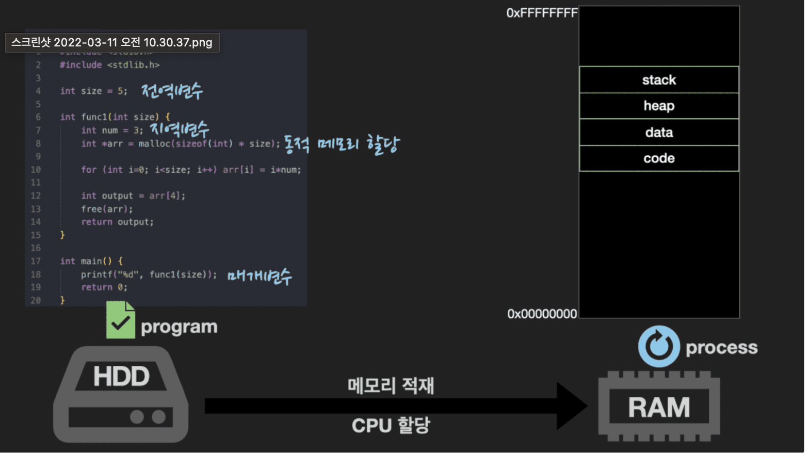
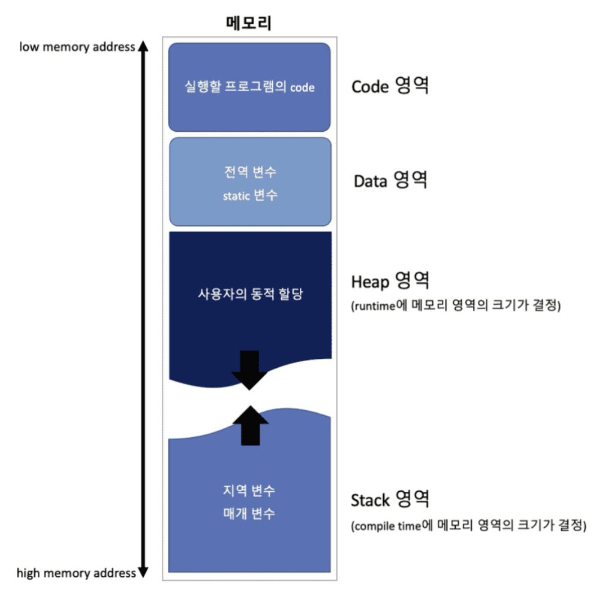
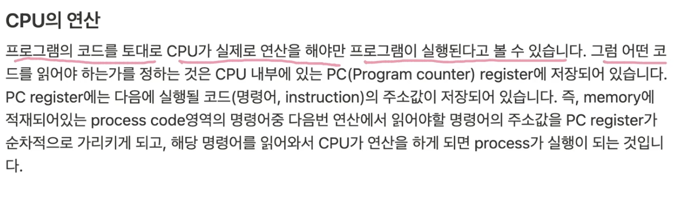

# 1. process

태그: cpu, memory

## 개념

- 실행파일(program)이 **`메모리에 적재`**되어 **`CPU를 할당`**받아 실행되는 것
    1. 실행파일 형태로 존재하던 프로그램이 메모리에 적재 
    2. CPU 할당 받으면
    3. **`프로세스가 된다`**

## 특징

- **`메모리`**
    - CPU가 직접 접근할 수 있는 컴퓨터 내부의 기억장치
    - 프로세스에 할당되는 메모리 영역
        - 각 프로세스마다 독립적으로 할당 받음.
        
        
        
        
        
        - stack
            - 함수 호출 시 지역변수와 매개변수가 저장되는 임시 영역
        - heap
            - 런타임 시 메모리 할당
            - 프로그래머가 직접 메모리 할당 / 해제 하는 영역
        - data
            - 전역 변수, static 변수 저장
        - code
            - 실행한 프로그램의 코드가 저장되는 영역
- **`CPU`**
    - 프로그램의 코드를 토대로 CPU가 연산을 해야 프로그램이 실행
    - 어떤 코드를 읽어야 하는가는 CPU 내부에 있는 **`PC(Program counter) register`**에 저장
    - PC register에 다음에 실행될 코드의 주소값이 저장되어 있음.
    - 결론
        - 메모리에 적재되어 있는 process code영역의 명령어 중 다음번 연산에서 읽어야 할 명령어의 주소값을 PC register가 순차적으로 가리키고, 해당 명령어를 읽어와서 CPU가 연산을 하면 process 실행

