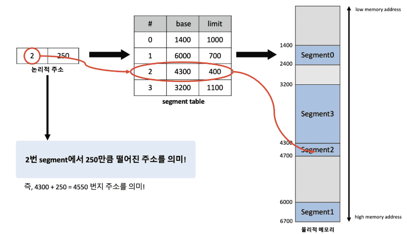

# 10. segmentation

## 개념

- process가 할당받은 메모리 공간을 논리적 의미 단위(segment)로 나누어 연속되지 않는 물리 메모리 공간에 할당될 수 있도록 하는 메모리 관리 기법
- 일반적으로 process 메모리 영역 중 Code, Data, Heap, Stack 등의 기능 단위로 segment를 정의하는 경우가 많음
- 주소 바인딩을 위해 모든 프로세스가 각각의 주소 변환을 위한 **`segment table`**을 갖는다.

## 메모리 단편화

- 내부 단편화 발생 X
- 서로 다른 크기의 segment들이 메모리에 적재되고 제거되는 일이 반복되면 외부 단편화 문제 발생 가능성 있음

## paging과 segmentation 차이

- paging
    - 일정한 크기의 단위로 나누어 할당
    - 내부 단편화 문제 가능성
- segmentaion
    - code, data, heap, stack 등의 기능 단위로 물리 메모리에 할당
    - 외부 단편화 문제 가능성

## paged segmentaion

- segmentaion을 기본으로 하되 이를 다시 동일 크기의 page로 나누어 물리 메모리에 할당하는 메모리 관리 기법
- paging + segmentaion 각각의 장점을 가져왔다
    - 외부 단편화 문제 해결,
    - segment 단위로 procees 간의 공유나 process 내의 접근 권한 보호가 이루어지도록 하여 paging 기법의 단점 해결
