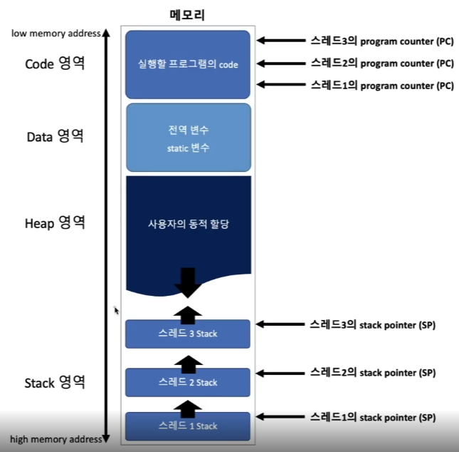
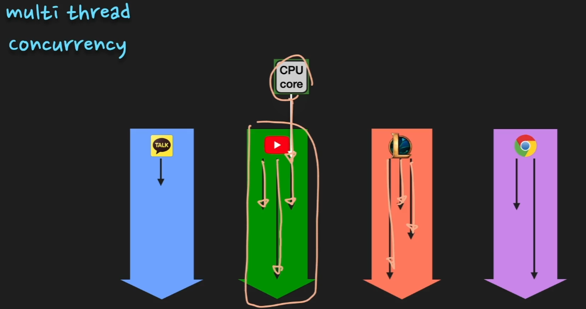

# 3. thread & Multi thread

## thread 개념

- 한 프로세스 내에서 실행되는 동작의 단위
- 각 스레드는 프로세스의 stack 메모리를 제외한 나머지 메모리 공유 가능
- 프로세스 내에서 **`독립적인 기능, 즉 독립적으로 함수를 호출`**
    - 이를 위해 stack 메모리가 각자 필요하다

## 특징

- Stack memory
    - 쓰레드가 함수를 호출하기 위해서는 인자 전달, Return Address 저장, 함수 내 지역변수 저장 등을 위한 독립적인 스택 메모리 공간을 필요로 함
    - 결과적으로  쓰레드는 프로세스로부터 독립적인 스택 메모리 영역 할당받고
    - Code, Data, Heap 영역은 공유하는 형태를 갖게 된다
- PC register
    - 각각의 쓰레드마다  PC register를 가지고 있어야 한다
    - 한 프로세스 내에서도 thread끼리 context swich가 일어나는데
    - PC register에 code address가 저장되어 있어야 실행을 할 수 있다
- 그림 설명
    
    
    

## Multi thread

- 하나의 프로세스가 동시에 여러개의 일을 수행할 수 있도록 해주는 것
- 즉 하나의 프로세스에서 여러 작업을 병렬로 처리하기 위해 multi thread 사용
- 멀티쓰레드에서는 한 프로세스 내에 여러개의 쓰레드가 있고, 각 쓰레드들은 스택 메모리를 제외한 힙, 데이터, 코드 영역을 공유함

