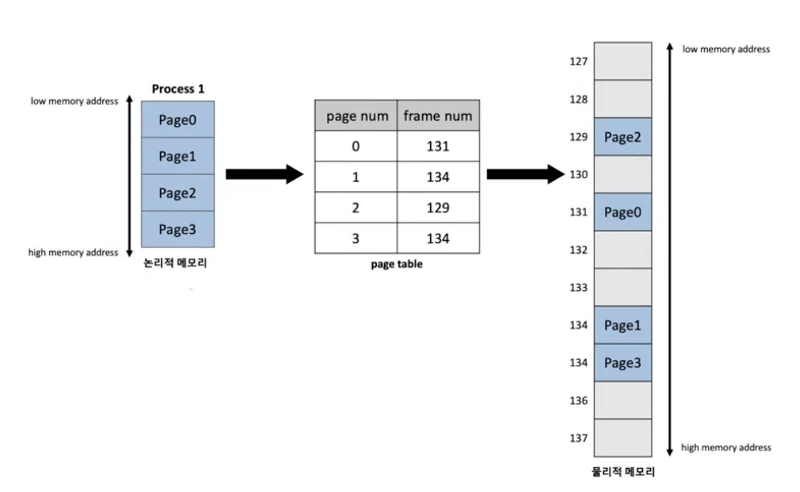
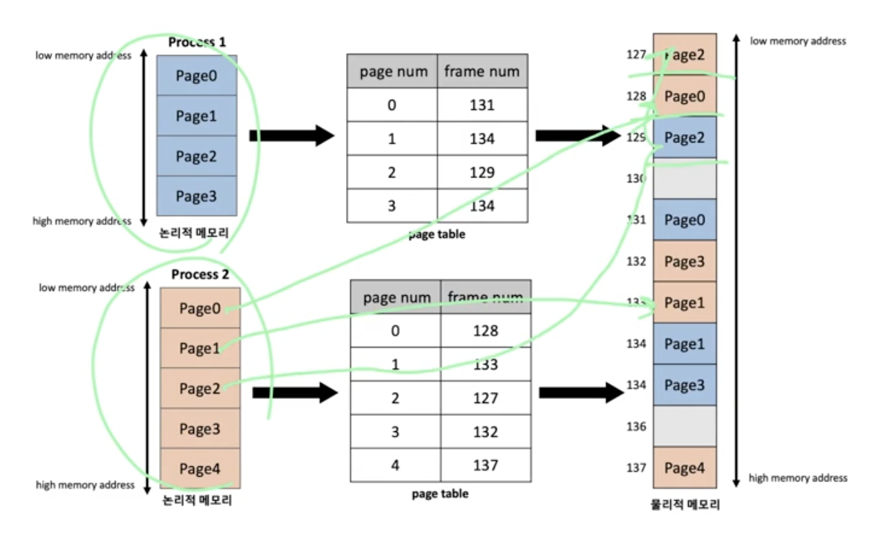

# 9. paging

## 용어정리

- 논리적 주소
    - 프로세스가 메모리에 적재되기 위한 독자적인 주소 공간
    - 각 프로세스마다 독립적으로 할당
    - 0번지부터 시작된다.
- 물리적 주소
    - 프로세스가 실제로 메모리에 적재되는 위치
- 주소 바인딩
    - CPU가 기계어 명령을 수행하기 위해 **`프로세스의 논리적 주소가 실제 물리적 메모리의 어느 위치에 매핑되는 지`**를 확인하는 과정

<aside>
💡 논리적 주소와 물리적 주소의 차이, 물리 메모리에 연속되지 않은 서로 다른 위치에 페이지 단위만큼 저장한다.

</aside>

## 개념

- 프로세스가 할당받은 공간을 **`동일한 page`**로 나누어 물리 메모리에서 연속되지 않은 서로 다른 위치에 저장하는 메모리 관리 기법
- 물리적 메모리를 페이지와 같은 크기의 프레임으로 미리 나누어 둔다
    - 페이지 단위로 메모리 적재가 이루어지기 때문에 미리 나누어두면 빠르게 메모리 할당이 가능하다
- 주소 바인딩을 위해 모든 프로세스가 각각의 주소 변환을 위한 page table을 가짐
    - 한 프로세스 내에서도 페이지 단위로 다른 물리적 메모리에 적재되기 때문에 주소 바인딩을 위해서 별도의 페이지 테이블이 필요한 것임

## 장점

- 빈 공간에다가 넣을 수 있다

## 메모리 단편화

- 물리적 메모리 공간이 작은 조각으로 나눠져서 메모리 공간이 충분함에도 할당이 불가능한 상태
- 페이징 기법에서는 **`외부 단편화`**는 발생 X
    - 논리적 주소 공간과 물리적 메모리가 같은 크기의 페이지 단위로 나뉘어져 있어서.
    - 외부 단편화
        - 메모리 상의 비어있는 공간의 크기가 작아서, 빈 메모리 공간임에도 할당되지 못하는 상황
    - 내부 단편화
        - 프로세스 주소 공간의 크기가 page의 배수라는 보장이 없어서, 프로세스 주소 공간중 가장 마지막에 위치한 page는 내부 단편화 발생 가능성 있음
        - 프로세스가 필요한 양보다 더 큰 메모리가 할당되어서 메모리 공간이 낭비되는 상황
