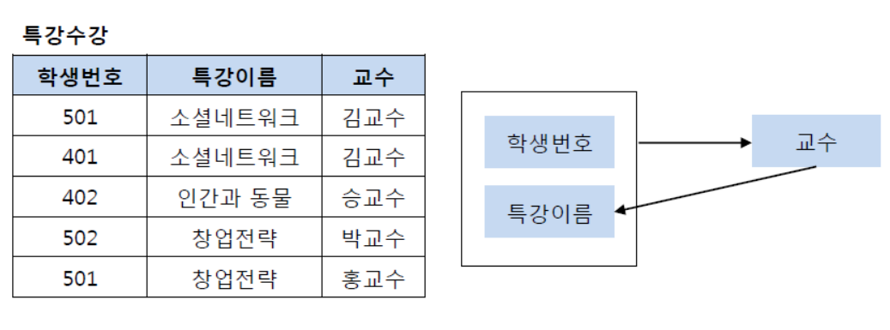

# 3. 정규화

[[Database] 정규화(Normalization) 쉽게 이해하기](https://mangkyu.tistory.com/110)

# 목적

- 테이블 간에 중복된 데이터를 허용하지 않는 것
- 이를 통해 무결성을 유지

### 제 1 정규화

- 테이블의 컬럼이 원자값을 갖도록 테이블을 분해하는 것

### 제 2 정규화

- 제 1 정규화를 진행한 테이블에 대해 완전 함수 종속을 만족하도록.
- 완전 함수 종속
    - 기본키의 부분집합이 결정자가 되어서는 안된다.

### 제 3 정규화

- 제 2정규화를 진행한 테이블에 대해 이행적 종속을 없앤다.
    - 이행적 종속 : A → B, B → C일 때 A → C
    
    
    

### BCNF 정규화

- 제 3정규화를 진행한 테이블에 대해 모든 결정자가 후보키가 되도록 테이블을 분해
    
    
