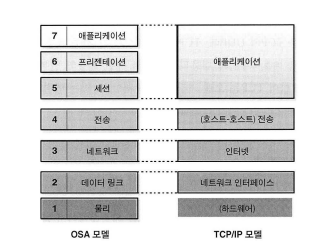
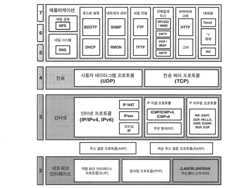

# TCP/IP 구조와 모델

## 네트워크 인터페이스

- 상위 계층에 있는 실제 TCP/IP 프로토콜이 로컬 네트워크에 접근하기 위해 사용하는 인터페이스 역할

## 인터넷

- OSI모델 상 3계층의 역할을 수행하며
- IP, ICMP 프로토콜과 라우팅 프로토콜 등의 지원 프로토콜이 존재
- 참고로 IPv6도 이 계층에 속함

## 호스트 간 전송 계층

- 핵심은 인터네트워크 상에서 종단간 통신을 쉽게 하는 것
- 장비 간에 데이터를 안정적이지 않거나, 안정적으로 보낼 수 있도록 하는 논리적 연결을 맺도록
- 특정 출발지와 목적지 애플리케이션 프로세스를 식별하는 작업도 수행
- TCP, UDP
- OSI 모델에서 세션 계층의 일부분으로 볼 수 있는 요소를 포함하고 있다.

## 애플리케이션

- OSI모델의 5,6,7 계층은 상위 계층 기능 간의 구분이 모호하다
    - TCP/IP 모델은 이 점을 잘 반영했다고 볼 수 있다.

# TCP/IP 프로토콜

- TCP/IP는 프로토콜 슈트다. 그렇기에, 프로토콜을 설명하는 것이 TCP/IP를 설명하기 가장 좋다
- 직렬 회선 프로토콜, 점대점 프로토콜 (2계층)
- ARP, RARP (2 / 3계층)
- IP, IP NAT, ICMP, RIP… (3계층)
- TCP, UDP (4계층)
- DNS, NFS, DHCP, FTP, HTTP, Telent … (5 / 6 / 7)계층
