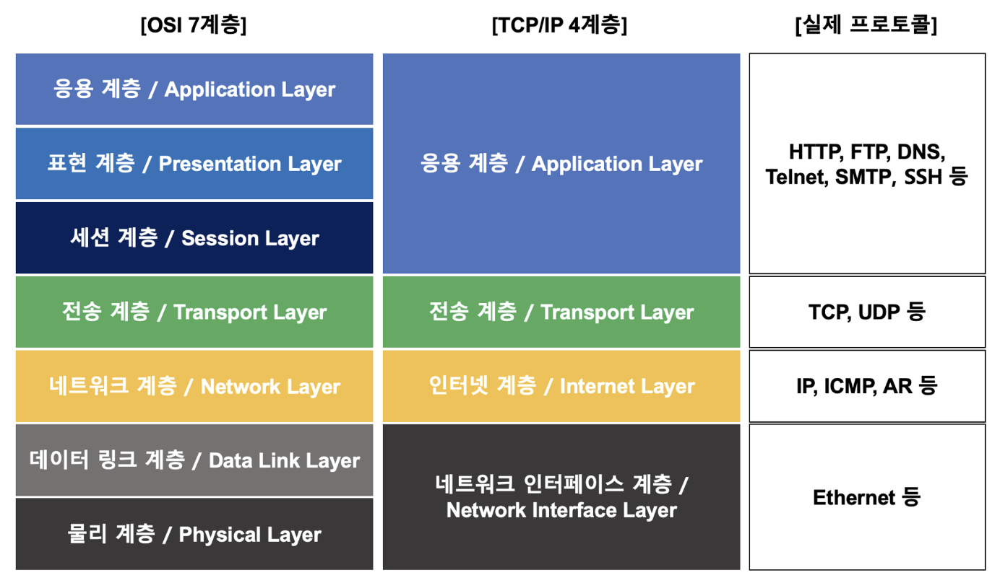

# 1.  OSI 7계층

## 정의

- 네트워크 통신을 표준화한 모델, 통신 시스템을 7단계로 나누어 설명
    - 현업에서는 주로 단순화한 TCP/IP 4계층 사용

## 특징

- 각 계층은 하위 계층의 기능을 이용하고, 상위 계층에게 기능을 제공

## 캡슐화 & 역캡슐화

- 캡슐화
    - 통신 프로토콜의 특성을 포함한 정보를 header에 포함시켜 하위 계층으로 전송

- 역캡슐화
    - header를 역순으로 제거하여 data를 얻는 과정
