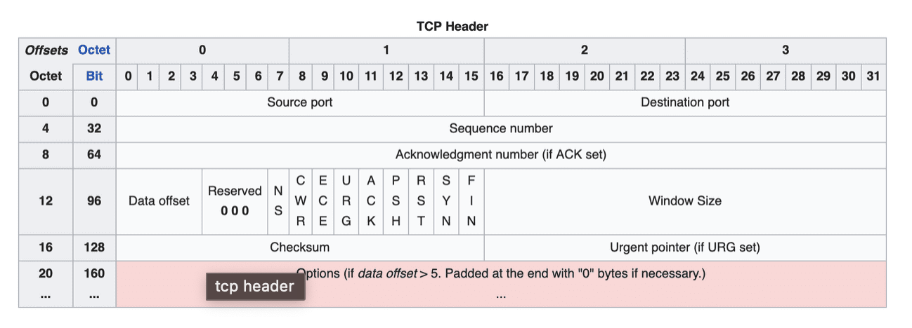

# 2.TCP vs UDP

태그: TCP header 추가 필요

## TCP

- 연결형, 신뢰성 전송 프로토콜
- 연결지향적 서비스를 위해 데이터를 전송하기 전에 **`3-way handshaking`**
    - 두 호스트의 전송계층 사이에 논리적 연결을 설정
- 가능하게 하는 방법
    - 오류제어
        - 훼손된 segement의 감지 및 재전송
        - 손실된 segement의 감지 및 재전송
        - 순서가 맞게 오지 않은 segement의 정렬
        - 중복 segement의 감지 및 폐기
    - 흐름제어
        - 데이터를 보내는 속도와 받는 속도의 균형 맞추기
    - 혼잡제어
        - 전송하는 패킷의 양을 조절하여 붕괴를 방지
- TCP header의 checksum, 확인응답, 타임-아웃 등으로 알 수 있다.

- 신뢰성 보장때문에 header가 크고 속도가 비교적 느림
- 신뢰성이 중요한 통신
    - Http, File 전송 등에 쓰임

## UDP

- 비연결형 프로토콜
- TCP에서 제공하는 서비스를 **`제공하지 않음`**
    - 3-way handshaking
    - 오류제어, 흐름제어, 혼잡제어
- 적은 양의 오버헤드를 갖고 수신여부를 확인하지 않음
    - 속도가 빠르다
- 실시간성이 중요한 통신
    - 동영상 스트리밍 등에 사용

## TCP/IP 전송계층

- 인터넷에서 사용하는 프로토콜 그룹
- 5계층
    - 응용 계층
    - 전송 계층
    - 네트워크 계층
    - 데이터링크 계층
    - 물리 계층

### 전송 계층

- 두 응용계층 사이에서 process-to-process 제공
- 응용계층으로부터 메시지를 받아 **`전송계층 패킷`**으로 캡슐화하여 전송
    - segement, datagram
- TCP(Transmission Control Protocol)로 전송하는 것이 segment
- UDP(User Datagram Protocol)로 전송하는 것이 datagram

## TCP header 분석

- 20byte → 160bit 헤더 사용
- TCP의 여러 옵션들을 사용하면 20byte → 최대 60byte까지 사용 가능

- Source port / Destination Port
    - 세그먼트의 출발지와 목적지를 나타내는 포트
    - 포트를 나타내는 필드만 존재 → 아직 전송계층이기 때문에.

- Sequenece number
    - 전송하는 데이터의 순서
    - 처음 데이터 전송시 **`0~4,294,967,296` 사이의 난수 생성**
    - 그 이후 1byte마다 number를 1씩 증가시키며 순서를 표현

- Acknowledgement number
    
    [ACK](http://www.ktword.co.kr/test/view/view.php?m_temp1=774&id=843)
    
    - 데이터를 받은 수신자가 예상하는 다음 시퀀스 번호
