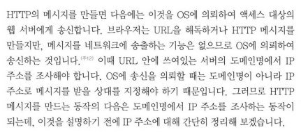
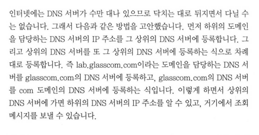
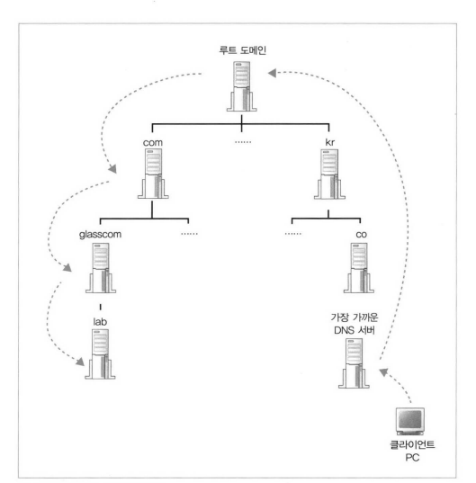

# 도메인

- 인터넷의 도메인은 루트 도메인이 존재
    - 루트 도메인은 전 세계에 13개 밖에 없음
    - 루트 도메인의 DNS 서버는 인터넷에 존재하는 DNS 서버에 **`전부 등록`**된다
        - 이 결과로 어느 DNS 서버도 루트 도메인에 액세스할 수 있다.
    - 전부 등록한다.. 는 13개 밖에 없고 변경이 잘 안되서 어렵지 않다고 한다.
    
    
