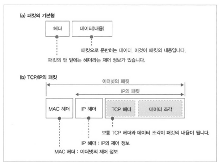
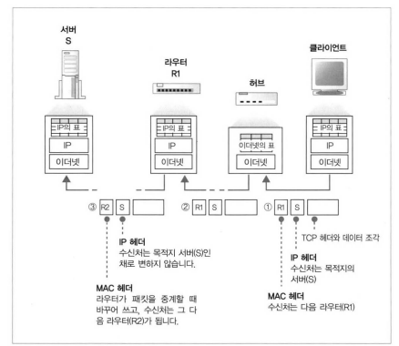
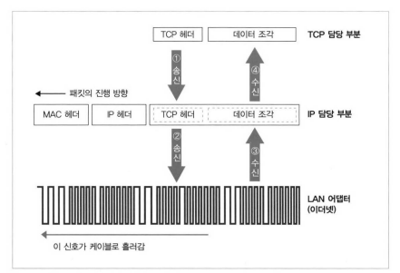

# 패킷

- 패킷의 송신처가 되는 기기가 패킷을 만든다.
    - 헤더에 적절한 정보를 기록
    - 데이터 부분에 데이터를 넣은 후 패킷을 가장 가까운 중계 장치에 송신
        - 중계 장치가 패킷의 헤더 조사해서 목적지 판단
            - 해당 과정의 반복.
    - 송신처와 수신처를 명확하게 구별하지 않는 경우
        - **`엔드 노드`**라고 부른다.

- TCP/IP의 패킷 모습
    
    
    
    - 그림과 같이 MAC 헤더는 계속해서 변화한다.
        - 왜? 중계 장치에 해당하는 다음 라우터를 조사하여 기록하기 때문에.
        - IP 헤더는 변하지 않는다. 목적지 그 자체이므로
    - 허브 → 라우터 → 라우터 → …. 목적지 도착.

## 패킷 송/수신 동작의 개요

- IP 담당 부분은 패킷을 상대에게 송출하기만 하면 끝.
    - 뒤에 상대가 있는 곳으로 운반하는 것은 네트워크 기기(허브, 라우터 등)의 역할.

### 출발점

- TCP 담당 부분이 IP 담당 부분에 패킷 송신을 의뢰하는 것부터 시작.
    - TCP가 TCP 헤더를 붙여서 IP에 준다.
        - 헤더와 데이터를 같이 주는 것. 즉, 어떤 상대에게 어떤 데이터를 주라는 요청
- 의뢰를 받은 IP 부분
    - IP 헤더와 MAC 헤더를 부가한다.
- 만든 패킷을 네트워크용 하드웨어(이더넷, 무선 LAN 등)에 준다.

- 알아둘 것
    - IP 담당 부분은 TCP 헤더와 데이터 조각을 단지 한 덩어리의 바이너리 데이터로 본다.
        - 내용 안보고, 데이터 조각 없고, TCP 헤더만 들어있는지 신경 안씀
        - TCP 동작도 신경 안쓴다. 패킷 순번 바뀌거나, 없어져도 신경 안쓴다.

## 수신처 IP 주소를 기록한 IP 헤더 만들기

- IP는 송/수신 의뢰 받으면 IP 헤더를 TCP 헤더 앞에 붙인다.
- 송신 의뢰를 받고, 송신처 IP 주소를 설정할 때, 복수 개의 LAN 어댑터를 사용하는 경우
    - IP가 여러 개여서 송신처 IP 주소를 설정할 때 헷갈림
        - 라우팅 테이블 이용해서 처리
            - 소켓에 기록되어 있는 수신처 IP 주소와 Network Destination 비교
            - Interface, Gateway 조사를 통해 어느 LAN 어댑터에서 패킷을 송신해야 하는지 알아내서 기록한다.

## 이더넷용 MAC 헤더 만들기

- 내용물은 IP나 ARP라는 프로토콜의 소켓
- 이더 타입
    - IP 프로토콜을 나타내는 0800 값 설정
- 송신처 MAC 주소
    - LAN 어댑터의 MAC 주소
        - LAN 어댑터 제조 시 그 안에 있는 ROM에서 값 가져오는 것
- 수신처 MAC 주소
    - 패킷을 건네주는 상대의 MAC 주소를 기록해야 한다.
        - Gateway에 기록되어 있는 IP 주소의 기기가 패킷을 건네주는 상대.
            - **IP에 해당하는 상대의 MAC 주소를 알아내는 과정이 필요**

## ARP로 수신처 라우터의 MAC 주소 조사

- 브로드캐스트
    - 패킷을 보낼 때마다 이 동작을 하면 비효율적이라 **ARP 캐시**
