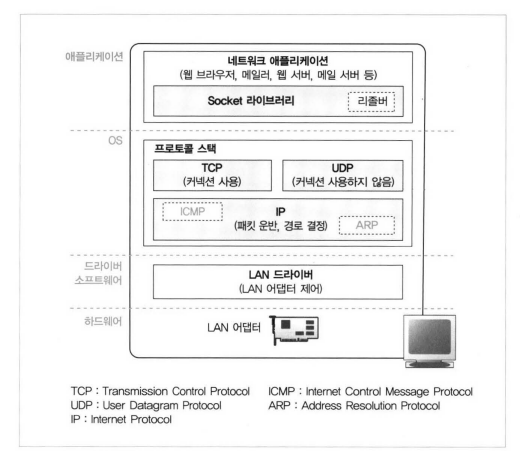
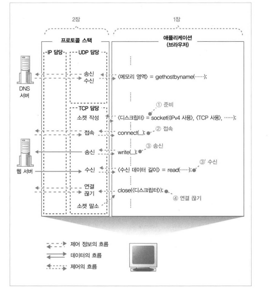
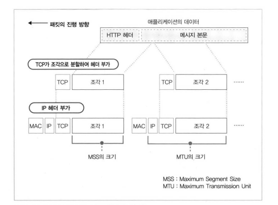
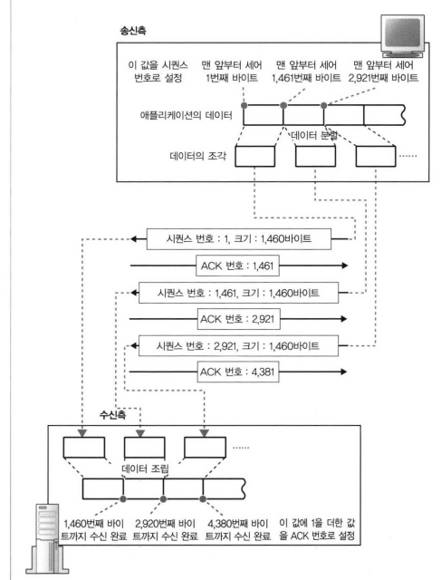

# 프로토콜 스택 / LAN 어댑터

- Socket 라이브러리에 있는 리졸버는 DNS 서버에 조회하는 동작을 실행
- 프로토콜 스택은 애플리케이션 계층으로부터 의뢰받은 동작을 수행
    - TCP / UDP로 나뉘어진다.
- IP 프로토콜을 사용하여 **`패킷`** 송/수신 동작 제어
    - IP 안에 ICMP와 ARP가 존재
        - ICMP는 패킷을 운반할 때 발생하는 오류를 통지하거나 제어용 메시지 통지
        - ARP는 IP 주소에 대응하는 이더넷의 MAC 주소 조사
- LAN 드라이버는 LAN 어댑터의 하드웨어 제어
- LAN 어댑터가 실제 송/수신, 케이블에 대해 신호를 송수신하는 동작 실행

## 프로토콜 스택

- 내부에 제어 정보를 기록하는 메모리 영역을 가지고 있다.
    - 통신 동작을 제어하기 위한 제어 정보를 기록
        - 통신 대상의 IP 주소, 포트 번호, 어떤 진행상태에 있는지.
- 데이터를 보내고 나면, 상대로부터 데이터를 받았는지 확인해야함
    - 따라서, 소켓에는 응답이 돌아오는지의 여부와, 송신 동작 후의 경과 시간 등 기록

## 소켓을 호출했을 때의 동작

### socket을 호출하여 socket을 만들어줄 것을 의뢰하면, 프로토콜 스택이 만든다.

- 이 때, 소켓 한 개 분량의 메모리 영역을 확보해야 한다.
    - 제어 정보를 담을 그릇을 준비하는 것과 같다.
- 소켓을 만들고 나서, 디스크립터를 애플리케이션에 알려준다.
    - 번호표 주는것
- 디스크립터를 받은 애플리케이션은, 이후 프로토콜 스택에 송수신 동작을 의뢰할 때 디스크립터를 통지해준다.

### 소켓을 만들면 애플리케이션은 connect 호출(접속)

- 프로토콜 스택은 자기쪽의 소켓을 서버측 소켓에 접속한다.
    - 서버의 IP 주소나 포트 번호를 프로토콜 스택에 알리는 동작이  필요한데, 이 것이 접속 동작의 한가지
- 서버에게 이곳의 IP 주소는 무엇이고, 포트번호는 무엇인데 송수신 가능? 물어본다.
- 즉, 통신 상대와의 사이에 제어 정보를 주고받아 소켓에 필요한 정보를 기록하고 데이터를 송수신이 가능한 상태로 만드는 것.
    - 클라이언트 IP 주소나 포트 번호를 서버 측에 알려주는 것이 한 예
- 데이터 송수신 동작을 실행할 때 데이터를 일시적으로 저장하는 메모리 영역 필요
    - 버퍼 메모리 확보, 접속한다는 동작의 의미이다.

### 접속 동작의 실제

- connect (( 디스크립터>， 서버측의 IP 소와 포트 번호>， .... ..
    - 정보를 써서 프로토콜 스택의 TCP 담당 부분에 전달
- 데이터 송수신 동작 개시를 나타내는 제어 정보를 기록한 TCP 헤더를 만든다.
    - 헤더에 송신처, 수신처 포트 번호 포함, SYN 컨트롤 비트 1로 만든다.
- 이렇게 해서 헤더 만들었으면, IP 담당 부분에 넘겨서 송신 의뢰
- IP 담당 부분은 패킷 송신 동작 실행
    - 서버의 IP 담당부분이 받아서 TCP에 넘겨준다.
    - 서버의 TCP가 받은 헤더를 조사하여 수신처 포트 번호에 해당하는 소켓 찾아낸다.
    - 여기에 필요한 정보를 기록하고 접속 동작이 진행중이라는 상태로 변경되고
        - 이 과정 끝나면 서버의 TCP 담당 부분은 응답을 돌려보낸다.
        - 응답 보낼 때 포트 번호, SYN 비트 설정한 헤더 만들고 ACK 컨트롤 비트 1로 만든다.
        - 다시 TCP 헤더를 IP 담당 부분에 넘겨서 클라이언트에 반송 의뢰
- 서버측으로부터 클라이언트가 패킷을 받았다면, 헤더 확인
    - SYN이 1이면 접속 성공이므로 서버에 접속 완료 요청 보낸다.

### 프로토콜 스택에 HTTP 리퀘스트 메시지 넘기기

- connect에서 애플리케이션 제어가 되돌아오면, 데이터 송수신 동작에 들어간다.
    - 애플리케이션에서 write 호출하여 송신 데이터를 프로토콜 스택에 건네주는 것부터 시작
- 프로토콜 스택은 받은 데이터가 뭔지 모름
    - 단지 바이너리 데이터가 1바이트씩 차례로 나열되어 있다고 인식함
- 받은 데이터를 곧바로 송신하지 않고, 자체 내부의 송신용 버퍼 메로리 영역에 저장하고, 애플리케이션이 다음 데이터를 건네주기를 대기
    - 왜 대기? 아래와 같은 요소로 판단.
        - MTU
            - 한 패킷으로 운반할 수 있는 디지털 데이터의 최대 길이, 이더넷은 보통 1500바이트
            - 헤더를 제외하고 나면 데이터의 최대 길이가 되고 MSS라고 부름
            - 즉 애플리케이션에서 받은 데이터가 MSS 초과하거나, 엄청 가까워질 때까지 데이터를 저장하고 송신하는 것
        - 타이밍
            - 프로토콜 스택의 내부 타이머에 의해
        - 이것들은 프로토콜 스택을 만드는 개발자에게 맡겨져 있으므로 OS 종류마다 다름
        - 버퍼에 머무르지 않고 바로 송신할 수 있도록 옵션을 만들수도 있다

### 데이터가 클 때 분할해서 보낸다.

- MSS를 초과한 경우 데이터 기다릴 필요 없다.
- MSS 크기에 맞게 분할하고 패킷에 넣어 송신

- ACK 번호를 사용하여 패킷이 도착했는지 확인
    - 데이터 조각을 분할할 때 조각이 통신 개시부터, 몇 번째 바이트에 해당하는지 센다
        - 세어둔 값을 TCP 헤더에 기록하고, 시퀀스 번호
        
        
        
        - 수신측은 ACK 사인으로 수신 확인 응답을 하게 됨
            - 1번째 바이트 수신 완료한 상태에서 3번 패킷이 도착하면 2번 패킷 누락을 확인

<aside>
💡 1. 접속 동작을 실행할 때 클라이언트에서 서버로 보내는 데이터에 관한 시퀀스 번호의 초기값을 클라이언트가 만들어서 서버에 알려준다

2. 서버에서 초기값으로부터 ACK 번호를 산출하여 클라이언트에 반송
(서버에 도착한 것을 알리기 위해 ACK 번호 반송)

3. 클라이언트도 마찬가지로 받은 시퀀스 번호의 초기값으로부터 ACK 번호를 산출하여 반송

</aside>

- TCP는 확인할 때까지 송신한 패킷을 송신용 버퍼 메모리 영역에 보관해두고, ACK 번호가 날라오지 않는 경우 다시 패킷을 보내게 된다.
- TCP의 구조 때문에 LAN 어댑터, 버퍼, 라우터 모두 회복 조치를 취하지 않는다.
    - 근데 도중 무슨 장애가 발생해서 못보내면?
        - 몇 번 보내고 데이터 송신 동작을 강제로 종료하고 애플리케이션에 오류 통지

### 패킷 평균 왕복시간으로 ACK 번호 대기 시간 조정

- ACK 번호가 돌아오는 시간 : **타임아웃 값**
    - 대기 시간을 어느정도 설정하여, ACK 번호가 돌아오기 전에 다시 보내는 사태 방지
- TCP는 대기 시간을 동적으로 변경하는 방법을 취함

### 윈도우 제어 방식으로 ACK 번호 관리

- ACK 번호가 돌아올 때까지 기다리는 동안 아무것도 하지 않는 것은 낭비
    - 윈도우 제어
        - 한 개의 패킷을 보낸 후 ACK 기다리지 않고 계속 복수의 패킷 보낸다
        - 이 경우 수신 측의 능력을 초과하는 경우가 있음
            - 따라서 수신 측에서 송신측에 수신 가능한 양을 통지하여 제어
            - **`TCP 헤더의 윈도우 필드`**에 작성해서 알림
