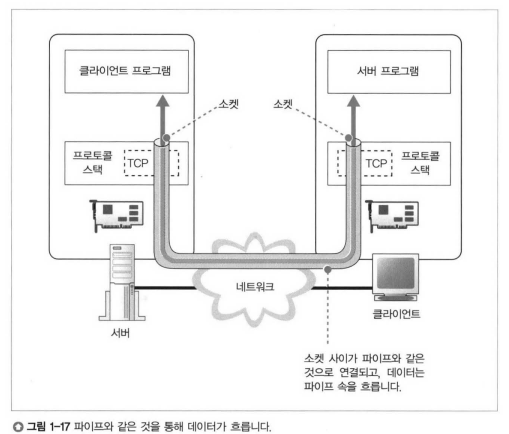

# 프로토콜 스택에 메시지 송신

- IP주소 조사 후, 액세스 대상의 웹 서버에 메시지를 송신하도록 **OS의 내부에 있는 프로토콜 스택에 의뢰**
    - 왜? 브라우저는 URL을 해독하여 HTTP 메시지를 만들 수는 있다.
    - 근데 네트워크 통해 보내는 역할은 못한다
        - 그래서 OS 내부에 의뢰해야 한다

- 의뢰를 위해서 Socket 라이브러리에 있는 프로그램 부품 이용
- 데이터 송수신을 위해 송 / 수신하는 양자 사이를 파이프로 연결하는 동작이 필요
    
    
    
    - 파이프의 양 끝에 있는 데이터의 출입구가 **`소켓`**
    - 먼저 서버 측에서 소켓을 만들고, 클라이언트가 파이프를 연결하기를 대기

- 순서 정의
    - 소켓을 만든다 (소켓 작성)
    - 서버측의 소켓에 파이프를 연결한다 (접속)
    - 데이터를 송수신한다 (송, 수신)
    - 파이프를 분리하고 소켓을 말소한다. (연결 끊기)

- 소켓 작성
    - 소켓 라이브러리의 socket이라는 프로그램 부품만 호출.
    - socket을 호출한 후의 socket 내부에 제어가 넘어가 소켓을 만드는 동작을 실행
    - 소켓이 생기면 **`디스크립터`**가 돌아옴, 일종의 번호표다.
        - 어느 소켓을 사용하여 접속할지, 데이터를 송수신할지 판단하는 지표

- 접속
    - socket의 connect를 호출
    - 디스크립터를 보고 어느 소켓에 접속할지 판단하여 접속 동작 실행
    - 송, 수신 상대의 IP 주소를 프롵토콜 스택에도 알려줘야 한다.
        - 이 때 IP주소만으로는 불가. **포트**랑 같이 지정해줘야 한다
        - 포트는 일반적인 관례가 있음. 예를 들어 웹은 80, 메일은 25 등.
        - 포트 번호는 접속 상대측에서 소켓을 지정하기 위해 사용
    - 서버에서도 클라이언트의 소켓 번호가 필요
        - 소켓을 만들 때, 프로토콜 스택이 적당한 값을 골라서 할당해줌
        - 이 값이 서버에 같이 넘어감

- 송/수신
    - socket의 write
        - 애플리케이션이 송신 데이터를 메모리에 준비
        - 디스크립터와 송신 데이터를 지정
        - 프로토콜이 송신 데이터를 서버에 송신ㄴ
    - sockter read
        - 수신할 때는 read
        - 수신한 응답 메시지를 받기 저장하기 위한 메모리 영역 지정 **`(수신 버퍼)`**
    
- 종료
    - socker의 close
    - HTTP 프로토콜은, 응답 메시지의 송신을 완료했을 때 웹 서버측에서 연결 끊기 동작을 실행한다. 따라서, 웹 서버 측에서 close를 호출하여 연결을 끊는다.
    - 클라이언트측에 전달되면, 연결 끊기 단계로 돌아간다. 즉, read 했음을 알려준다.
