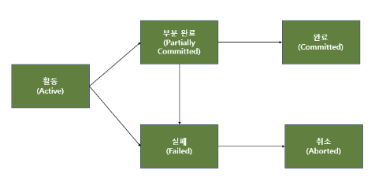
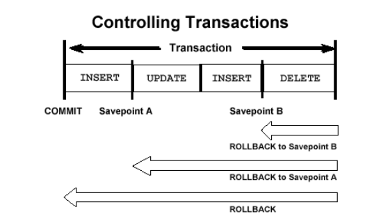

# Transaction

날짜: 2023년 3월 21일
사람: 태훈 김

## 정의

DB의 상태를 변화시키는 `하나`의 `논리적 기능을 수행`하기 위한 `작업의 단위` 또는 `한꺼번에 모두 수행`되어야 하는 `일련의 연산`

## 특징

1. DBMS에서 `병행 제어` 및 `회복 작업` 시 처리되는 작업의 논리적 단위
2. 사용자가 시스템에 대한 서비스 요구 시 시스템이 응답하기 위한 상태 변환 과정의 작업 단위
3. `Commit` 되거나 `Rollback` 되어야 함

## 연산

### `Commit`

트랜잭션이 시작하고 나서 진행한 모든 작업이 성공적으로 끝나 DB에 영속화 시키는 작업

### `Rollback`

트랜잭션이 시작하고 나서 Commit이 수행되기 전 오류나 비정상적인 상황이 발생해 DB의 일관성이 깨졌을 때, 정상적으로 처리된 연산도 트랜잭션의 원자성을 지키기 위해 Undo 하는 작업

## 성질 `ACID`

1. `Atomicity` `원자성`
    - 트랜잭션의 연산은 DB에 모두 반영되든지 아니면 전혀 반영되지 않아야 한다. 이러한 특징을 `All Or Nothing` 이라고도 부른다.
2. `Consistency` `일관성`
    - 트랜잭션이 성공적으로 Commit 되면 언제나 일관성 있는 DB 상태로 변환된다.
    - 시스템이 가지고 있는 고정 요소는 트랜잭션 수행 전과 수행 후가 같아야 한다.
        
        ex) 계좌 이체 과정
        
        이체 전
        
        A: 1000 | B: 2000 → A + B == 3000
        
        이체 후
        
        A: 950  | B: 2050 → A + B == 3000
        
        계좌 이체 전이나 후 모두 A와 B의 합산 금액은 같아야 한다.
        
3. `Isolation` `독립성`
    - 둘 이상의 트랜잭션이 동시에 병렬적으로 실행되는 경우 어느 하나의 트랜잭션 실행 중에 다른 트랜잭션 연산이 끼어들 수 없다. 즉, Write 연산이 불가능하다는 의미이다.
    - 수행 중인 트랜잭션은 완전히 완료될 때까지 다른 트랜잭션에서  수행 결과를 참조할 수 없다.
        
        즉, Read 연산이 불가능하다는 의미이다.
        
    - 격리 수준에 따라 수행 결과 참조 가능 여부가 달라진다.
        - 트랜잭션 격리수준 (Transaction Isolation Level)
            
            특정 트랜잭션이 다른 트랜잭션이 변경한 데이터를 볼 수 있도록 허용할지 여부를 결정하는 것
            
            - READ UNCOMMITTED
                
                어떤 트랜잭
                
            - READ COMMITED
            - REPEATABLE READ
            - SERIALIZABLE
    
4. `Durability` `영속성`
    - 성공적으로 완료된 트랜잭션의 결과는 시스템이 고장나더라도 영구적으로 반영되어야 한다.
    

## 상태



- `활동` `Active`
    
    트랜잭션이 실행 중인 상태
    
- `실패` `Failed`
    
    트랜잭션 실행에 오류가 발생하여 중단된 상태
    
- `철회` `Aborted`
    
    트랜잭션이 비정상적으로 종료되어 Rollback 연산을 수행한 상태
    
- `부분 완료` `Partially Committed`
    
    트랜잭션의 마지막 연산까지 실행했지만, Commit 연산이 실행되기 직전의 상태
    
- `완료` `Committed`
    
    트랜잭션이 성공적으로 종료되어 Commit 연산을 실행한 후의 상태
    

## 세이브포인트



트랜잭션 전체가 아닌 특정 부분까지만 작업을 취소하기 위해 사용된다.

현재 진행하고 있는 트랜잭션을 작게 분할하는 역할을 한다.

트랜잭션 중간 중간에 세이브포인트를 설정한다면, 트랜잭션 중간에 오류가 난다면 rollback할 때 세이브포인트 지점까지만 rollback할 수 있다.

### 사용 방법

```sql
-- 세이브포인트 지정
SAVEPOINT XXX;
```

```sql
-- 해당 세이브포인트 지점까지 처리한 작업을 Rollback 함
ROLLBACK TO XXX;
```

## 주의할 점

트랜잭션은 꼭 필요한 최소의 코드에만 적용하는 것이 좋다. 즉, 트랜잭션의 범위를 최소화하라는 뜻이다.

DB의 접근을 하기 위해서는 DB Connection을 획득해야 한다.

하지만, 이런 Connection의 개수는 제한적이다.

그런데, 각각의 트랜잭션이 여러 연산을 수행하면서 Connection을 길게 잡고 있다면, 사용 가능한 여유 Connection의 개수가 줄어들게 된다.

이러한 상황이 지속되다 보면, 다른 트랜잭션이 Connection을 얻기 위해 기다리는 상황이 발생할 수 있고, 이것은 서버의 성능을 야기한다.
