# 정규화

날짜: 2023년 3월 21일
사람: 이성민

## 정규화 개요

 정규화란 관계형 데이터베이스에서 중복을 최소화하고 데이터를 구조화하는 프로세스입니다. 이를 통해 데이터베이스의 유연성과 안정성을 높일 수 있습니다. 정규화는 종속성 이론을 활용하여 잘못 설계된 관계형 스키마를 더 작은 속성의 세트로 분해하여 바람직한 스키마로 만들어 가는 과정입니다.

## 정규화 목적

- 데이터 구조의 안정성 및 무결성을 유지
- 어떠한 릴레이션이라도 데이터베이스 내에서 표현 가능하게 만듬
- 효과적인 검색 알고리즘을 생성할 수 있음
- 데이터 중복을 배제하여 이상의 발생 방지 및 자료 저장 공간의 최소화가 가능
- 데이터 삽입 시 릴레이션을 재구성할 필요성을 줄임
- 데이터 모형의 단순화가 가능
- 개체와 속성의 누락 여부 확인이 가능
- 자료 검색과 추출의 효율성을 추구

## 정규화 종류

### 1. 1NF(제1정규형)

 1NF는 릴레이션에 속한 모든 도메인이 **원자값**만으로 되어 있는 정규형

**`-적용 전`**

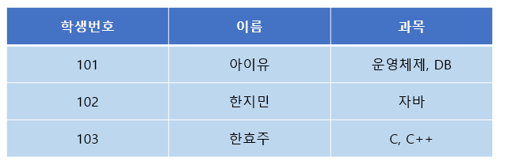

**`-적용 후`**

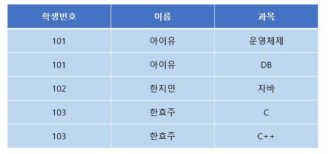

### 2. 2NF(제2정규형)

 2NF는 1NF를 만족하면서, **부분적 함수 종속을 제거**하는 것입니다. 부분적 함수 종속이란 어떤 컬럼이 기본키의 일부인 다른 컬럼에 종속되어 있는 것을 말합니다. 이를 해결하기 위해서는 기본키가 아닌 다른 컬럼들을 별도의 테이블로 분리해야 합니다.

**`-적용 전`**

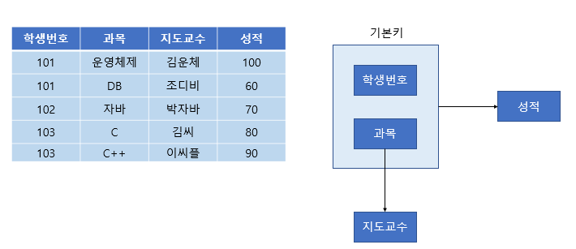

**`-적용 후`**

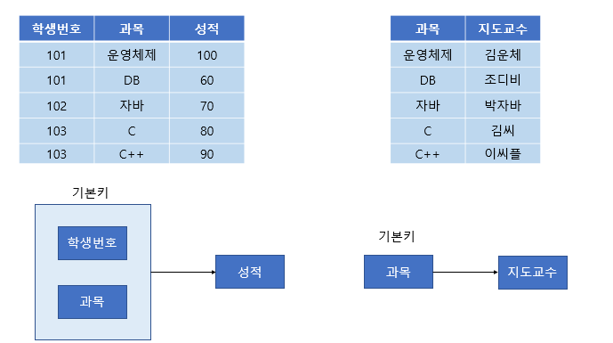

### 3. 3NF(제3정규형)

  3NF는 2NF를 만족하면서, **이행적 함수 종속을 제거**하는 것입니다. 이행적 함수 종속이란 A -> B, B -> C와 같은 관계에서 A -> C와 같은 관계가 성립되는 것을 말합니다. 이를 해결하기 위해서는 B를 기준으로 별도의 테이블을 만들어야 합니다.

**`-적용 전`**

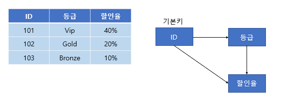

**`-적용 후`**

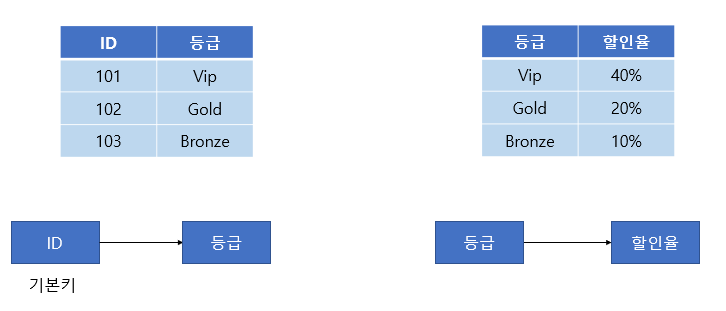

### 4. BCNF(Boyce-Codd Normal Form)

  모든 **결정자가 후보키인 정규형**입니다. 즉 후보키 집합에 없는 칼럼이 결정자가 되어서는 안됩니다.

**`-적용 전`**

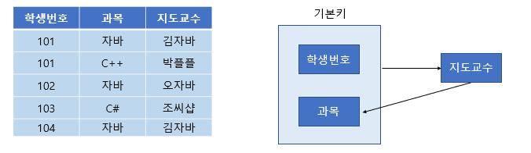

**`-적용 후`**

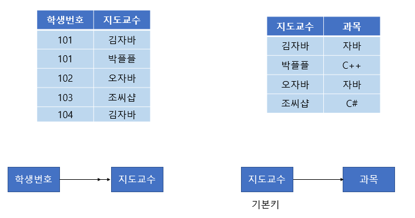

### 5. 4NF(제4정규형)

  4NF는 릴레이션 R에 **다치 종속** A↠B가 성립하는 경우 R의 모든 속성이 A에 함수적 종속 관계를 만족하는 정규형입니다.

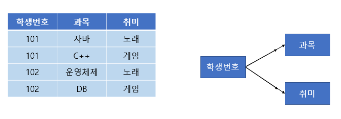

**다치 종속**

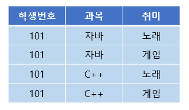

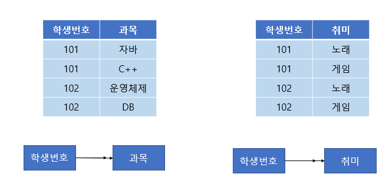

### 6. 5NF(제5정규)

  5NF는 릴레이션 R의 모든 **조인 종속**이 R의 후보키를 통해서만 성립되는 정규형입니다.

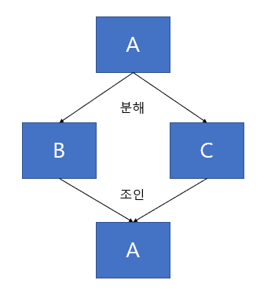

**조인 종속**
