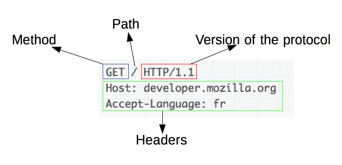
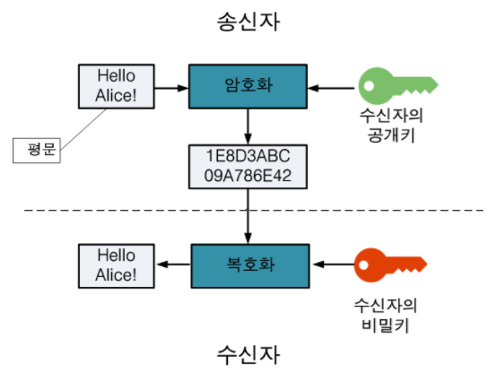
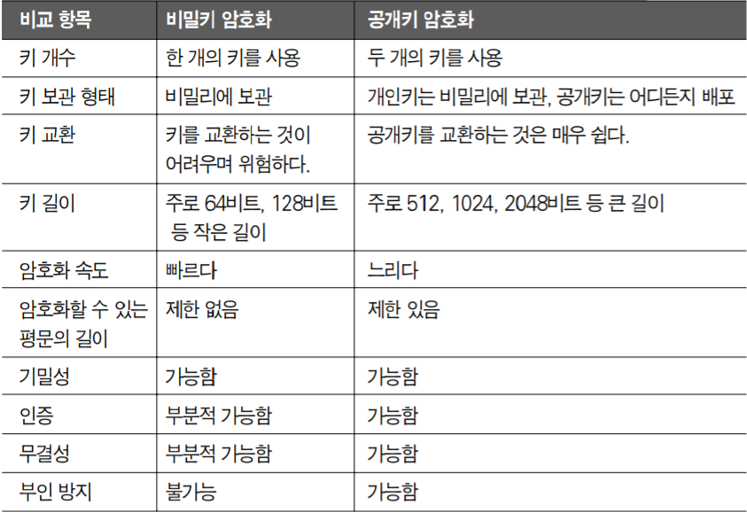
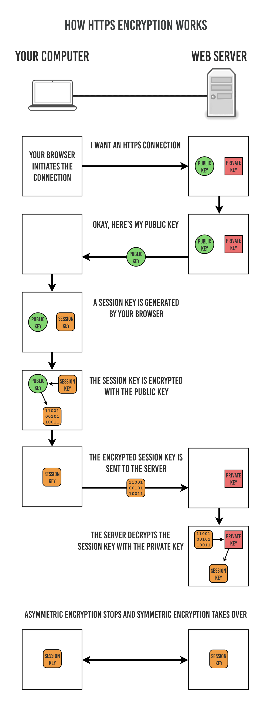

# HTTP vs. HTTPS

날짜: 2023년 3월 31일
사람: 이성민

## **1.HTTP(Hyper Text Transfer Protocol)란?**

[HTTP란?]

- 서버/클라이언트 모델을 따라 데이터를 주고 받기 위한 프로토콜
- HTTP는 인터넷에서 하이퍼텍스트를 교환하기 위한 통신 규약으로, 80번 포트를 사용

[HTTP의 구조]

- 애플리케이션 레벨의 프로토콜로 TCP/IP 위에서 작동
- Stateless 프로토콜이며 Method, Path, Version, Headers, Body 등으로 구

- 암호화가 되지 않은 평문 데이터를 전송

## **2.HTTPS(Hyper Text Transfer Protocol Secure)란?**

[HTTPS란?]

- HTTP에 데이터 암호화가 추가된 프로토콜
- 443번 포트를 사용하며, 암호화를 지원

[HTTPS 방식]

1. 대칭키 암호화
    - 클라이언트와 서버가 동일한 키를 사용해 암호화/복호화를 진행
    - 키가 노출되면 매우 위험하지만 연산 속도가 빠름
2. 비대칭키 암호화
    - 1개의 쌍으로 구성된 공개키와 개인키를 암호화/복호화 하는데 사용
    - 키가 노출되어도 비교적 안전하지만 연산 속도가 느림
    - 공개키 : 모두에게 공개 가능한 키
    - 개인키 : 나만 가지고 알고 있어야 하는 키
    - 공개키 암호화는 Data 보안에 중점
    - 개인키 암호화는 인증 과정에 중

[HTTPS의 동작 과정]

1. 클라이언트(브라우저)가 서버로 최초 연결 시도
2. 서버는 공개키(인증서)를 브라우저에게 넘겨줌
3. 브라우저는 인증서의 유효성을 검사하고 세션키를 발급함
4. 브라우저는 세션키를 보관하며 추가로 서버의 공개키로 세션키를 암호화하여 서버로 전송
5. 서버는 개인키로 암호화된 세션키를 복호화하여 세션키를 얻음
6. 클라이언트와 서버는 동일한 세션키를 공유하므로 데이터를 전달할 때 세션키로 암호화/복호화를 진

## **3.HTTP와 HTTPS**

[HTTP와 HTTPS]

- HTTPS는 HTTP에 속도가 느리며(오늘날에는 거의 차이를 못 느낄 정도) 인증서 발급을 위해 추가 비용 발생
- 개인 정보와 같은 민감한 데이터를 주고 받아야 한다면 HTTPS를 이용
- 노출이 되어도 괜찮은 단순한 정보 조회 등 만을 처리하고 있다면 HTTP를 이용

참고 자료

[https://mangkyu.tistory.com/98](https://mangkyu.tistory.com/98)

[https://brunch.co.kr/@artiveloper/24](https://brunch.co.kr/@artiveloper/24)

[https://gaeko-security-hack.tistory.com/123](https://gaeko-security-hack.tistory.com/123)
