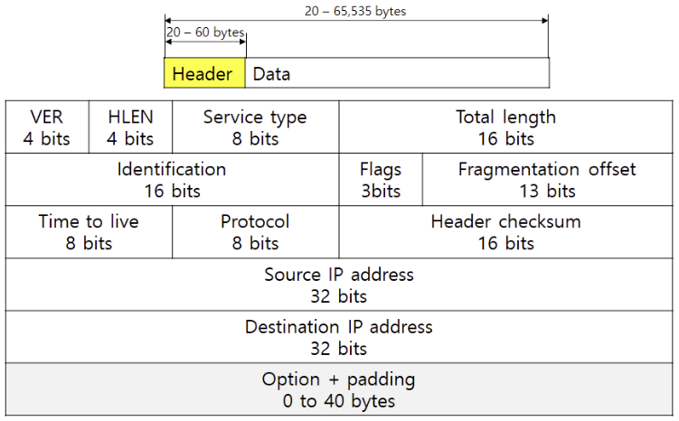
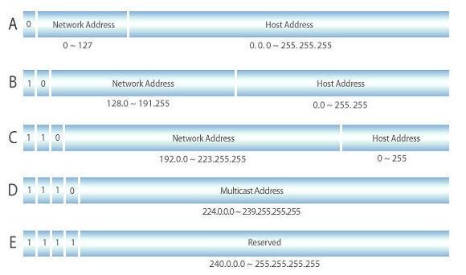
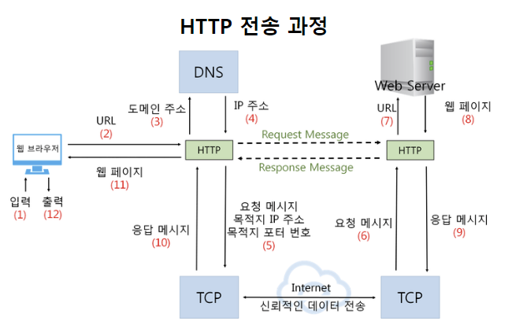

# IP, Web 요청 생명주기

날짜: 2023년 4월 4일
사람: 태훈 김

## IP

- 네트워크 계층의 프로토콜이다.
- TCP/IP에서 활용하는 주소체계이다.

### Header 정보

| 필드 | 내용 | 크기 |
| --- | --- | --- |
| VER | 인터넷 프로토콜의 버전 정보
ex) IPv4, IPv5, IPv6 | 4 |
| HLEN | 헤더의 길이 | 4 |
| Service type | IP 데이터그램의 서비스 타입 | 8 |
| Total length | IP 데이터그램의 크기(Header + Data) | 16 |
| Identification | 데이터그램을 구분하는 용도
데이터그램이 단편화 되었고 재조립 할 때 원래 어떤 데이터그램이었는지를 나타냄 | 16 |
| Flags | 데이터그램이 단편화되었는지 여부 | 3 |
| Fragmentation offset | 단편화된 데이터그램의 순서 | 13 |
| Time To Live
TTL | 패킷이 몇 번의 라우터를 거쳐야 사라지는지에 대한 정보
라우터를 하나 거칠 때 마다 1씩 감소 | 8 |
| Protocol | 상위 계층의 프로토콜 정보를 담음
ex) ICMP, IGMP, TCP, UDP | 8 |
| Header Checksum | 헤더 정보의 오류를 검출함 | 16 |
| Source/Destination IP address | 출발지와 도착지의 IP 주소 | 32 |

## A/B/C 클래스

### 구조

`네트워크_주소`.`호스트_주소`

호스트 주소가 모두 1 → Broadcast

호스트 주소가 모두 0 → 네트워크 주소

### A 클래스

- 하나의 네트워크가 가질 수 있는 호스트 수가 제일 많은 클래스
- IP 범위
    - Binary: `00000000`.`00000000.00000000.00000000` ~ `01111111`.`11111111.11111111.11111111`
    - Decimal:  0.0.0.0 ~ 127.255.255.255
- 네트워크 주소 범위
    - 1 ~ 126 (127은 제외하기로 약속함)
- 호스트 주소의 개수 → (2^24) - 2

### B 클래스

- IP 범위
    - Binary: `10000000.00000000`.`00000000.00000000` ~ `10111111.11111111`.`11111111.11111111`
    - Decimal:  `128.0`.`0.0` ~ `191.255`.`255.255`
- 네트워크의 주소 범위
    - 128.0 ~ 191.255
- 호스트 주소의 개수 → (2^16) - 2

### C 클래스

- IP 범위
    - Binary: `10000000.00000000.00000000`.`00000000` ~ `10111111.11111111.11111111`.`11111111`
    - Decimal: 192.0.0.0 ~ 223.255.255.255
- 네트워크의 주소 범위
    - 192.0.0 ~ 223.255.255
- 호스트 주소의 개수 → (2^8) - 2

## Subnet

하나의 네트워크가 분할되어 나누어진 작은 네트워크

`CIDR` (Classless Inter Domain Routing) 이라고도 한다.

`네트워크를 분할`하는 것을 `Subnetting`이라고 하고, 이것은 Subnet Mask를 통해 수행될 수 있다

### 탄생 배경

- 클래스 단위로만 네트워크를 분류하는 것 보다 `더 적절한 단위로 네트워크를 분할해야 할 필요성`이 생겼다
- 어떤 기업은 적은 양의 호스트가 필요한데 B 클래스 네트워크를 할당받아서 IP 주소에 여유가 생기고, 어떤 기업에서는 많은 양의 호스트가 필요한데, C 클래스 네트워크를 할당 받아서 IP 주소가 부족해지는 현상이 발생한다

### 목적

1. 네트워크를 운영 중인 서비스의 규모에 맞게 분할한다
2. 낭비되는 IP 주소 자원을 최소화한다
3. 네트워크의 규모를 줄여서 Broadcasting의 부하를 줄인다

### Subnet Mask

네트워크 주소를 나타내는 비트 수

IP 주소의 어디까지 네트워크 주소를 표현하는지 명시하는 값

ex) A 클래스의 Subnet Mask ⇒ 8 | 255.0.0.0 | 11111111.00000000.00000000.00000000

B 클래스의 Subnet Mask ⇒ 16 | 255.255.0.0 | 11111111.11111111.00000000.00000000

C 클래스의 Subnet Mask ⇒ 24 | 255.255.255.0 | 11111111.11111111.11111111.00000000

Subnet Mask ⇒ 25 | 255.255.255.128 | 11111111.11111111.11111111.10000000

ex) if

Subnet Mask: 255.255.255.128

IP 주소: 205.0.1.129

then

205.0.1.129/25 와 같이 간소화하여 표현

---

## Web 요청 생명주기

1. `DHCP 서버` 로 `broadcast 요청`을 보내 응답으로 본인의 `IP` 주소, `first-hop router`의 `IP` 주소, 그리고 `DNS 서버`의 `IP` 주소와 이름을 받게 된다.
2. `first-hop router`의 `MAC` 주소를 알아내기 위해서 `ARP` 쿼리를 `broadcast` 방식으로 요청을 보내면 `MAC` 주소를 담고 있는 `ARP` 응답을 받게 된다.
3. 알아낸 `first-hop router`의 `MAC` 주소를 사용해 `DNS 서버`로 특정 `url`의 `IP` 주소를 알아내기 위해 요청을 보내면, `DNS 서버`에서 온 응답에서 요청했던 `url`에 대한 `IP` 주소를 알아낸다.
4. 이렇게 알아낸 `IP` 주소로 `UDP` 방식으로 통신을 진행한다면 바로 웹페이지 요청을 보내면 되지만, `TCP` 방식이라면 `3-way handshake` 과정을 거친 후 통신을 진행한다.
5. 이제야 비로소 `HTTP` 통신을 주고 받을 수 있게 된다.
