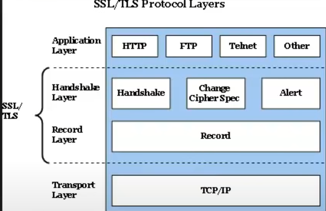
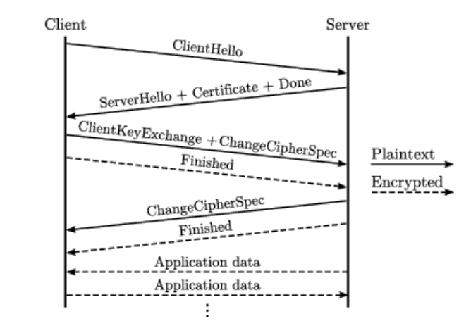

# SSL/TLS

날짜: 2023년 4월 4일
사람: 성재 김

[간략 이해]

HTTPS : HTTP에서 통신 내용을 암호화하는 것 추가

- HTTPS
    - **얘는 SSL 위에서 동작하는 개념임**
    - Client - Server 통신에 있어 ‘제 3자’ 인증 필요
    - 이러한 일을 해주는 회사 = CA(certificate Authority)
    - 이 CA들은 **SSL 인증서를 기준**으로 Client가 접속한 Server가 유효한지 확인
    - SSL 인증서 : 제3자가 보증해주는 전자화된 문서
        - 1) 서버가 신뢰할 수 있는 곳인가?
        - 2) 그러면 SSL 통신에 사용될 공개키를 클라이언트에게 줄게.
            - 서버의 신뢰는 어떻게 파악? → 공개키 서명 방식
        - SSL/TLS HandShake

# **SSL(Secure Sockets Layer)이란**

## 1) 개념

- 암호화 기반 인터넷 보안 프로토콜, 웹 서버와 클라이언트의 통신을 위한
    - SSL통신이 적용되지 않으면 평문(Plain Text) 그대로 전송 : 보안취약

## 2) 특징

- URL 프로토콜 : https, 기본 포트 443
- **전달되는 데이터 암호화** / 특정 공격 차단
    - 데이터를 가로채려 해도 거의 복호화가 불가능
- **SSL 인증서**를 통한 신뢰성 검증
    - 클라이언트가 접속한 서버가 신뢰 할 수 있는 서버임을 보장한다.
    - SSL 통신에 사용할 공개키를 클라이언트에게 제공한다.
- 데이터 송/수신 과정 암/복호화 발생 : 속도 저하
- Client - Server 간의 **HandShake**를 통해 인증이 이루어진다.

## 3) TLS/SSL HandShake

- HTTPS에서 클라이언트와 서버 간 통신 전, SSL 인증서로 신뢰성 여부를 판단하기 위해 연결하는 방식
- 이 과정을 통해 세션을 생성, 두 노드의 통신은 세션 상에서 수행된다.
- Handshake (클라이언트와 서버의 정보 공유 및 진행 과정)

## 4) SSL의 동작 방법

- 암호화된 데이터를 전송하기 위해 공개키와 대칭키를 혼합해서 사용
    - 실제 데이터 : 대칭키로 암호화
        - 양쪽 모두 대칭키를 공유하고 있어야 하는데,
        - 그 대칭키를 공유할 때 사용하는 암호화 기법으로 공개키 사용
    - 대칭키의 키 : 공개키

.

- 클라리언트가 서버에 접속 (Client Hello)
    - **클라이언트 측에서 생성한 랜덤 데이터**
    - 클라이언트가 지원하는 암호화 방식
        - 클라이언트와 서버가 지원하는 암호화 방식이 다를 수 있음
        - 그래서 어떤 암호화 방식을 사용할 지에 대한 협상
    
- 서버가 클라이언트에 응답 (Server Hello)
    - **서버 측에서 생성한 랜덤 데이터**
    - 서버가 선택한 클라이언트의 암호화 방식
        - 서버쪽에서도 사용할 수 있는 암호화 방식을 선택하는 것
    - **인증서 전송**

<aside>
💡

1. 웹 브라우저가 서버에 접속할 때 서버는 브라우저에 인증서를 제공한다.
2. 웹 브라우저는 이 인증서를 발급한 CA가 자신이 내장한 CA의 리스트에 있는지를 확인한다.
3. 확인 결과 서버로부터 받은 인증서가 브라우저에 내장된 CA리스트에 포함되어 있는 CA로부터 발급받은 것이라면 **해당 CA의 공개키**를 이용해 인증서를 복호화한다. => 해당 절차를 통해 이 인증서가 CA의 비공개키에 의해서 암호화 된 것을 보장한다.
4. CA에 의해서 발급된 인증서라는 것은 접속한 사이트가 CA에 의해 검토된 신뢰 할 수 있는 사이트라는 것을 의미한다.
</aside>

- 클라이언트는 인증서가 어떤 CA에서 발급된 것인지 확인
    - 클라이언트에 내장된 CA 리스트 확인(브라우저에 내장)
    - 인증기관에 있는 공개키로 복호화가 된다 (클라이언트는 내장된 CA 공개키 있음)
        - 인증서가 틀림없이 인증기관에 의해 발급된 것임을 확인
        - 인증서 안에는 서버가 생성한 공개키가 들어있음
        - 클라이언트가 서버 공개키를 획득!

 

- 위의 두 과정에서 서버의 랜덤 데이터 / 클라이언트의 랜덤 데이터 조합
    - pre master secret 키 생성 : 세션 단계에서 데이터를 주고 받을 때 암호화 목적
    - 대칭키 기법으로 = pre master secret 키 노출 절대 안됌
    - pre master secret 키는 서버에게 전달할 때 서버의 공개키로 암호화하여 전달
    - 서버의 공개키는 어디있을까?? —> CA 인증서 안에.

- 서버가 클라이언트가 전송한 pre master secret 키를 자신의 비공개키로 복호화

- 서버와 클라이언트가 모두 pre master secret 키를 가지고 있고, 이를 통해 master secret 값으로 만들고 session key를 생성하고 이 session key를 이용해 서버와 클라이언트가 데이터를 대칭키 방식으로 공유한다..

- 위의 과정이 끝나면 Finished 사인

- 세션은 실제로 서버와 클라이언트가 데이터를 주고 받는 단계이다. 이 단계에서 핵심은 정보를 상대방에게 전송하기 전에 session key 값을 이용해서 대칭키 방식으로 암호화 한다는 점이다. 암호화된 정보는 상대방에게 전송될 것이고, 상대방도 세션키 값을 알고 있기 때문에 암호를 복호화 할 수 있다.
