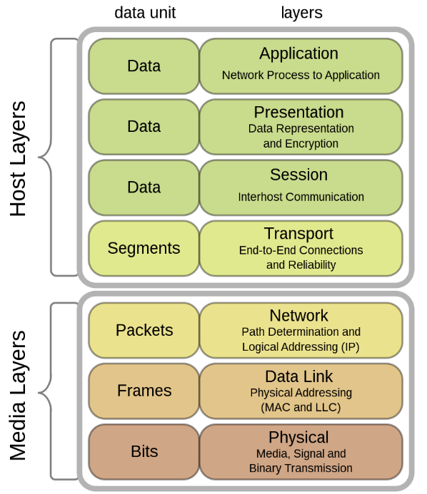
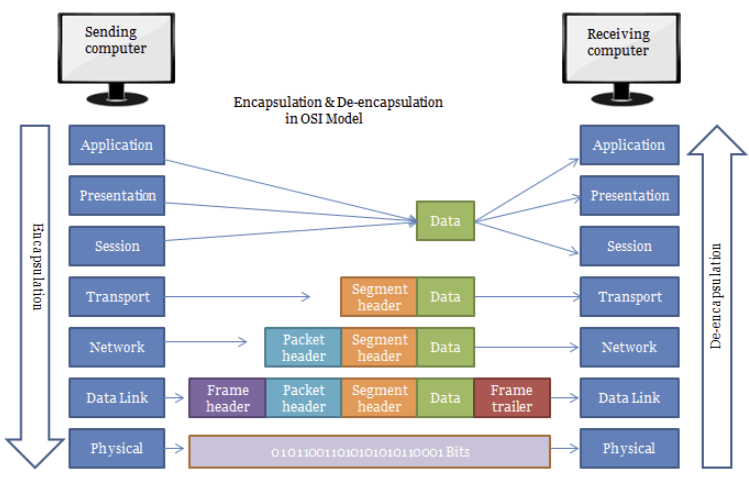
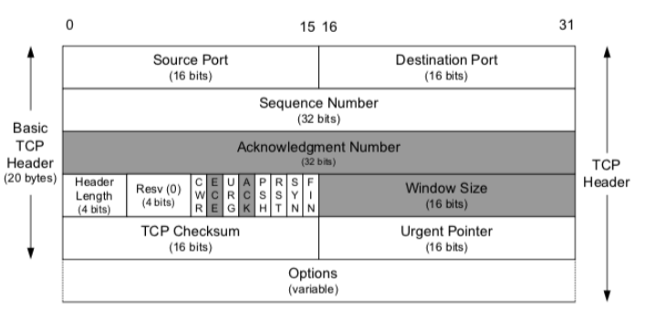
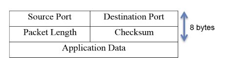

# TCP vs UDP

날짜: 2023년 3월 31일
사람: 태훈 김

# 주요 용어 정리

## 프로토콜 Protocol

복수의 컴퓨터가 데이터 통신을 원활하게 하기 위해 필요한 `통신 규약`

신호 송신의 순서, 데이터의 표현법, 오류 검출법 등을 정하는 `통신 규약`

## PDU(Protocol Data Unit)

데이터 통신에서 상위 계층이 전달한 데이터에 붙이는 제어 정보

각각의 계층마다 데이터를 부르는 이름이 달라진다.

## 패킷 Packet

4계층에서 보낸 Segment에 Header를 붙인 3계층의 PDU

## 세그먼트 Segment

7계층에서 보낸 데이터에 Header를 붙인 4계층의 PDU

---

## Transport 계층

TCP와 UDP 프로토콜은 4계층인 Transport 계층에서 사용된다.

---

## TCP(Transmission Control Protocol)

### 특징

1. 연결 지향적이다. → 연결할 때 3-way-handshake, 해제할 때, 4-way-handshake
2. 흐름 제어(Flow Control)와 혼잡 제어(Congestion Control)를 한다. → 높은 신뢰성 보장
3. UDP보다 속도가 느리다. ← 높은 신뢰성 보장, 패킷에 대한 응답을 해야 함(시간 지연, CPU 소모)
4. 전이중(Full-Duplex), 점대점(Point to Point) 방식이다. → 1:1 통신
5. 주로 신뢰성 있는 전송이 중요할 때 사용하는 프로토콜이다.

### Header 정보

7계층인 Application 계층으로부터 데이터를 받아, Header를 붙여 Network 계층으로 보낸다.

| 필드 | 내용 | 크기(bit) |
| --- | --- | --- |
| Source/Destination Port | 송수신 `프로세스에 할당`되는 `포트 주소` | 16 |
| Sequence Number | TCP `세그먼트`의 `연속된 데이터 번호`
전송되는 세그먼트의 `가장 앞에 있는 숫자`를 표기하고 있음 | 32 |
| ACK Number | 수신 프로세스가 상대방으로부터 받아야 하는 `다음` TCP `세그먼트 데이터 번호` | 32 |
| Reserved | 현재는 사용 X | 6 |
| Flag Bit(SYN, ACK, FIN, … ) | 각종 제어 비트 | 6 |
| Window Size | 수신 `윈도우`의 `버퍼 크기`를 지정함
0은 송신 프로세스의 전송 중지를 의미함 | 16 |
| Urgent Pointer | 긴급 데이터를 처리
URG 플래그 비트가 지정된 경우에만 유효함 | 16 |
| CheckSum | 세그먼트의 헤더와 데이터에 대한 `오류 검출` | 16 |

## 혼잡 제어 Congestion Control

- 네트워크가 감당하기 힘들 정도로 `많은 양의 데이터`가 `너무 빨리 전송`되는 현상을 해결하기 위한 기법
- 혼잡 제어가 발생하면
    1. 라우터의 버퍼에서 오버플로우가 발생해 `패킷이 소실`될 수 있다.
    2. 라우터의 버퍼에서의 큐잉 때문에 `딜레이가 길어질` 수 있다.
- 해결 기법
    1. AIMD(Additive Increase/Multicative Decrease)
    2. Slow Start
    3. Fast Retransmit
    4. Fast Recovery

## 흐름 제어 Flow Control

- 송신측과 수신측의 데이터를 받는 버퍼의 크기 차이로 인해 발생하는 데이터 처리 속도를 해결하기 위한 기법
- 만약 송신 측이 수신 측보다 데이터 처리 속도가 빠르다면 오버플로우가 발생해 패킷이 손실될 수도 있고, 불필요한 데이터의 재전송이 발생할 수도 있다.
- 해결 기법
    1. Stop And Wait
        
        매번 전송한 패킷에 대해 확인 응답(ACK)를 받으면 다음 패킷을 전송하는 방법이다.
        
        그러나 패킷을 하나씩 보내기 때문에 비효율적인 방법이다.
        
    2. Sliding Window
        
        수신 측에서 설정한 윈도우 크기만큼 송신 측에서 확인 응답(ACK) 없이 패킷을 전송할 수 있게 하여 데이터 흐름을 동적으로 조절하는 제어 기법이다.
        

[[네트워크] TCP/IP 흐름 제어 & 혼잡 제어](https://steady-coding.tistory.com/507)

[[네트워크] - TCP (흐름제어/혼잡제어)](https://rok93.tistory.com/entry/네트워크-TCP-흐름제어혼잡제어)

---

## UDP(User Datagram Protocol)

### 특징

1. `비연결` 지향적이다 → 연결 설정/해제 과정 없이 통신이 가능함
2. 정보를 주고 받을 때 정보를 보내거나 받는다는 신호 절차를 거치지 않는다.
3. UDP 헤더의 CheckSum 필드를 통해 `최소한의 오류만 검출`한다.
4. `신뢰성이 낮다` ← 패킷에 순서 부여 X, 재조립 X, 흐름 제어 X, 혼잡 제어 X
5. TCP보다 `속도가 빠르다`
6. 네트워크 부하가 적다
7. `N:M 통신`이 가능하다.
8. 주로 연속성이 중요한 서비스에 사용되는 프로토콜이다.

### 헤더 정보

| 필드 | 내용 | 크기(bit) |
| --- | --- | --- |
| Source/Destination Port | 송수신 `프로세스에 할당`되는 `포트 주소` | 16 |
| Packet Length | 헤더와 데이터를 합한 `데이터그램`의 `전체 길이` | 16 |
| Checksum | 데이터그램 전체에 대한 `오류 탐지` | 16 |

---

## TCP vs UDP
