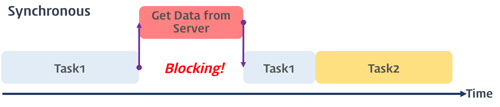
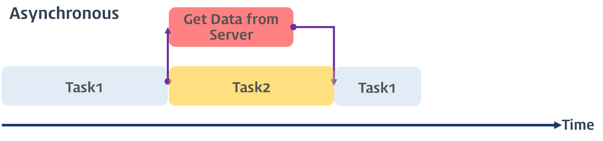

# 동기, 비동기 처리

날짜: 2023년 4월 4일
사람: 유영

# **동기 (Synchronous)**



> **직렬적**으로 작업을 수행하는 방식
> 

보낸 **요청**에 대한 **응답**이 돌아온 후에야 비로소 다음 작업이 동작하는 방식

한 작업을 실행하는 동안에 다른 작업들은 대기한다. → **동시**에 여러 작업을 처리하지 않는다.

⇒ 시스템의 전체적인 **효율** 저하

# **비동기(Asynchronous)**



> **병렬적**으로 작업을 수행하는 방식
> 

보낸 요청에 대한 **응답** 여부에 상관없이 다음 작업이 동작하는 방식

한 작업의 실행 중 다른 작업을 작업할 수 있으므로 자원의 효율적인 사용

응답 값이 필요한 작업은 **콜백 함수**를 선언하여 **응답 이후** 처리해줄 작업 호출

# 콜백함수

→ 다른 함수에 **인자**로 전달되는 함수

함수 내에서 작업을 한 후 실행을 완료 했을 때, 혹은 이벤트 발생 시에 호출할 수 있다.

## Callback Hell

```jsx
var data = callbackFunc(var1, function(var2){
	// TO DO TASK ...
	callbackFunc(var2, function(var3){
		// TO DO TASK ...
		callbackFunc(var3, function(var4){
			// TO DO TASK ...
		}
	}
});
```

비동기 방식에서 응답 후 처리해야 할 코드가 많을 경우 callback 함수를 중첩(nesting) 사용해야 한다.

⇒ **Callback Hell** 발생

- 가독성이 떨어진다.
- 유지보수가 어렵다.

### 해결 방법

1. 별도의 함수 선언: calllback함수를 최대한 분리하여 코드의 가독성을 높인다.
2. **Promise** 사용: **Promise** 객체의 사용과 then(), catch() method를 통해 callback함수를 처리한다.
3. **async · await** 사용: **async** 함수 내부에서 **await** keyword를 통해 후술된 함수가 처리될 때까지 대기할 수 있다.

# Promise

> **비동기** 작업의 **성공**(resolve)과 **실패**(reject)를 다루기 위한 객체
> 

```jsx
// 선언부
var _promise = function (param) {
	return new Promise(function (resolve, reject) {
		if(param /* 성공 시 */)
			resolve(/* 성공 결과 obj */);
		else {
			reject(/* 실패 처리 obj */);
		}
	});
};

// 구현부
_promise(true)
.**then**(
	result => {
		// 성공 시 처리 로직
	},  // 
	error => {
		// 실패 시 처리 로직
	}
)
.**catch**(error => {
	// error를 이용한 오류 처리 (인자는 오류 이유)
})
.**finally**( () => {
	// 수행이 완료 되었을 경우 처리 로직
});
```

1. **선언부**에서 Promise 객체를 이용한 **응답** 처리 구현 후,
2. **구현부**에서 응답 후의 **비동기** 처리 방법 구현

### 상태

- **pending** : Promise 수행 상태
- **fulfilled** : Promise 수행 성공 상태 (resolve() 함수 호출)
- **rejected** :  Promise 수행 실패 상태 (reject() 함수 호출)
- **settled** : 수행 완료 상태 (성공 여부 판단 X)

### Method

- **then()** : Promise 객체가 resolve 혹은 reject 상태일 경우 각 상태 반환 값에 대한 비동기 처리
    - 첫 번째 인자는 resolve data, 두 번째 인자는 오류 이유
- **catch()** : Promise 객체가 reject 상태일 경우 각 오류 이유에 대한 비동기 처리 ( = then()의 두 번째 인자)
- **finally()** : Promise 객체가 settled 상태일 경우 반환 값에 대한 비동기 처리

## **async · await**

> 일반적인 **동기** 방식으로 진행되도록 처리해주는 패턴
> 

```jsx
async function getData() {
  const response = await fetch('https://api.example.com/data');
  const data = await response.json();
  console.log(data);
}
```

**async** 키워드 : 함수 **선언부** 앞에 선언한다. 해당 함수에서 async · await 패턴 사용을 **정의**해준다.

**await** 키워드 : **호출** 함수 앞에 선언한다. 해당 함수의 작업이 끝나기 전까지 아래 줄을 읽지 않는다.
