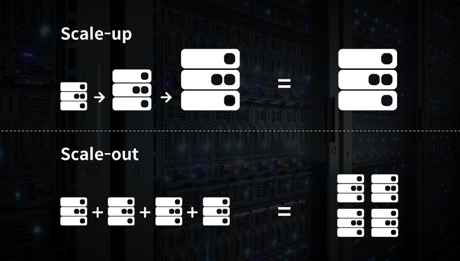
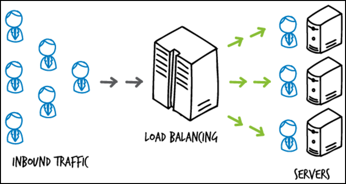
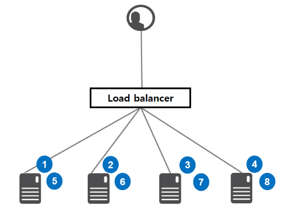
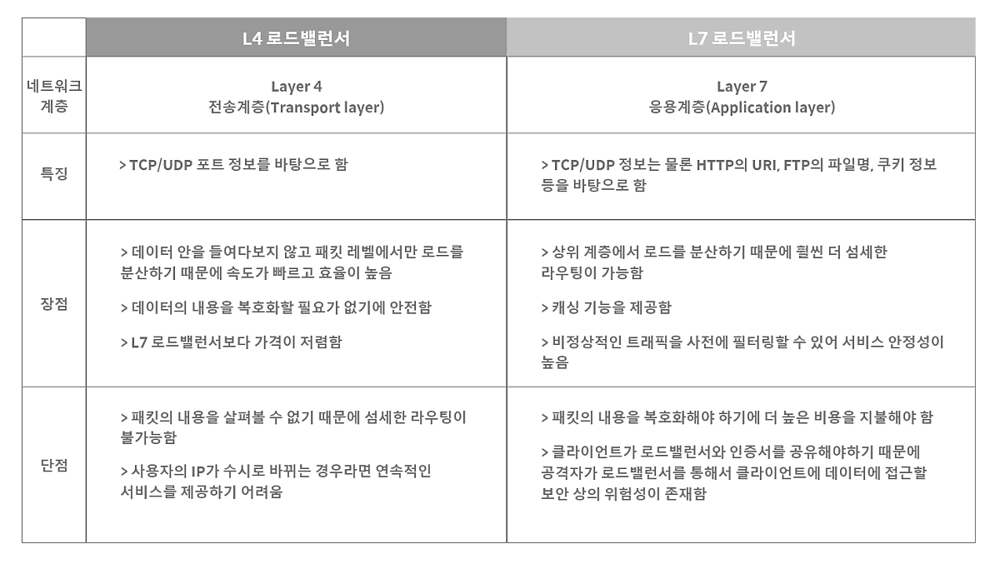

# 로드밸런싱

날짜: 2023년 4월 5일
사람: 이성민

## **1. Load Balancing이란?**

[**Load Balancing이란?**]

- 서버가 처리해야 할 업무 혹은 **요청(Load)을 여러 대의 서버로 나누어(Balancig) 처리**하는 것을 의미
- 한 대의 서버로 부하가 집중되지 않도록 트래픽을 관리해 각각의 서버가 최적의 퍼포먼스를 보일 수 있도록 하는 것이 목적

[**Load Balancing의 이점**]

- 애플리케이션 **가용성**
    - 애플리케이션 가동 중지 없이 애플리케이션 서버 유지 관리 또는 업그레이드 실행
    - 백업 사이트에 자동 재해 복구 제공
    - 상태 확인을 수행하고 가동 중지를 유발할 수 있는 문제 방지
- 애플리케이션 **확장성**
    - 트래픽 병목 현상 방지
    - 다른 서버를 추가하거나 제거할 수 있도록 애플리케이션 트래픽을 예측
    - 안심하고 조정할 수 있도록 시스템에 중복성을 추가
- 애플리케이션 **보안**
    - 트래픽 모니터링 및 악성 콘텐츠 차단
    - 공격 트래픽을 여러 백엔드 서버로 자동으로 리디렉션하여 영향 최소화
    - 추가 보안을 위해 네트워크 방화벽 그룹을 통해 라우팅
- 애플리케이션 **성능**
    - 서버 간에 로드를 균등하게 배포하여 애플리케이션 성능 향상
    - 클라이언트 요청을 지리적으로 더 가까운 서버로 리디렉션하여 지연 시간 단축
    - 물리적 및 가상 컴퓨팅 리소스의 신뢰성 및 성능 보

## **2. Load Balancing Algorithm**

[**정적 로드 밸런싱** - 고정된 규칙을 따르며 현재 서버 상태와 무관]

1. **라운드 로빈 방식**
    - 서버에 들어온 요청을 **순서대로 돌아가며 배정**하는 방식
    - 여러 대의 서버가 동일한 스펙을 갖고 있고, 서버와의 연결(세션)이 오래 지속되지 않는 경우에 활용

1. **가중 기반 라운드 로빈 방식**
    - 각각의 서버마다 가중치를 매기고 **가중치가 높은 서버**에 클라이언트 요청을 우선적으로 배분
    - 서버의 트래픽 처리 능력이 상이한 경우 사용되는 부하 분산 방식
2. **IP 해시 방식**
    - 클라이언트의 IP 주소를 특정 서버로 매핑하여 요청을 처리하는 방식
    - 사용자의 **IP를 해싱**해 로드를 분배하기 때문에 사용자가 항상 동일한 서버로 연결되는 것을 보장

[**동적 로드 밸런싱** - 트래픽을 배포하기 전에 서버의 현재 상태를 점검]

1. **가중치 기반 최소 연결 방식**
    - 요청이 들어온 시점에 **가장 적은 연결 상태**를 보이는 서버에 우선적으로 트래픽을 배분
    - 자주 세션이 길어지거나, 서버에 분배된 트래픽들이 일정하지 않은 경우에 적합한 방식
2. **최소 응답 시간 방식**
    - 서버의 현재 연결 상태와 **응답 시간**을 모두 고려하여 트래픽을 배분
    - 가장 적은 연결 상태와 가장 짧은 응답 시간을 보이는 서버에 우선적으로 로드를 배분하는 방식
3. **리소스 기반 방식**
    - 현재 서버 부하를 분석하여 트래픽을 배분
    - 로드 밸런서는 해당 서버에 트래픽을 배포하기 전에 **에이전트**에 충분한 여유 리소스가 있는지 확인

## **3. L4 Load Balancing & L7 Load Balancing**

[**L4와 L7**]

- L4는 네트워크 계층이나 트랜스포트 계층의 정보를 바탕으로 로드를 분산
- L7는 특정한 패턴을 감지해 네트워크를 보호할 수 있으며, DoS/DDoS와 같은 비정상적인 트래픽을 필터링할 수 있어 네트워크 보안 분야에서도 활용

참고 자료

[https://aws.amazon.com/ko/what-is/load-balancing/](https://aws.amazon.com/ko/what-is/load-balancing/)

[https://tecoble.techcourse.co.kr/post/2021-11-07-load-balancing/](https://tecoble.techcourse.co.kr/post/2021-11-07-load-balancing/)

[https://aws-hyoh.tistory.com/entry/Server-Load-Balancing-쉽게-이해하기](https://aws-hyoh.tistory.com/entry/Server-Load-Balancing-%EC%89%BD%EA%B2%8C-%EC%9D%B4%ED%95%B4%ED%95%98%EA%B8%B0)
