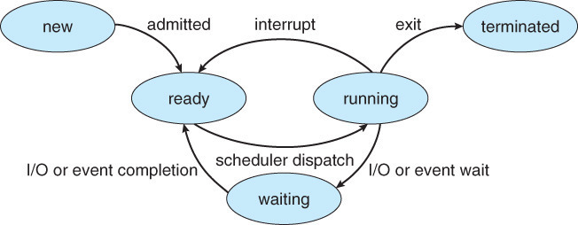
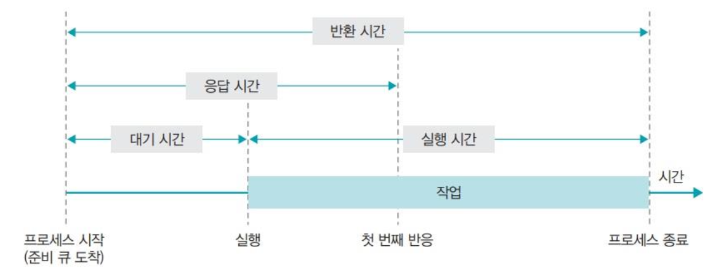

# CPU Scheduling

날짜: 2023년 4월 13일
사람: 유영

## CPU 스케줄링이란?

> 궁극적인 탄생 이유 : [CPU](README.md) 자원의 **효율**적인 **활용**을 위하여 !
> 
1. 하나의 CPU가 여러 개의 프로세스를 실행 시키는데, 이 때 실행 되는 프로세스 간의 **자원 공유** 및 **충돌**을 관리해야 한다.
    1. 한 [**프로세스**](README.md)가 **I/O burst** 단계일 경우, CPU는 놀고 있게 된다.
    2. 한 프로세스가 **무한 루프**에 빠지게 될 시, 다른 프로세스들은 CPU를 사용할 수 없다 ([**데드락**](README.md)).
    3. **우선순위**가 높은 프로세스가 계속해서 CPU를 점유할 시 다른 프로세스들은 실행할 수 없다.
2. 실행 중인 여러 개의 프로세스 중, **우선순위**가 높은 프로세스에게 더 먼저 CPU 자원을 할당함으로써 긴급한 작업 처리에 대해 성능을 높일 수 있다.
3. 대기 중인 프로세스의 적절한 처리를 통해 프로세스 처리 대기 시간을 **최소화**할 수 있다.

⇒ **CPU 스케줄링이란** 프로세스 간의 **효율적인** **CPU 할당**을 결정하는 작업

## CPU 스케줄러

> CPU 스케줄링을 **수행**해주는 모듈
> 

현재 실행 중인 프로세스에서 CPU가 [유휴 상태](README.md)가 될 때마다 **실행 준비**가 되어있는 메모리 내의 프로세스 중 어떤 프로세스가 CPU를 사용할지 선택하여 CPU를 할당한다.

### 프로세스 상태

- 생성 상태 (New State) : 프로세스가 **생성**되고, 운영 체제에서 **초기화**가 완료된 상태
- 준비 상태 (Ready State)
    - 프로세스가 **실행**되기 위해 기다리는 상태
    - 즉, CPU를 **할당** 받기를 기다리는 상태
    - 실행 준비가 완료되면 CPU 스케줄러에 의해 **실행 대기열**에 추가
- 실행 상태 (Running State) : CPU를 할당 받아 **실행** 중인 상태
- 대기 상태(Waiting State / Blocked State)
    - 프로세스가 어떠한 **이벤트**(입출력 완료, 시그널 수신 등)를 기다리는 상태
    - 이벤트 실행 **완료** 시 다시 **Ready State**로 돌아간다.
- 종료 상태(Terminated State) : 프로세스가 **실행 완료** 혹은 **강제 종료** 되었을 때의 상태

## 스케줄링의 기법

### CPU 스케줄링 발생

1. 한 프로세스가 **실행 상태**에서 **대기 상태**로 전환될 때 [ **Running** → **Waiting** ]
2. 프로세스가 **실행 상태**에서 **준비 완료 상태**로 전환될 때 [ **Running** → **Ready** ] : 인터럽트
3. 프로세스가 **대기 상태**에서 **준비 완료 상태**로 전환될 때 [ **Waiting** → **Ready** ]
4. 프로세스가 **종료**될 때 : [ **Terminated** ]

⇒ 2, 3번의 경우 현재 실행 중인 프로세스에게서부터 **강제**로 다른 프로세스로 **전환** 시킬 수 있다.

### 선점 스케줄링

> **강제**로 프로세스의 사용권을 **통제**하는 방식
> 
- **우선순위**가 높은 프로세스가 CPU **강제** **선점** 가능
- **우선순위**가 높은 프로세스를 먼저 처리해야 하는 작업에서 **빠른 응답성** 보장
- 프로세스가 I/O 작업 등의 **대기 상태**에 놓일 때 **다른** 프로세스가 CPU **사용** 가능
- [컨텍스트 스위칭](README.md)이 발생하면서 [오버헤드](README.md) 발생 = 프로세스 **상태 저장**에 대하여 CPU **시간**과 **메모리** 낭비
- 데드락 발생 가능

### 비선점 스케줄링

> 프로세스가 **스스로** 다음 프로세스에게 자리를 넘겨주는 방식
> 
- 이미 사용되고 있는 CPU를 빼앗지 못하고 사용이 끝날 때까지 **대기**
- 할당 받은 CPU는 끝날 때까지 사용
- **단순**한 구현
- 모든 프로세스에 대해 **공정**
- 우선순위가 높은 프로세스에 대한 처리 지연
- 특정 프로세스가 계속 점유할 경우 다른 프로세스들의 [기아 상태](README.md)

## 스케줄Leing 알고리즘

### 스케줄링 기준

해당 특성들을 고려하여 적합한 스케줄링 알고리즘 선별

**< 시스템 입장에서의 성능 척도 >**

1. **CPU 이용률** (CPU Utilization) : 전체 시간 중 CPU가 쉬지 않고 일한 시간
2. **처리량** (Throughput) : 단위 시간 당 수행 완료한 프로세스의 수

**< 프로그램 입장에서의 성능 척도 >**

1. **대기 시간** (Waiting Time) : 프로세스가 **Ready Queue**에서 대기하는 시간
2. **응답 시간** (Response Time) : 프로세스가 **처음**으로 CPU를 **할당** 받기까지 걸린 시간
3. **반환 시간** (Turn Around Time) : 프로세스가 Ready queue에서 대기한 시간부터 **작업**을 **완료**하는데 걸리는 시간

### FCFS (First Come First Served)

> CPU에 **먼저** 도착하는 순서대로 프로세스를 할당해주는 방식
> 
- **비선점** 스케줄링
- 구현이 쉬워 간단한 시스템에 자주 사용
- 하나의 긴 프로세스로 인해 나머지 프로세스가 오래 기다리게 되어 CPU 효율성이 낮아지는 **Convoy Effect** 발생 가능
    - 해당 문제는 **SJF** 알고리즘 사용 추천

### SJF (Shortest Job First)

> 프로세스의 **수행 시간**이 짧은대로 프로세스를 할당해주는 방식
> 
- **비선점** 스케줄링 / **선점** 스케줄링
- **최소**의 평균 **대기 시간** 보장
- 수행시간이 긴 프로세스는 계속 뒤로 밀려나는 **기아 현상** 발생 가능
- 각 프로세스가 얼마나 CPU를 사용할지 모르는 경우 사용하기가 어려움 (I/O burst가 길 수 있으므로?)

### RR (Round Robin)

> 각 동일한 크기의 **할당 시간**이 끝날 때마다 자동 선점 당하는 방식
> 
- **선점** 스케줄링
- 10 ~ 100ms의 동일한 크기의 할당 시간 부여
- 할당 시간이 끝나면 해당 프로세스는 준비 상태로 변환되어 ready queue에 줄을 서고, 다음 프로세스 수행
- **기아 현상** 발생하지 않음
- 컨텍스트 스위칭이 발생하면서 오버헤드 발생 가능

### **Priority Scheduling**

> 특정 기준을 통해 프로세스에 **우선순위**를 부여하여 우선순위대로 프로세스를 할당해주는 방식
> 
- **비선점** 스케줄링 / **선점** 스케줄링
- **SJF**도 일종의 우선순위 스케줄링이라고 볼 수 있음
- 기아현상을 **에이징** 기법으로 해결 ⇒ 시간이 지날수록 **오래 대기**한 프로세스의 우선순위를 높이는 방식
- 다른 스케줄링 알고리즘과 **결합** 가능

---

- **CPU** : 컴퓨터 시스템을 통제하고, 모든 프로세스를 **처리**하고 **실행**하는 중심적인 자원
- **프로세스** : 기본적으로 프로세스는 **CPU burst**와 **I/O burst**의 반복으로 구성된 사이클의 형태로 수행
- **데드락(교착 상태)** : 두 개 이상의 작업이 서로 상대방의 작업이 끝나기 만을 기다리고 있기 때문에 결과적으로 아무것도 완료되지 못하는 상태
- **유휴 상태** : 컴퓨터 시스템이 **사용 가능한 상태**이나 **실제적인 작업**이 없는 시간
- **컨텍스트 스위칭** : 여러 개의 프로세스가 실행되고 있을 때 기존에 실행되던 프로세스를 **중단**하고 다른 프로세스를 **실행**하는 것
- **오버헤드** : 프로그램의 실행 흐름 도중에 동떨어진 위치의 코드를 실행시켜야 할 때 추가적으로 시간, 메모리, 자원이 사용되는 현상
- **기아 상태** : 프로세스가 끊임없이 필요한 컴퓨터 자원을 가져오지 못하는 상태

### Reference

[https://dkswnkk.tistory.com/405](https://dkswnkk.tistory.com/405)

[https://rebro.kr/175](https://rebro.kr/175)

[https://imbf.github.io/computer-science(cs)/2020/10/18/CPU-Scheduling.html](https://imbf.github.io/computer-science(cs)/2020/10/18/CPU-Scheduling.html)

[https://www.uname.in/252](https://www.uname.in/252)
